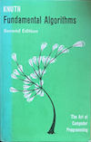

## Some Reflections on Literature for General Perspectives

### Donald E. Knuth

Donald E. Knuth (1938-) is an American computer scientist and mathematician widely
regarded as one of the most influential figures in the field. He is best known as
the author of the multi-volume work *The Art of Computer Programming*, which establishe
 rigorous analysis of algorithms and set a gold standard for algorithmic reasoning
 in computer science.

*The Art of Computer Programming* was originally conceived in the 1960s and has grown
into a projected seven-volume series covering fundamental aspects of algorithms,
data structures, and computational theory. Its exhaustive, precise treatment has
made it a cornerstone of advanced study in the discipline.

Knuth also pioneered *literate programming*, a methodology that treats programs as
works of human communication, not just machine instructions. In this view, code
should be written primarily for human understanding, interleaving narrative and
formal code so that explanations and logic flow clearly. He embodied this idea in
systems such as WEB and CWEB, exemplifying the belief that clarity and explanation
are integral to good programming.

In response to dissatisfaction with the quality of typesetting for his books, Knuth
developed the *TeX* typesetting system in the 1970s and 1980s. TeX provides precise
control over the presentation of complex mathematical text and has become a de facto
standard in scientific publishing, especially in mathematics and physics. Alongside
TeX, Knuth created METAFONT and the Computer Modern typeface family.
LaTeX, developed later by Leslie Lamport in the early 1980s, is a widely used macro package
that simplifies document preparation on top of Donald Knuth's TeX typesetting system.
(LaTeX has been used to produce the printed book.)

Across his many contributions, Knuth’s standpoint unifies deep theoretical insight
with a strong appreciation for clarity, structure, and what might be called *craftsmanship*
in computing. He views programming not merely as a technical task but as a form of
human expression in which correctness, readability, maintainability and elegance
matter as much as performance. He has described the best computer programmes as rising
"to the level of art" because they combine rigorous analysis with aesthetic qualities
that make them pleasurable for humans to read and reason about.  

Knuth’s concept of literate programming exemplifies this philosophy: a methodology
in which programmes are written primarily for human understanding, with narrative
exposition interwoven with code so that the author’s intent and logic are clear.
This approach emphasises communication and comprehension over purely machine-oriented
structure.  

His work on TeX similarly reflects a craftsman’s concern for precision and quality.
Frustrated by the limitations of existing typesetting tools for mathematical texts,
he created TeX to produce high-quality typesetting and documented it with the same
rigour that characterises his algorithmic writing. The development process itself,
including his bug-reward system for finding errors, demonstrates his emphasis on
stability, correctness, and long-term reliability over rapid, incremental fixes.  

While some aspects of his approach (for example, the density and mathematical depth
of The Art of Computer Programming) are seen as demanding and sometimes impractical
for everyday industrial work, many commentators still regard his work as foundational
and aesthetically rich. For Knuth, the craft of programming involves precise thought,
clear communication, and an appreciation of the beauty inherent in well-designed
computational artefacts--a perspective that has influenced generations of computer
scientists even as software practice evolves.

### 

