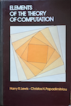
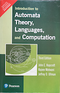
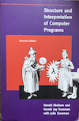

## Some Reflections on Literature for General Perspectives

Although we have only just begun our journey through this vast landscape,
it is already worthwhile to pause and reflect on existing literature.
A central guiding principle of this book (or repository) has been *craftsmanship*
Not only in the practice of programming but, to a significant extent, in
the appreciation and application of theory as well. Many excellent books
in the field adopt a predominantly theoretical starting point:
they lay rigorous mathematical foundations first and only later illustrate
how those abstractions manifest in actual code. In contrast, we deliberately
take the opposite approach: starting from concrete, hands-on code and practical
problem-solving, then gradually ascending toward the underlying theory that
explains *why* certain patterns, limitations, and elegances emerge.

This "code-first" philosophy is not a rejection of theory but a different path to it.
By beginning with working programs, intuitive experiments, and real-world constraints,
we aim to build motivation and intuition organically. Theory, when it arrives,
feels earned rather than imposed; it illuminates code that the reader already
understands rather than remaining an abstract prelude to implementation.
This mirrors the way many practising programmers naturally learn:
through trial, error, and craftsmanship--before formalising their insights.

### Donald E. Knuth

Donald E. Knuth (1938-) is an American computer scientist and mathematician widely
regarded as one of the most influential figures in the field. He is best known as
the author of the multi-volume work *The Art of Computer Programming*, which establishe
 rigorous analysis of algorithms and set a gold standard for algorithmic reasoning
 in computer science.

*The Art of Computer Programming* was originally conceived in the 1960s and has grown
into a projected seven-volume series covering fundamental aspects of algorithms,
data structures, and computational theory. Its exhaustive, precise treatment has
made it a cornerstone of advanced study in the discipline.

Knuth also pioneered *literate programming*, a methodology that treats programs as
works of human communication, not just machine instructions. In this view, code
should be written primarily for human understanding, interleaving narrative and
formal code so that explanations and logic flow clearly. He embodied this idea in
systems such as WEB and CWEB, exemplifying the belief that clarity and explanation
are integral to good programming.

In response to dissatisfaction with the quality of typesetting for his books, Knuth
developed the *TeX* typesetting system in the 1970s and 1980s. TeX provides precise
control over the presentation of complex mathematical text and has become a de facto
standard in scientific publishing, especially in mathematics and physics. Alongside
TeX, Knuth created METAFONT and the Computer Modern typeface family.
LaTeX, developed later by Leslie Lamport in the early 1980s, is a widely used macro package
that simplifies document preparation on top of Donald Knuth's TeX typesetting system.
(LaTeX has been used to produce the printed book.)

Across his many contributions, Knuth's standpoint unifies deep theoretical insight
with a strong appreciation for clarity, structure, and what might be called *craftsmanship*
in computing. He views programming not merely as a technical task but as a form of
human expression in which correctness, readability, maintainability and elegance
matter as much as performance. He has described the best computer programmes as rising
"to the level of art" because they combine rigorous analysis with aesthetic qualities
that make them pleasurable for humans to read and reason about.

Knuth's concept of literate programming exemplifies this philosophy: a methodology
in which programmes are written primarily for human understanding, with narrative
exposition interwoven with code so that the author's intent and logic are clear.
This approach emphasises communication and comprehension over purely machine-oriented
structure.

His work on TeX similarly reflects a craftsman's concern for precision and quality.
Frustrated by the limitations of existing typesetting tools for mathematical texts,
he created TeX to produce high-quality typesetting and documented it with the same
rigour that characterises his algorithmic writing. The development process itself,
including his bug-reward system for finding errors, demonstrates his emphasis on
stability, correctness, and long-term reliability over rapid, incremental fixes.

While some aspects of his approach (for example, the density and mathematical depth
of The Art of Computer Programming) are seen as demanding and sometimes impractical
for everyday industrial work, many commentators still regard his work as foundational
and aesthetically rich. For Knuth, the craft of programming involves precise thought,
clear communication, and an appreciation of the beauty inherent in well-designed
computational artefacts--a perspective that has influenced generations of computer
scientists even as software practice evolves.

###  Traditional Approaches

*Elements of the Theory of Computation* (2nd edition, 1997) by Harry R. Lewis and
Christos H. Papadimitriou is a classic, rigorous textbook on theoretical computer
science, widely praised in reviews for its clear writing, balanced blend of mathematical
formalism and intuition, and accessibility compared to denser alternatives like
Hopcroft and Ullman. Reviewers often highlight its effectiveness in classroom teaching
and its ability to build deep understanding, though many note the material is dense
and "dry," requiring careful, slow reading with limited worked examples and no exercise
solutions--making it ideal with an instructor but challenging for pure self-study.

*Introduction to Automata Theory, Languages, and Computation* (1st edition, 1979)
by John E. Hopcroft and Jeffrey D. Ullman (later editions co-authored with Rajeev Motwani)
is a foundational, highly rigorous textbook widely regarded as a classic and authoritative
reference in theoretical computer science, frequently praised in reviews for its
comprehensive coverage, precise proofs, and depth, but commonly criticized for its terse
and formal style, minimal intuitive motivation, sparse examples, abrupt transitions,
and numerous typographical errors (especially in the first edition)--making it notoriously
challenging for self-study or beginners, though highly valued by advanced students or
as a reference when paired with strong instruction. Reviewers often contrast it
unfavorably with more approachable texts like Lewis and Papadimitriou (for better
intuition and notation) or Sipser (for clearer explanations), describing it as "dense,"
"dry," and better suited for those already comfortable with the material.

Both Lewis & Papadimitriou and Hopcroft & Ullman exemplify the theory-first
tradition this is a contrast against. Reviewers frequently note that these
classics demand patience and mathematical maturity precisely because they
begin with formal models. The example here as a contrast is the inversion
and could serve as a valuable companion or alternative pathway--especially
for readers which find those texts dense or intimidating on first encounter.

 

### Craftmanship in a New Way

*Structure and Interpretation of Computer Programs* (often called the
"Wizard Book" due to its iconic cover) by Harold Abelson, Gerald Jay Sussman,
and Julie Sussman (first edition 1985, second edition 1996) is widely regarded
as one of the most influential and profound introductory computer science
textbooks ever written. It uses Scheme (a Lisp dialect) to explore fundamental
ideas in programming and computation through a strongly code-first, exploratory
approach--starting with simple expressions and procedures, then building increasingly
sophisticated abstractions, all the way to implementing interpreters, compilers,
and even a full metacircular evaluator.

The book's core philosophy is that programs should be viewed as models of computational
processes, and that mastering abstraction (procedural, data, and metalinguistic)
allows programmers to tame complexity and express powerful ideas elegantly. Key
chapters progress from functional programming basics (higher-order functions, recursion)
to symbolic differentiation, logic programming (via nondeterminism), and hardware
simulation (register machines). Exercises are legendary--challenging, insightful,
and designed to provoke deep thinking rather than rote application.

The Little ..

Turing Omnibus ..
