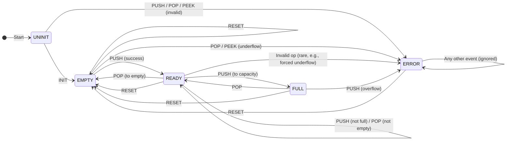

### A State Machine and a Stack

Looking at "machines" in the context of virtual machines, the *state machine* plays an important
role. While we will explore different varieties of state machines in more detail later (see e.g.,
in [ch04](./../../ch04/) [state](./../../ch04/state/)), it is useful to begin with a simple
illustration. One such example is the implementation of a stack. By modelling stack
operations--such as initialise, push, pop, and reset--as events that drive state transitions,
we can view the stack not simply as a data structure, but as a system whose behaviour is entirely
defined by its states and transitions.

This perspective highlights how even a fundamental abstraction like the stack can be expressed in
terms of a state machine, offering insight into how higher-level computational models can be grounded
in simple, deterministic mechanisms.

A *state machine* (specifically a Finite State Machine or FSM) is a model where a system
can be in one of a finite number of states at any time, and it changes states based on
events or inputs. It's like a traffic light: states (red, yellow, green) transition based
on timers or sensors, with rules defining valid transitions.

In this code, the stack is implemented with a fixed capacity (STACK_CAP = 8 by default)
using an array `data[STACK_CAP]` to store integers and an index `top` to track the current
top position (-1 when empty). It prevents overflows (pushing beyond capacity) and underflows
(popping from empty) by transitioning to an error state instead of crashing or
using exceptions.

The stack is "*driven purely by a state machine*," meaning all operations are funnelled
through events that trigger state transitions and actions. The states
(enum StackState) represent the stack's condition:
- *ST_UNINIT*: Not yet initialised (starting point).
- *ST_EMPTY*: No items (top = -1).
- *ST_READY*: Has 1 to (capacity-1) items.
- *ST_FULL*: At maximum capacity (top = STACK_CAP-1).
- *ST_ERROR*: Invalid operation attempted (e.g., push on full, pop on empty,
  or operations on uninitialised stack).

Events (enum StackEvent) are the inputs that drive changes:
- *EV_INIT*: Sets up the stack (to EMPTY).
- *EV_PUSH*: Adds a value (param_in) if possible; updates state via `state_from_top()`.
- *EV_POP*: Removes top value (writes to param_out); errors on empty/uninit.
- *EV_PEEK*: Views top value (writes to param_out) without removing; errors on empty/uninit.
- *EV_RESET*: Clears back to EMPTY, even from ERROR.
- *EV_GET_STATE*: Retrieves current state (optional helper).

The core function `stack_step()` processes an event based on the current state:
- It first checks for ERROR state (only RESET allowed).
- Then handles the event in a switch, performing actions (e.g., increment/decrement
  top, store/read data) and updating state.
- Returns true if handled (even if it errors), false otherwise.

This setup ensures predictable behavior: invalid actions don't corrupt data but
explicitly enter ERROR, from which only RESET recovers. The helper `state_from_top()`
derives state from the top index, keeping state consistent with the underlying data.

### Comparison to a Conventional Stack Implementation

A conventional stack implementation would typically expose separate functions for
each operation, without tightly coupling them to states or events. Here's a breakdown:

| Aspect | This State Machine-Driven Stack | Conventional Stack |
|---|---|---|
| *Interface* | Single function (`stack_step()`) takes an event code and params. All ops are event-driven. | Multiple functions: e.g., `init_stack()`, `push(int val)`, `int pop()`, `int peek()`, `reset()`, `is_empty()`, `is_full()`. |
| *State Management* | Explicit states (UNINIT, EMPTY, READY, FULL, ERROR) tracked internally. Transitions are rule-based (e.g., PUSH on FULL → ERROR). State is queryable via event. | Implicit states: Often just checks like `if (top < 0)` for empty or `if (top >= CAP-1)` for full inside functions. No dedicated ERROR state; might return error codes, throw exceptions, or assert/crash. |
| *Error Handling* | Centralised: Enters ERROR on invalid ops (overflow, underflow, uninit access). Ignores most events in ERROR until RESET. Prevents further misuse. | Decentralised: Each function handles errors separately (e.g., push returns bool success, pop returns sentinel value like -1 on empty). Less rigid; caller must check returns. |
| *Control & Safety* | High: Forces initialisation, blocks invalid sequences (e.g., no ops in UNINIT except INIT). Event-based like a protocol or automaton. Good for embedded/safety-critical systems where predictability is key. | Flexible but error-prone: Caller can misuse (e.g., pop without checking empty), leading to bugs like array out-of-bounds. Relies on caller discipline. |
| *Complexity* | Higher upfront: Everything routed through one function with switch/case. But modular for extension (add events/states easily). | Simpler: Direct functions, easier for basic use. But scaling to complex rules (e.g., custom error recovery) requires more code. |
| *Use Cases* | Suited for event-driven systems (e.g., UI, protocols, automata). Ensures finite, verifiable behaviours. Demo shows controlled pushes/pops with auto-state updates. | General-purpose: Algorithms like recursion simulation, undo systems. Faster for simple scripts but less robust in concurrent or state-heavy apps. |
| *Performance* | Slight overhead from event switching and state checks, but negligible (O(1) ops). Fixed array is efficient. | Similar O(1) efficiency, potentially leaner without extra state logic. |

In essence, this implementation wraps a standard stack in a state machine for stricter
control and explicit error states, making it more like a "controlled automaton" than a
loose collection of functions. It's overkill for trivial stacks but shines in scenarios
needing reliability, like finite-state protocols or where operations must follow a strict
sequence. The demo in `main()` illustrates this: it initialises, pushes to full, attempts
overflow (enters ERROR), rejects pops until reset, then normal ops, and underflow handling.

#### Notes:

- PEEK and GET_STATE are omitted from transitions where
  they don't change state (they just read data if valid,
  or error if not).
- RESET always goes to EMPTY (even from ERROR).
- INIT is similar to RESET but typically from UNINIT.
- The diagram assumes valid capacity (e.g., PUSH from
  EMPTY goes to READY unless immediately FULL, but that's
  edge-case for cap=1).
- Ignored events in ERROR (anything but RESET) are shown
  as a self-loop for simplicity.

