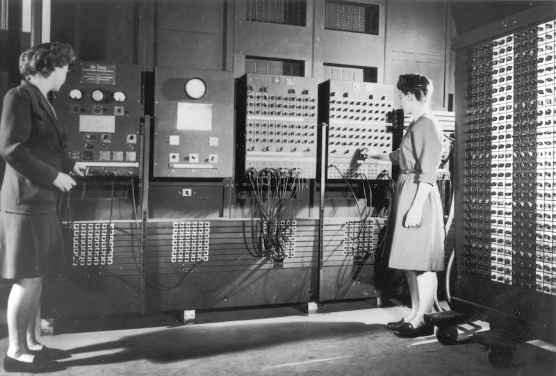

## John von Neumann machine

The von Neumann machine is a foundational computer architecture conceptualized in the 1940s
by mathematician John von Neumann. It introduced the revolutionary idea of a stored-program
model, where instructions and data share the same memory space, allowing a computer to execute
sequences of instructions loaded into its memory. This design contrasted with earlier machines 
that were hardwired for specific tasks, offering flexibility and programmability that paved
the way for modern computing. The architecture laid out core components-an arithmetic logic
unit (ALU), control unit, memory, and input/output-forming the basis of most computers to
this day. Its principles were outlined in the 1945 report First Draft of a Report on the EDVAC,
co-authored by von Neumann, which deeply influenced subsequent computer development.

* On Wikipedia: [https://en.wikipedia.org/wiki/First_Draft_of_a_Report_on_the_EDVAC](https://en.wikipedia.org/wiki/First_Draft_of_a_Report_on_the_EDVAC)

* First draft PDF: [John von Neumann, First Draft of a Report on the EDVAC, 1945](./../../assets/pdf/neumann.pdf)

### Exercises or projects

#### Simulating a basic von Neumann machine

- You can build a simple von Neumann machine simulator in a language like Python or JavaScript.
  The project involves creating a program that mimics the machine's architecture, including a
  memory system for data and instructions, a basic ALU, and a control unit. You write code to 
  load, fetch, decode, execute instructions, and update a program counter. This exercise provides
  hands-on experience with how CPUs process instructions in sequence and manage memory.

- Learning: Gain understanding of low-level instruction execution, memory management,
  and control flow.

#### Assembly language programming exercises

- Using an emulator like RARS for RISC-V, Ripes or search for something similar, you can write 
  simple assembly language programs that showcase how data and instructions coexist in memory,
  typical of the von Neumann model. You can start with basic arithmetic operations, control
  structures (loops, conditionals), and progress to more complex tasks (sorting algorithms,
  simple I/O operations).

  * RARS: https://github.com/TheThirdOne/rars
  * Ripes: https://github.com/mortbopet/Ripes

- Learning: Familiarize youself with machine-level operations and how high-level concepts
  like loops translate to low-level code.

#### Von Neumann bottleneck exploration

- In this exercise, you investigate the von Neumann bottleneck, the limitation caused by shared
  memory access for data and instructions. Design experiments to measure memory access times in
  a simulated environment, comparing sequential access patterns versus cache-optimized or parallel
  approaches.

- If LLMs are assumed, use them as a reference to check your understanding, ask questions about
  bottleneck implications, or get guidance on optimization ideas.

- Learning: Understand the performance challenges in von Neumann architecture and the role
  of caches.

#### Basic compiler design project

- For a deeper dive, you implement a very simple compiler that translates a high-level language
  (like a subset of C or LISP but only for arithmetical expressions) into the assembly language
  of your von Neumann simulator. You will need to implement lexical analysis, parsing, and code
  generation stages.

- Learning: Appreciate the role of compilers in translating high-level code to machine
  instructions and reinforce concepts of instruction fetching and decoding.

#### LLM-Assisted program design & debugging

- In this exercise, you design programs for a von Neumann machine simulator, with optional help
  from an LLM. They can use the LLM as a debugging partner to explain specific assembly instructions
  or diagnose errors. For example, you might ask, "Why is this loop not updating the accumulator
  correctly?" to receive potential solutions or hints.

- Learning: Develop problem-solving skills for low-level programming while gaining practice
  in seeking out debugging support.

These exercises and projects can help you develop a deep understanding of the von Neumann machine
and its principles, with LLMs available optionally for guidance without directly impacting or solving
the core tasks.

### ENIAC

Before EDVAC we had ENIAC. ENIAC (Electronic Numerical Integrator and Computer) was not a von Neumann
machine but rather a precursor. It was one of the first general-purpose digital computers and
laid important groundwork for future computing concepts. However, ENIAC did not embody the defining
characteristics of the von Neumann architecture:

1. Stored program: In a von Neumann machine, instructions and data are stored in the same memory.
   ENIAC, on the other hand, did not have a stored-program design. Instead, it had to be physically
   rewired for each new problem, making programming labor-intensive and time-consuming.

2. Single memory: ENIAC used separate systems for its instructions (hardwired into its configuration)
   and the data it processed. The von Neumann machine integrates both into a single memory space.

3.	Automatic sequential execution: While ENIAC could perform calculations at high speeds once configured,
    it required manual intervention to change its program by altering wiring and switches, which contrasts
    with the automated and dynamic sequence of instructions in a von Neumann system.

Although ENIAC was later modified in 1948 to include some aspects of a stored-program system, this was a
'retrofit' rather than part of its original design. As such, ENIAC remains firmly categorized as a precursor.

