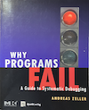

## A Reference Tip: Why Programs Fail

*Why Programs Fail: A Guide to Systematic Debugging* (2006) by Andreas Zeller is a systematic
treatment of debugging that stands out for bringing scientific rigor to what's often treated
as an art form. Published in the mid-2000s, it remains relevant because it focuses on fundamental
principles rather than specific tools.

The book's strength is its methodical approach: Zeller walks through the debugging process as a
scientific investigation--tracking problems, forming hypotheses, experimenting, and automating
where possible. He introduces delta debugging, a technique he pioneered for automatically isolating
the minimal test case that triggers a bug, which is both intellectually elegant and practically useful.
The book also covers automated testing, assertions, and systematic approaches to understanding
program behaviour.

*Context in debugging literature*: Debugging has traditionally been taught through experience
and folklore rather than formal methods. Classic works like Kernighan and Pike's "The Practice
of Programming" offer wisdom and heuristics, while Agans' "Debugging" provides practical rules
of thumb. Zeller's contribution is bringing computer science research into the practitioner's
toolkit--he shows debugging isn't just careful detective work but can be systematised and even
partially automated.

The book works well for intermediate to advanced programmers who want to move beyond print statements
and breakpoints to more sophisticated strategies. It's somewhat academic in tone but filled with real
examples. If you're looking to level up your debugging skills with techniques you can actually apply,
this is one of the best resources available.

*Why Programs Fail* is a comprehensive guide to debugging that transcends simple "how-to" tips and
instead frames debugging as a methodological discipline. Zeller presents debugging as a structured
process that can be learned, analysed and improved using systematic techniques. The book bridges the
gap between practical debugging tactics and formal reasoning about software defects.

The core thesis is that failures are symptoms and that systematic analysis of symptoms can lead to
the causes. Zeller formalises debugging into definable steps and introduces tools and algorithms
that embody those steps.

### Conceptual Framework

Zeller's distinction between failure, error, and defect is foundational. He introduces the
*cause-effect chain* concept: inputs cause defects, defects cause errors, errors lead to
failures. This framing helps readers focus on causality rather than symptoms.

The book also formalises the notion of a *debugging hypothesis* and shows how
evidence can confirm or refute hypotheses.

The core of the book lies in systematic methods:
* *Delta Debugging*: a systematic minimisation technique that reduces inputs or code changes
  to the minimal difference that reproduces the failure.
* *Execution differencing*: comparing successful and failing runs to isolate differing behaviours.
* *Automated test generation and slicing*: techniques for reducing the search space.

These methods are presented with algorithmic clarity, often in pseudocode or structured description.

Zeller stresses the importance of collecting and managing evidence. Structured logging, assertions,
test cases and controlled experiments are treated as data sources that shape debugging decisions.

The book encourages a scientific mindset: form hypotheses, collect data, refine hypotheses.

Examples span multiple languages (C, C++, Java) and environments. Real world bugs and debugging
sessions illustrate how systematic approaches outperform ad-hoc trial and error.

### Tooling Context

Because the book was published in 2006, some tool recommendations are dated. References to
specific debuggers, environments or languages may not reflect modern ecosystems.

Despite this, the underlying principles are timeless. Modern tools (IDE debuggers, automated
test frameworks, continuous integration) embody the same ideas.

Some readers might find sections on formal definitions and algorithms dense. If one is seeking
quick "tricks", the rigor can feel heavy. However, for those interested in deep understanding,
the rigor strengthens the lessons.

There is less emphasis on modern practices such as dynamic analysis for concurrent and distributed
systems, fuzzing as practiced today, or integration with DevOps practices. The core methods apply,
but later literature expands further.

### Some Takeaways

* Debugging is a systematic, evidence-based process, not random guesswork.
* Failures are symptoms; finding root causes requires isolating differences between correct
  and incorrect behaviour.
* Techniques like delta debugging and execution differencing automate and accelerate
  fault isolation.
* Scientific reasoning--hypothesis, evidence, refutation--is central to effective debugging.

The book is most useful for:
* Intermediate to advanced programmers
* Software engineers interested in quality and correctness
* Researchers and tool builders in software analysis

Beginners will benefit from conceptual clarity, but may need supplementary material
for day-to-day debugging workflows.

### Conclusion

*Why Programs Fail* remains a seminal text that reframes debugging as a disciplined activity
grounded in evidence and algorithmic reasoning. While specific tool references are dated,
the conceptual contributions are enduring. The book is recommended for programmers who seek
depth, want to improve their debugging methodology, or are building tools to support analysis
and testing.

The systematic techniques in this book often repay the initial investment in study by
reducing time spent on future debugging tasks.

