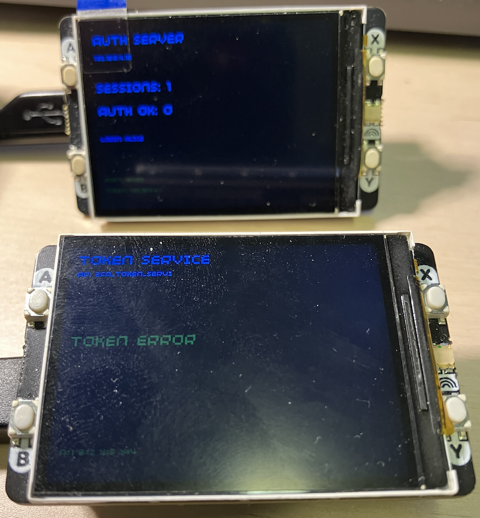
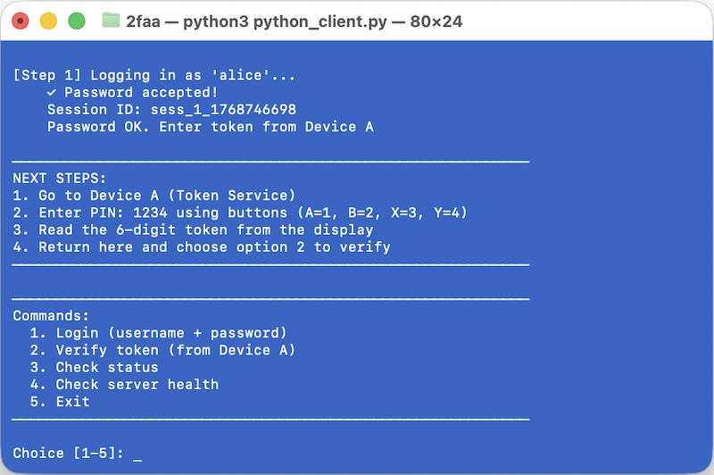

## Two-Factor Authentication System w/ Raspberry Pi Pico

A 2FA implementation using two Raspberry Pi Pico devices communicating
over WiFi to demonstrate multi-factor authentication concepts.


### Overview

This project implements a *hardware-based two-factor authentication (2FA)
system* split across three components:
1. *Device A (Token Service)* - Physical token generator with PIN protection
2. *Device B (Auth Server)* - Authentication server validating credentials
3. *Python Client* - User interface running on PC/Mac

The system demonstrates the security principle: *"Something you know + Something you have"*


### Core Concepts Used

#### 1. *Time-Based One-Time Passwords (TOTP)*
- *What*: Generates 6-digit codes that change every 30 seconds
- *How*: Uses HMAC-SHA1 with current Unix timestamp divided by time interval
- *Why*: Prevents replay attacks - stolen codes expire quickly
- *Implementation*: Device A generates tokens using shared secret `JBSWY3DPEHPK3PXP`

```python
# Simplified TOTP algorithm
timestamp = current_time // 30_seconds
hmac_hash = HMAC-SHA1(secret_key, timestamp)
token = extract_6_digits(hmac_hash)
```

#### 2. *PIN-Protected Hardware Token*
- *What*: Physical device requiring 4-digit PIN before showing tokens
- *How*: Button-based PIN entry (A=1, B=2, X=3, Y=4) with debouncing
- *Why*: Prevents unauthorized physical access to token generator
- *Security Feature*: Auto-locks after 2 minutes of inactivity

#### 3. *WiFi Access Point Architecture*
- *What*: Device A creates its own WiFi network
- *How*: Uses `network.AP_IF` mode with WPA2 password
- *Why*: Creates isolated network for secure device-to-device communication
- *Details*: SSID `2FA_Token_Service`, Password `SecureToken2024`

#### 4. *Session Management*
- *What*: Tracks authentication state across multiple steps
- *How*: Generates unique session IDs, stores in dictionary
- *Why*: Separates password verification from token validation
- *Features*:
  - Session timeout: 5 minutes
  - Maximum 50 concurrent sessions
  - Automatic cleanup of expired sessions

#### 5. *HTTP-Based API Communication*
- *What*: RESTful endpoints for authentication flow
- *Endpoints*:
  - `POST /login` - Verify username/password
  - `POST /verify` - Validate TOTP token
  - `POST /status` - Check session state
  - `GET /health` - Server health check
  - `GET /validate?token=` - Token validation (Device A)

#### 6. *Non-Blocking Socket I/O*
- *What*: Asynchronous network handling
- *How*: `socket.setblocking(False)` with timeout management
- *Why*: Prevents server hanging on slow clients
- *Challenge*: MicroPython's limited async support requires manual timeout handling


## 🏗️ System Architecture

```

   Device A                    Device B                 Python Client
 Token Service   <---------  Auth Server    <---------    (PC/Mac)
                    WiFi                      LAN/WiFi
 - Creates AP              - Connects to A.           - User login
 - Generates               - Validates                - Token entry
   TOTP tokens               credentials
 - PIN lock                - Requests

  192.168.4.1               192.168.4.x                Your IP address
```

### Authentication Flow

```
1. Client -> Server B: POST /login {username, password}
2. Server B -> Client: {session_id, status: "pending"}
3. User -> Device A: Enter PIN (1234) via buttons
4. Device A -> Display: Show TOTP token (e.g., "738291")
5. Client -> Server B: POST /verify {session_id, token}
6. Server B -> Device A: GET /validate?token=738291
7. Device A -> Server B: {valid: true/false}
8. Server B -> Client: {status: "success"} or {status: "error"}
```


### Some Technical Details

#### HMAC-SHA1 Implementation
The project includes a *custom HMAC-SHA1* implementation in MicroPython:

```python
def hmac_sha1(key, msg):
    # Standard HMAC algorithm (RFC 2104)
    # 1. Pad key to block size (64 bytes)
    # 2. XOR with inner/outer padding
    # 3. Hash twice: SHA1(outer_pad || SHA1(inner_pad || message))
```

*Why custom implementation?* MicroPython's `uhashlib` has SHA1 but not HMAC.


#### Base32 Decoding
TOTP secrets are Base32-encoded (standard for authenticator apps):

```python
def base32_decode(s):
    alphabet = "ABCDEFGHIJKLMNOPQRSTUVWXYZ234567"
    # Converts: "JBSWY3DPEHPK3PXP" -> binary secret key
```

*Why Base32?* Human-readable, case-insensitive, avoids ambiguous characters.


#### Button Debouncing
Hardware buttons need debouncing to prevent multiple inputs:

```python
DEBOUNCE_MS = 300
if time.ticks_diff(current_time, last_button_time) < DEBOUNCE_MS:
    return  # Ignore rapid button presses
```


#### Socket Timeout Handling
Critical for preventing hung connections:

```python
def read_request_with_timeout(conn, timeout=2):
    conn.setblocking(True)
    conn.settimeout(timeout)
    # Read until \r\n\r\n or timeout
    # Handle Content-Length for POST bodies
```


### Setup Instructions

#### Hardware Required
- 2x Raspberry Pi Pico W
- 2x Pimoroni Pico Display Pack 2.0
- PC/Mac/Linux with Python 3.7+


#### Software Installation

1. *Flash MicroPython* to both Picos
   - Download from [micropython.org](https://micropython.org/download/rp2-pico-w/)
   - Use Thonny IDE to flash firmware

2. *Upload Device Scripts*
   - Device A: Upload `token_service.py`
   - Device B: Upload `auth_server.py`

3. *Install Python Client Dependencies*
   ```bash
   pip install requests
   ```

#### Running ..

1. *Start Device A* (Token Service)
   - Run `token_service.py` in Thonny
   - Creates WiFi AP: `2FA_Token_Service`
   - IP: `192.168.4.1`

2. *Start Device B* (Auth Server)
   - Run `auth_server.py` in Thonny
   - Connects to Device A's WiFi
   - Note its IP address from display

3. *Run Python Client*
   ```bash
   python python_client.py 192.168.4.x
   ```
   Replace `x` with Device B's IP from display



#### Test Authentication

1. Login with credentials: `alice` / `password123`
2. On Device A: Press buttons to enter PIN `1234` (A=1, B=2, X=3, Y=4)
3. Read 6-digit token from Device A's display
4. Enter token in Python client
5. Authentication complete!




### Areas for Further Investigation

#### 1. *Cryptographic Security*
- [ ] Why is HMAC-SHA1 still used in TOTP despite SHA1 weaknesses?
- [ ] How does the truncation in TOTP affect security?
- [ ] Could quantum computing break TOTP? Timeline?

#### 2. *Network Security*
- [ ] WPA2 vulnerabilities in the Access Point setup
- [ ] Man-in-the-middle attack vectors between devices
- [ ] Why is HTTP used instead of HTTPS? (Hint: MicroPython limitations)

#### 3. *Protocol Analysis*
- [ ] Session fixation attack possibilities
- [ ] Race conditions in session management
- [ ] Replay attack window during 30-second TOTP interval

#### 4. *Hardware Considerations*
- [ ] What if someone extracts `TOTP_SECRET` from Device A's flash memory?
- [ ] Power analysis attacks on PIN entry
- [ ] Physical security: tamper detection mechanisms

#### 5. *Scalability Challenges*
- [ ] Why limit to 50 sessions? Memory constraints?
- [ ] Database alternatives to in-memory dictionary
- [ ] Load balancing multiple auth servers

#### 6. *User Experience*
- [ ] What happens if user enters wrong PIN 10 times?
- [ ] Time synchronization issues between devices
- [ ] Accessibility: blind users can't see display


### Advanced Project Extensions

#### Project 1: *Red Team vs. Blue Team Security Competition*

*Setup*: Two competing teams, rotating roles every round.

__*Blue Team (Defenders)* - Security Hardening Tasks:__
1. *Network Security*
   - [ ] Implement WPA3 encryption
   - [ ] Add MAC address filtering
   - [ ] Set up VPN tunnel between devices
   - [ ] Implement certificate pinning

2. *Authentication Hardening*
   - [ ] Add rate limiting (max 3 attempts per minute)
   - [ ] Implement account lockout after failed attempts
   - [ ] Add CAPTCHA-like challenge (e.g., solve math problem on display)
   - [ ] Store passwords using bcrypt/scrypt hashing

3. *Communication Encryption*
   - [ ] Implement TLS/SSL (challenging in MicroPython!)
   - [ ] Add message signing with RSA/ECDSA
   - [ ] Encrypt session tokens with AES
   - [ ] Use Diffie-Hellman key exchange

4. *Advanced Features*
   - [ ] Implement FIDO2/WebAuthn protocol
   - [ ] Add biometric verification (fingerprint sensor)
   - [ ] Geofencing: lock if devices too far apart
   - [ ] Anomaly detection: flag unusual login patterns

__*Red Team (Attackers)* - Breaking Challenges:__
1. *Network Attacks*
   - [ ] WiFi deauthentication attack
   - [ ] ARP spoofing between devices
   - [ ] DNS hijacking on the AP
   - [ ] Packet sniffing and analysis

2. *Cryptographic Attacks*
   - [ ] Brute force TOTP secret (timing analysis)
   - [ ] Replay captured authentication tokens
   - [ ] Hash collision attacks on session IDs
   - [ ] Extract secrets from firmware dump

3. *Physical Attacks*
   - [ ] Side-channel attack: analyze power consumption during crypto
   - [ ] Button press timing analysis to guess PIN
   - [ ] Fault injection: corrupt memory during validation
   - [ ] Evil maid attack: replace firmware

4. *Protocol Exploitation*
   - [ ] Session hijacking via stolen session_id
   - [ ] SQL injection (if database added)
   - [ ] Race condition exploitation
   - [ ] DOS attack: exhaust session pool

__*Scoring System*:__
- Blue Team: +10 points per successful defense
- Red Team: +20 points per successful breach
- Bonus: +50 for novel attack/defense not in checklist


#### Project 2: *Blockchain-Based Authentication Log*

Add immutable audit trail:

```python
# Each auth attempt creates a block
block = {
    "timestamp": time.time(),
    "username": "alice",
    "action": "login_success",
    "previous_hash": "abc123...",
    "hash": sha256(...)
}
```

*Challenges*:
- Implement SHA-256 in MicroPython
- Consensus mechanism between devices
- Storage constraints on Pico


#### Project 3: *Multi-Device Token Federation*

Extend to support multiple token devices:

```
Client -> Auth Server -> Token Device Pool (A1, A2, A3...)
```

*Features*:
- User chooses preferred token device
- Fallback if primary device offline
- Load balancing across token generators

*Research Topics*:
- Service discovery protocols (mDNS/Bonjour)
- Distributed consensus (Raft/Paxos)
- Fault tolerance mechanisms


#### Project 4: *Hardware Security Module (HSM) Emulation*

Transform Device A into an HSM:

```python
# Store multiple secrets securely
secrets = {
    "totp_key": encrypted_value,
    "signing_key": encrypted_value,
    "encryption_key": encrypted_value
}

# Master key derived from PIN + hardware unique ID
master_key = pbkdf2(PIN + device_unique_id)
```

*Security Features*:
- Key derivation function (PBKDF2)
- Secure element simulation
- Anti-tamper detection (accelerometer)
- Key destruction on threat detection


#### Project 5: *Penetration Testing Lab*

Document all vulnerabilities:

| Vulnerability | Severity | Exploit | Mitigation |
|---------------|----------|---------|------------|
| Plaintext HTTP | High | Packet sniffing | TLS/HTTPS |
| Hardcoded secret | Critical | Firmware extraction | Secure enclave |
| No rate limiting | Medium | Brute force | Token bucket |
| Session timeout | Low | Session hijacking | Shorter timeout |

Create CTF-style challenges for each vulnerability.


### Security Considerations (Current Implementation): You fix!

#### Known Vulnerabilities

1. *Plaintext Communication*: All HTTP traffic is unencrypted
2. *Hardcoded Credentials*: `USERS` dictionary in source code
3. *Shared Secret Exposure*: `TOTP_SECRET` visible in code
4. *No Certificate Validation*: Devices trust any connection
5. *Weak PIN*: Only 4 digits = 10,000 combinations
6. *No Brute Force Protection*: Unlimited PIN/token attempts
7. *Fixed WiFi Password*: Same password for all deployments

#### Security Features Implemented

1. Session timeouts prevent indefinite access
2. PIN auto-lock after 2 minutes inactivity
3. Token rotation every 30 seconds
4. Input validation on all endpoints
5. Separate authentication factors (password + token)


### Learning Resources

#### TOTP & 2FA Standards
- [RFC 6238](https://tools.ietf.org/html/rfc6238) - TOTP Specification
- [RFC 4226](https://tools.ietf.org/html/rfc4226) - HOTP Algorithm
- [Google Authenticator Protocol](https://github.com/google/google-authenticator/wiki/Key-Uri-Format)

#### Cryptography
- Applied Cryptography (Bruce Schneier)
- Cryptographic Engineering (Ferguson, Schneier, Kohno)
- [Crypto 101](https://www.crypto101.io/) - Free cryptography course

#### Embedded Security
- [Hardware Security Training](https://hardwaresecurity.training/)
- IoT Penetration Testing Cookbook
- Hardware Hacking Handbook


### Contributing as Project?

Ideas for contributions:
- [ ] Add HTTPS/TLS support
- [ ] Implement password hashing (bcrypt)
- [ ] Add WebAuthn/FIDO2 protocol
- [ ] Create mobile app client
- [ ] Add database persistence
- [ ] Implement RSA key exchange
- [ ] Build web dashboard for monitoring


*ALWAYS Remember*: This is a *learning project* demonstrating 2FA concepts.
To iterate: Real-world systems require additional security layers including
TLS, secure key storage, audit logging, intrusion detection, and regular security audits.

Good luck!

