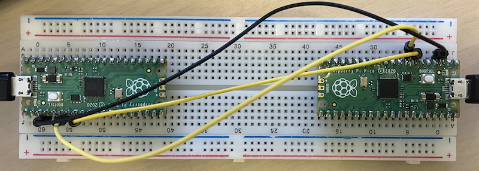

## Blockchain Technology

A blockchain is a special kind of database designed to store data in a way that
makes it extremely difficult to alter or tamper with. Instead of keeping information
in a single server or location, blockchain systems distribute the data across many
computers (nodes) connected in a network. The key idea is that everyone shares
and verifies the same history of records, so no single party controls the data.

At its simplest, you can think of a blockchain as a chain of blocks, where each
block contains some data (for example: transactions, contracts, or records).
Once a block is added to the chain, it becomes part of a permanent history.

A more indepth story about blockchain can be found in
[ch07, addition](./../../../ch07/addition/algo/blockchain/).


### Why Blockchains?

They are designed to provide:
- Integrity: Data cannot be changed after it has been recorded,
  or at least not without being detected.
- Transparency: Everyone in the network can verify what has happened.
- Decentralisation: No central authority is required to manage the system.

One common application is cryptocurrencies such as Bitcoin and Ethereum, where
the blockchain keeps track of who owns what. But the technology has much wider uses,
including digital identity, asset tracking, voting systems, supply chains,
and smart contracts.

A blockchain is composed of several major components and concepts:

__1. Blocks__

Each block contains:
- Header
- Data (payload)

A simplified block structure in pseudo-JSON:
```json
{
  "index": 5,
  "timestamp": 1735689600,
  "transactions": [...],
  "previous_hash": "000000b7f5e912...",
  "nonce": 492883,
  "hash": "000000c17fa3e9..."
}
```

__2. Hashing__

A cryptographic hash function (for example SHA-256) takes an input and produces
a fixed-length output. A small change in input leads to a completely different output.

```
hash = SHA256(block_header)
```

Properties used by blockchains:
- One-way (practically impossible to reverse)
- Collision-resistant (extremely unlikely that two inputs produce the same output)
- Deterministic (the same input always results in the same hash)

__3. Linking Blocks__

Each block stores the hash of the previous block. This is what creates the chain:

```
[Block A] --hash--> [Block B] --hash--> [Block C]
```

If someone tries to alter Block A, its hash changes, which breaks the link to Block B,
and the entire chain after it becomes invalid. This provides tamper-evidence.

__4. Distributed Consensus__

Because there is no central server, the network must agree on the current version of
the blockchain. This agreement mechanism is called consensus.

Common consensus algorithms:
- Proof of Work (PoW): Participants (miners) solve difficult mathematical
  puzzles to add blocks.
- Proof of Stake (PoS): Participants lock up funds as a guarantee of honest
  behaviour and are chosen to create blocks based on stake.
- Practical Byzantine Fault Tolerance (PBFT): Nodes vote on the correct state;
  more common in permissioned blockchains.

__5. Nodes and Network__

Nodes maintain copies of the blockchain. They validate new transactions and new blocks.
Some nodes simply store the chain, others perform mining or forging, depending on the system.


### Smart Contracts

A smart contract is code stored on the blockchain that automatically
executes when certain conditions are met.

Example in a simplified Ethereum-like syntax:

```solidity
contract SimpleStorage {
    uint storedValue;

    function set(uint x) public {
        storedValue = x;
    }

    function get() public view returns (uint) {
        return storedValue;
    }
}
```

Smart contracts allow the blockchain to support programmable logic,
turning it into a platform for decentralised applications.


### Permissioned vs Permissionless Blockchains

| Type | Description | Examples |
|--|--|--|
| Permissionless | Anyone can join and participate in consensus | Bitcoin, Ethereum |
| Permissioned | Only approved participants may join | Hyperledger Fabric, R3 Corda |

This difference dictates performance, trust assumptions, and use-cases.


### Strengths and Weaknesses

Strengths
- Strong data integrity
- No single point of failure
- Tamper-evident and often politically neutral
- Allows trust among parties without direct pre-existing trust

Weaknesses
- Slower than centralised databases
- Uses more storage and computation
- Hard to change the system once deployed
- Energy-intensive if using Proof of Work


### Practical Implementation: block.py

The included `block.py` demonstrates a working blockchain implementation designed for
educational purposes, running on microcontrollers communicating via UART.

__Key Features__

- *Hash-chained blocks*: Each block links to the previous via cryptographic hash
- *HMAC authentication*: Blocks are authenticated using a shared secret key
- *Tamper detection*: Both hash and HMAC are verified on receipt
- *Loss recovery*: Missing blocks are explicitly requested and retransmitted
- *Deterministic convergence*: Both nodes eventually reach the same chain state

__Implementation Details__

```python
class Block:
    def __init__(self, index, prev_hash, payload):
        self.index = index
        self.prev_hash = prev_hash  # Links to previous block
        self.payload = payload
        self.hash = self.compute_hash()
        self.hmac = self.compute_hmac()  # Authentication
```

The blockchain uses:
- *SHA-1 hashing* for block identity (educational choice; production systems use SHA-256)
- *HMAC-SHA1* for authentication between trusted parties
- *Serial protocol* for block transmission and recovery

__Consensus Model__

This implementation uses a *permissioned, authenticated chain* model rather than
Proof of Work mining:
- Nodes share a secret key and trust each other
- Blocks are added sequentially with authentication
- Out-of-order or missing blocks trigger recovery requests
- No mining or computational puzzles required

This approach is similar to permissioned blockchains like Hyperledger Fabric,
where participants are known and authenticated rather than anonymous.

__Message Types__

```
BLK|index|prev_hash|payload|hash|hmac    # Block transmission
REQ|index                                # Request missing block
```

__Recovery Mechanism__

When a node receives a block with an unexpected index or prev_hash mismatch,
it requests the specific block it needs. The sender maintains a cache and can
retransmit any block on demand, ensuring eventual consistency.

__Why This Matters__

This implementation demonstrates that blockchain is fundamentally about:
- Cryptographic linking of data
- Tamper-evident history
- Distributed verification
- Resilience to message loss

It is NOT about:
- Cryptocurrency (no tokens or value transfer)
- Mining (no computational puzzles)
- Public networks (uses shared secret)

This makes it a simplified educational tool for understanding core blockchain
concepts without the whole complexity of cryptocurrency systems.


