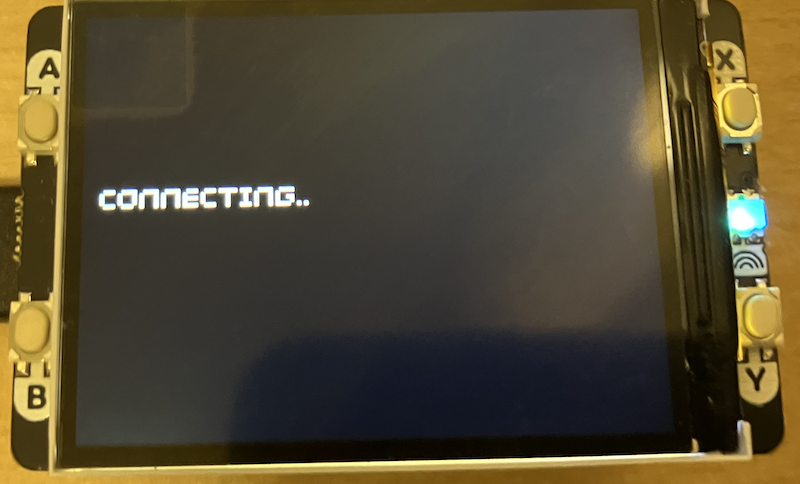
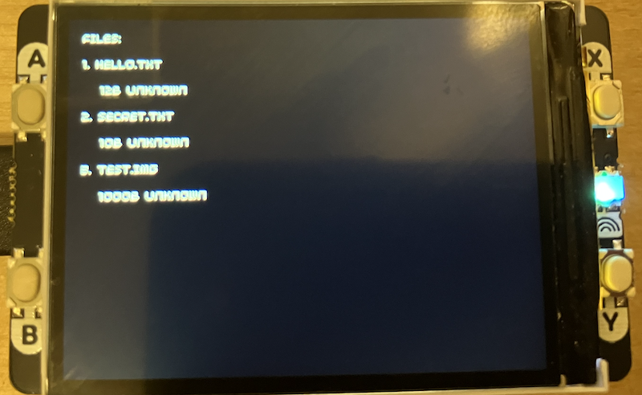

## Projects using a File Server and Client

Build on the client-server solution to be more versatile. Improve on debugging
and make more roboust solutions.

### Wireless Sensor Networks

*Environmental Monitoring Station*
Deploy multiple Pico clients with sensors (temperature, humidity, air quality)
around your home or greenhouse. Each client connects to a central Pico server
with SD card that logs all readings. The server could display real-time graphs
on its display and store historical data for analysis. Perfect for tracking
conditions in different rooms or monitoring plant growth environments.

*Weather Station Network*
Build distributed weather sensors (rain gauge, wind speed, temperature) that
report to a central logging station. The server stores daily summaries to SD
card and displays current conditions. Since Picos are low-power, you could run
clients on solar panels for outdoor deployment.

*Home Security System*
Multiple Pico clients with PIR motion sensors or door/window reed switches. When
triggered, they connect to the server and report the event with timestamp. Server
logs everything to SD card and displays alerts on the screen. You could add a
buzzer for audible alarms.

### Data Collection & Logging

*Multi-Point Temperature Logger*
Industrial/workshop application where you monitor temperatures at multiple points
(3D printer enclosure, resin curing station, electronics bench). Clients send
readings every few minutes, server stores to SD with timestamps. Great for
understanding thermal patterns or compliance monitoring.

*Machine Runtime Tracker*
Attach Pico clients to various machines/tools with current sensors. They track
when equipment is running and report usage statistics to the server. Server
generates daily reports showing machine utilization--useful for workshop management
or predictive maintenance.

*Solar Panel Monitor*
Multiple clients measure voltage/current from different solar panels or battery banks.
Server aggregates the data to SD card and displays total system performance. Helps
identify underperforming panels or track energy generation patterns.

### Industrial/Workshop Applications

*Inventory Scanner System*
Clients act as wireless barcode scanner stations around a warehouse. When items are
scanned, data is sent to the server which maintains the inventory database on SD card.
Display shows current stock levels. Much cheaper than commercial wireless scanners.

*Quality Control Station*
Production line setup where clients at different stations collect test data (measurements,
pass/fail status). Server aggregates everything into production reports stored on SD.
Display shows real-time yield statistics.

*Wireless Gauge Reader*
Place Pico clients with camera modules near analog gauges (pressure, temperature, flow).
They capture images and send them to the server which stores them with timestamps.
Later you can review historical gauge readings without physically visiting each gauge.

### Scientific/Educational Projects

*Multi-Point Vibration Monitor*
Clients with accelerometers placed around a structure or machine. They detect vibration
patterns and send data to the server for FFT analysis. Store results to SD card. Useful
for machinery diagnostics or structural health monitoring.

*Garden Soil Moisture Network*
Multiple clients with soil moisture sensors in different garden beds or zones. Server
logs moisture levels and can trigger irrigation systems. Display shows which zones need
watering. Data stored to SD helps understand watering patterns over seasons.

*Aquarium/Pond Monitoring Array*
Clients measure pH, temperature, dissolved oxygen at different depths or locations. Server
maintains historical logs on SD card and displays current parameters. Alerts when conditions
go out of range.

### Practical Home Automation

*Smart Power Monitor*
Clients with current sensors on different circuits or appliances. They report power
consumption to the server which logs everything to SD. Display shows real-time usage
and daily totals. Helps identify energy hogs.

*HVAC Performance Logger*
Clients measure temperatures at supply and return vents throughout the house. Server
logs the data and calculates system efficiency. Helps identify ductwork problems or
imbalanced zones.

*Freezer/Refrigerator Guardian*
Clients inside multiple freezers/fridges monitoring temperature. If temperature rises
(power failure, door ajar), they connect to the server which sounds an alarm. All
events logged to SD with timestamps.

### Image/Display Applications

*Wireless Digital Picture Frames*
Server stores images on SD card. Multiple client Picos with displays request and
display images. You could build a synchronized slideshow system or let each client
display different content.

*Status Dashboard Network*
Clients are info displays around your facility (workshop, office, lab). Server pushes
updates showing production status, weather, calendar, or system health. Each client
displays relevant information for its location.

*Remote Camera System*
Clients with camera modules capture images on triggers (motion, timer, button press)
and send them to the server. Server stores all images to SD with timestamps. Display
shows most recent captures. Budget security camera system.

### Key Advantages

1. *No Internet Required* - Works completely offline, perfect for remote locations
2. *Low Power* - Clients can sleep between transmissions, battery operation feasible
3. *SD Card Storage* - Huge capacity for long-term data logging
4. *Simple Protocol* - Easy to extend with new commands or data types
5. *Visual Feedback* - Display Pack makes debugging and monitoring intuitive
6. *Cost-Effective* - Much cheaper than commercial wireless sensor systems

The most practical projects leverage:
- The wireless communication for distributed sensors
- SD card storage for long-term logging (months/years of data)
- The display for immediate visual feedback
- Low cost for deploying multiple nodes
- Pico's low power modes for battery operation

