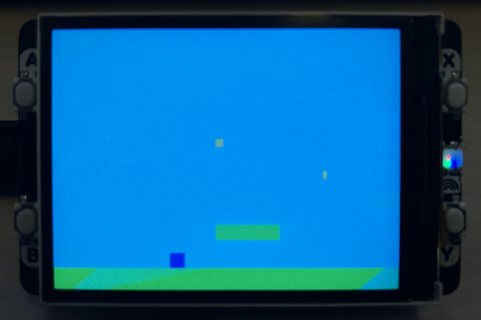

## ECS Platform Game for Raspberry Pi Pico with Display Pack 2.0

An incomplete Mario-style platformer game built using Entity-Component-System
(ECS) architecture in C for the Raspberry Pi Pico/Pico 2/Pico 2W with
Pimoroni Display Pack 2.0.

The Project here is naturally to make it better. To get it to work. There
are timing issues with the display, flickering issues, jumping may cause
glitches, and falling through the ground .. and many other problems!

Starting Features:
- *Pure ECS Architecture*: Follows the design principles from ECSC.md
- *Smooth 30 FPS gameplay* with DMA-accelerated rendering
- *Mario-style mechanics*:
  - Double jump
  - Enemy stomping
  - Coin collection
  - Platform collision detection
  - Camera following
  - Lives system
  - Score tracking
- *Multiple entity types*: Player, enemies, platforms, collectibles
- *Modular system design*: Easy to extend with new systems and components

Assumptions:
- Raspberry Pi Pico, Pico 2, or Pico 2W (prefably the later series)
- Pimoroni Display Pack 2.0 (320x240 ST7789 display with buttons)


### Controls

| Button | Action |
|--------|--------|
| A | Move Left |
| B | Move Right |
| Y | Jump (press again in air for double jump) |
| X | Restart game (when game over) |


### Project Structure

```
platformer_game/
├── CMakeLists.txt      # Build configuration
├── main.c              # Main application and game loop
├── game.h              # ECS definitions and game structures
├── game.c              # ECS implementation and game logic
├── sprites.h           # Sprite bitmap definitions
├── display.h           # Display driver header
├── display.c           # Display driver implementation
└── README.md           # This file
```


### ECS Architecture

#### Components

- *PositionComponent*: Entity position in world space
- *VelocityComponent*: Movement velocity
- *SpriteComponent*: Visual representation
- *PlayerComponent*: Player-specific state (lives, jumps)
- *ColliderComponent*: Collision box
- *PhysicsComponent*: Physics properties (gravity, friction)
- *EnemyComponent*: Enemy AI state (patrol range)
- *PlatformComponent*: Platform properties
- *CollectibleComponent*: Collectible items (coins)

#### Systems (Update Order)

1. *InputSystem*: Reads button input and controls player
2. *EnemyAISystem*: Updates enemy patrol behavior
3. *PhysicsSystem*: Applies gravity and updates positions
4. *CollisionSystem*: Detects and resolves collisions
5. *RenderSystem*: Draws everything to the display


### Building

#### Prerequisites

1. Install the Pico SDK:
```bash
git clone https://github.com/raspberrypi/pico-sdk.git
cd pico-sdk
git submodule update --init
export PICO_SDK_PATH=/path/to/pico-sdk
```

2. Install CMake and ARM toolchain:
```bash
sudo apt install cmake gcc-arm-none-eabi libnewlib-arm-none-eabi
```


#### Compile

```bash
mkdir build
cd build
cmake ..
make
```

This generates `platformer.uf2` which you can drag-and-drop onto your Pico in BOOTSEL mode.


### Game Design

#### Level Layout

The game features:
- Ground platforms extending across the bottom
- Floating platforms at various heights
- Enemies patrolling between points
- Collectible coins scattered throughout
- Camera that follows the player


#### Gameplay Mechanics

*Movement*: 
- Smooth acceleration and deceleration
- Friction when no input is provided

*Jumping*:
- Variable height jump (based on button press duration)
- Double jump capability
- Only resets when landing on ground

*Enemies*:
- Patrol between defined points
- Can be defeated by jumping on top
- Cause damage if touched from the side
- Award 100 points when defeated

*Collectibles*:
- Award 50 points each
- Disappear when collected

*Game Over*:
- Player starts with 3 lives
- Lose life when hit by enemy
- Game over when lives reach 0
- Press X to restart


### Extending the Game

#### Adding New Entity Types

1. Define a new component type in `game.h`:
```c
typedef struct {
    // Your data here
} MyComponent;
```

2. Add component type enum value:
```c
enum ComponentType {
    // ...
    CT_MY_COMPONENT
};
```

3. Create entities with your component in `game_create_level()`.

#### Adding New Systems

1. Define system struct in `game.h`:
```c
typedef struct {
    System base;
    // System-specific data
} MySystem;
```

2. Implement update function in `game.c`:
```c
void my_system_update(System* self, World* world, float dt) {
    int required[] = {CT_MY_COMPONENT};
    Array entities = world_query(world, required, 1);
    // Process entities...
    array_free(&entities);
}
```

3. Add system to world in `game_init()`.

#### Adding Sprite Bitmaps

Edit `sprites.h` to add your bitmap data:
```c
static const uint8_t my_sprite[16] = {
    0b00111100,
    0b01111110,
    // ... more rows
};
```

Then update the SpriteComponent to use it:
```c
sprite.bitmap = my_sprite;
```

You'll also need to modify the render system to draw bitmap sprites instead of solid rectangles.


### Performance Optimisations

The game is optimized for the Pico's 133MHz ARM Cortex-M0+:

- *DMA transfers* for large display updates
- *Component type indexing* for fast entity queries
- *Spatial partitioning* possible for larger worlds
- *Fixed-point math* can replace floats if needed


### Troubleshooting

*Display not initializing*:
- Check SPI connections
- Verify Display Pack is properly seated
- Check power supply is adequate

*Choppy framerate*:
- Reduce entity count
- Optimize collision detection
- Lower target FPS in main.c

*Buttons not responding*:
- Ensure buttons_init() is called
- Check buttons_update() is in main loop
- Verify pull-up resistors are enabled


### Future Enhancements

- [ ] Multiple levels with transitions
- [ ] Power-ups (invincibility, speed boost)
- [ ] Animated sprites
- [ ] Sound effects (via PWM buzzer)
- [ ] High score persistence (flash storage)
- [ ] Parallax scrolling background
- [ ] Boss battles
- [ ] Particle effects


## References

- [Pico SDK Documentation](https://raspberrypi.github.io/pico-sdk-doxygen/)
- [Entity-Component-System Pattern](https://en.wikipedia.org/wiki/Entity_component_system)
- [Game Programming Patterns](https://gameprogrammingpatterns.com/)



