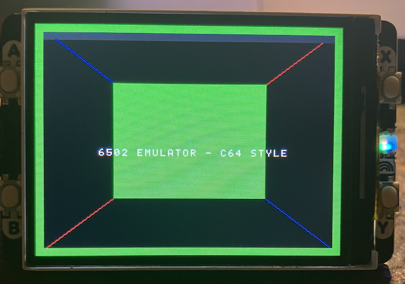

## Get the Pico 6502 Retro Computer Running ..


Start assembling the demo program (in assembly):
 
```bash
python asm.py demo.asm demo.bin -v
```

The output:

```bash
Pass1 L4: .org $8000
Pass1 L7: counter = $0020
Pass1 L8: color_idx = $0021
Pass1 L9: button_prev = $0022
Pass1 L11: start: @ $8000
Pass1 L27: clear_loop: @ $8016
Pass1 L43: title_loop: @ $8037
Pass1 L52: title_done: @ $8049
Pass1 L56: inst_loop: @ $804B
Pass1 L65: inst_done: @ $805D
Pass1 L69: colorbar_loop: @ $805F
Pass1 L78: colorbar_done: @ $8071
Pass1 L81: main_loop: @ $8071
Pass1 L87: draw_bar: @ $8078
Pass1 L104: skip_color_inc: @ $8093
Pass1 L125: check_b: @ $80B3
Pass1 L136: check_x: @ $80C4
Pass1 L147: check_y: @ $80D8
Pass1 L157: check_done: @ $80E9
Pass1 L166: no_clear: @ $80F7
Pass1 L179: counter_ok: @ $8108
Pass1 L191: counter_ok2: @ $811D
Pass1 L198: delay_outer: @ $8127
Pass1 L200: delay_inner: @ $8129
Pass1 L209: title_text: @ $8132
Pass1 L213: inst_text: @ $8134
Pass1 L217: colorbar_text: @ $8136
Assembled 380 bytes to demo.bin
```

We now have a file named `demo.bin`. Next convert the
binary to a header file for compiling with `main.c`:

```bash
python bin2header.py program.bin rom.h rom_data
```

The output:

```bash
Generated rom_data: 380 bytes as 'rom_data'
```

Then compile all the .c/.h files, and transfer the `.uf2`to the Pico.



#### First task is to construct the build scripts and ensure the toolchain is correctly configured.

After that, revise the code. The current text formatting is somewhat awkward? Improve the wording and add color changes to the text. Try your best in 6502 assembly.


### Assembly

Now the way to program our computer is very rudimentary through 6502 assembly.
The 6502 is an 8-bit microprocessor with a very small and clean instruction set.
It has three main registers:

* A  : Accumulator (most arithmetic and logic uses this)
* X  : Index register
* Y  : Index register

And a few important concepts:

* Memory is byte-addressed (0-65535)
* Most instructions work on the Accumulator
* Instructions are simple: load, store, add, subtract, jump, branch

Common instructions:

* `LDA`  Load Accumulator
* `STA`  Store Accumulator
* `LDX`, `LDY` Load X or Y
* `INX`, `INY` Increment X or Y
* `ADC`  Add with carry
* `JMP`  Jump
* `BRK`  Stop (on many systems)

Addressing example:

```
LDA #$10     ; immediate value 0x10
LDA $0200    ; load from memory address $0200
STA $0300    ; store to memory address $0300
```

Very simple program: store a value in memory.

```
        LDA #$42      ; load hex value 42 into A
        STA $0200     ; store A into memory address $0200
endless:
        JMP endless   ; pause kind of
```

Add two numbers:

```
        LDA #$05      ; A = 5
        ADC #$03      ; A = A + 3  -> A = 8
        STA $0200     ; store result
endless:
        JMP endless   ; pause kind of
```

Count from 0 to 5 using X:

```
        LDX #$00      ; X = 0
loop:
        STX $0200     ; store X in memory
        INX           ; X = X + 1
        CPX #$06      ; compare X with 6
        BNE loop      ; if not equal, repeat
endless:
        JMP endless   ; pause kind of
```

That is essentially 6502 assembly in its smallest form:
load values, modify registers, store results, and use
branches to create loops.

Study further `demo.asm`.

