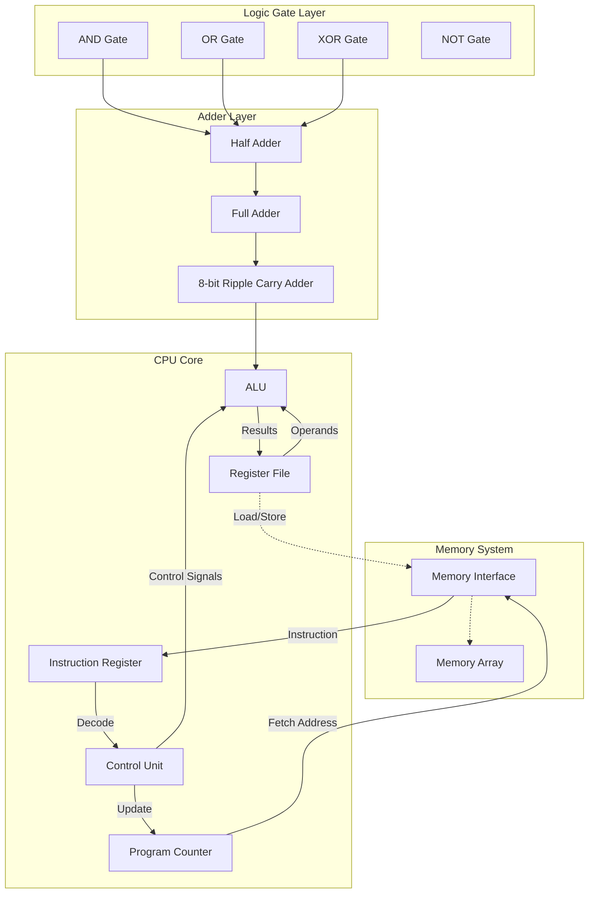

## Enhanced CPU Simulator

We address the missing parts from the simplified simulator .. 

At a high level:
1. *Fetch*: Get the next instruction from memory, using the program counter (PC).
2. *Decode*: Interpret the instruction, deciding what needs to be done.
3. *Execute*: Carry out the operation, which may involve arithmetic, moving data, or changing program flow.

This implementation demonstrates how a CPU is built from the ground up, starting with fundamental
logic gates and progressing through increasingly complex components.

```
Logic Gates (AND, OR, XOR, NOT)
    ↓
Half Adders & Full Adders
    ↓
8-bit Ripple Carry Adder
    ↓
8-bit Bitwise Operations
    ↓
Arithmetic Logic Unit (ALU)
    ↓
Complete CPU with Instruction Set
```


### CPU Components in Detail

#### Program Counter (PC)
In the code: `vm->pc`

- Always points to the next instruction in memory
- Automatically incremented by 2 after `cpu_fetch()` (for 16-bit instructions)
- Can be overridden by jump and branch instructions

#### Instruction Register (IR)
In the code: `vm->ir`

- Holds the current 16-bit instruction after fetch
- Filled by `cpu_fetch()` with the instruction from memory[pc]
- Used by decode logic to extract opcode and operands

#### Register File
In the code: `vm->registers[4]`

- Four 8-bit general-purpose registers (R0-R3)
- Used for temporary storage of operands and results
- Accessed by decoded register fields from instructions

#### Arithmetic Logic Unit (ALU)
Implemented in: `enhanced_alu()`

The ALU performs all arithmetic and logical operations:
- *Arithmetic*: ADD, SUB (using ripple carry adder)
- *Logical*: AND, OR, XOR, NOT (built from logic gates)
- *Shift*: SHL, SHR with carry flag support
- *Flags*: Zero, Carry, Overflow, Negative

#### Control Unit
Distributed between `cpu_decode_and_execute()`

- Decodes instructions using `decode_instruction()`
- Coordinates data flow between components
- Manages PC updates and conditional branching

#### Memory Interface
Via helper functions:
```c
mem_read(vm, addr);
mem_write(vm, addr, value);
```
Provides abstraction layer between CPU and memory system.


### Instruction Set Architecture (ISA)

#### 16-bit Instruction Encoding

Instructions are encoded as 16-bit words with the following format:

```
Bits 15-8: Opcode
Bits 7-6:  Register A
Bits 5-4:  Register B (for two-register ops)
Bits 7-0:  Immediate/Address (for memory ops)
```

#### Instruction Set

| Opcode | Mnemonic | Description | Format |
|--------|----------|-------------|---------|
| 0x00 | ADD R1, R2 | R1 = R1 + R2 | Two-register |
| 0x01 | SUB R1, R2 | R1 = R1 - R2 | Two-register |
| 0x02 | AND R1, R2 | R1 = R1 & R2 | Two-register |
| 0x03 | OR R1, R2  | R1 = R1 \| R2 | Two-register |
| 0x04 | XOR R1, R2 | R1 = R1 ^ R2 | Two-register |
| 0x05 | NOT R1     | R1 = ~R1 | Single-register |
| 0x06 | SHL R1     | R1 = R1 << 1 | Single-register |
| 0x07 | SHR R1     | R1 = R1 >> 1 | Single-register |
| 0x08 | LOAD R1, addr | R1 = memory[addr] | Register-memory |
| 0x09 | STORE R1, addr | memory[addr] = R1 | Register-memory |
| 0x0A | JMP addr   | PC = addr | Unconditional jump |
| 0x0B | JZ addr    | if (zero) PC = addr | Conditional jump |
| 0x0C | JC addr    | if (carry) PC = addr | Conditional jump |
| 0xFF | HALT       | Stop execution | Control |

#### Status Flags

The ALU sets four flags based on operation results:
- *Zero (Z)*: Result equals zero
- *Carry (C)*: Arithmetic carry/borrow occurred
- *Overflow (O)*: Signed arithmetic overflow
- *Negative (N)*: Result has MSB set


### Implementation Architecture




### Implementation Features


#### 1. Gate-Level Implementation
All operations as before are built from fundamental logic gates:
```c
bool and_gate(bool a, bool b) { return a && b; }
bool or_gate(bool a, bool b)  { return a || b; }
bool xor_gate(bool a, bool b) { return a != b; }
bool not_gate(bool a)         { return !a; }
```

#### 2. Adder Chain Construction
8-bit arithmetic uses a chain of full adders:
```c
AdderResult ripple_carry_adder_8bit(uint8_t a, uint8_t b, bool carry_in) {
    // Chain 8 full adders with carry propagation
    for (int i = 0; i < 8; i++) {
        FullAdderResult fa = full_adder(bit_a, bit_b, carry);
        // ... propagate carry to next stage
    }
}
```

#### 3. Instruction Decoding
16-bit instructions are decoded into component fields:
```c
typedef struct {
    uint8_t opcode;
    uint8_t reg_a;
    uint8_t reg_b;
    uint8_t immediate;
    uint8_t address;
} DecodedInstruction;
```

#### 4. Automatic PC Management
PC is automatically incremented unless overridden:
```c
uint16_t cpu_fetch(VM *vm) {
    uint16_t instruction = mem_read(vm, vm->pc) | (mem_read(vm, vm->pc + 1) << 8);
    vm->ir = instruction;
    vm->pc += 2;  // Auto-increment for 16-bit instructions
    return instruction;
}
```


#### PC Update is Automatic
Unlike many other educational simulators, this implementation automatically increments the PC during fetch.
Branch and jump instructions override this by directly setting `vm->pc` to the target address.

#### Instructions as Binary Numbers
Instructions are genuine 16-bit binary encodings, not symbolic representations. The encoding macros help
construct proper bit patterns:
```c
#define ENCODE_INSTRUCTION(opcode, reg_a, reg_b) \
    (((opcode) << 8) | ((reg_a) << 6) | ((reg_b) << 4))
```

#### Memory Interface Abstraction
The CPU accesses memory through helper functions rather than directly accessing arrays. This abstraction
allows for future enhancements like memory mapping, caching, or protection mechanisms.

#### Gate-Level Arithmetic
Arithmetic operations are implemented using actual logic gate functions rather than C operators, demonstrating
how hardware performs these operations at the transistor level.


### Program Execution

1. *Initialisation*: `init_vm()` clears all registers and memory
2. *Program Loading*: Instructions are placed in memory as binary words
3. *Execution Loop*: `run_vm()` performs fetch-decode-execute cycles:
   - *Fetch*: Read 16-bit instruction from memory[PC]
   - *Decode*: Extract opcode and operands from instruction
   - *Execute*: Perform operation using ALU or control logic
   - *Update*: Set flags, update registers, advance PC
4. *Termination*: Execution stops on HALT instruction or cycle limit

### Example

```c
// Load values from memory
LOAD R0, 100    // R0 = memory[100]
LOAD R1, 101    // R1 = memory[101]

// Arithmetic operations
ADD R0, R1      // R0 = R0 + R1
SUB R0, R1      // R0 = R0 - R1

// Conditional branching
JZ target       // Jump if R0 == 0

..
````

NOT FINISHED
