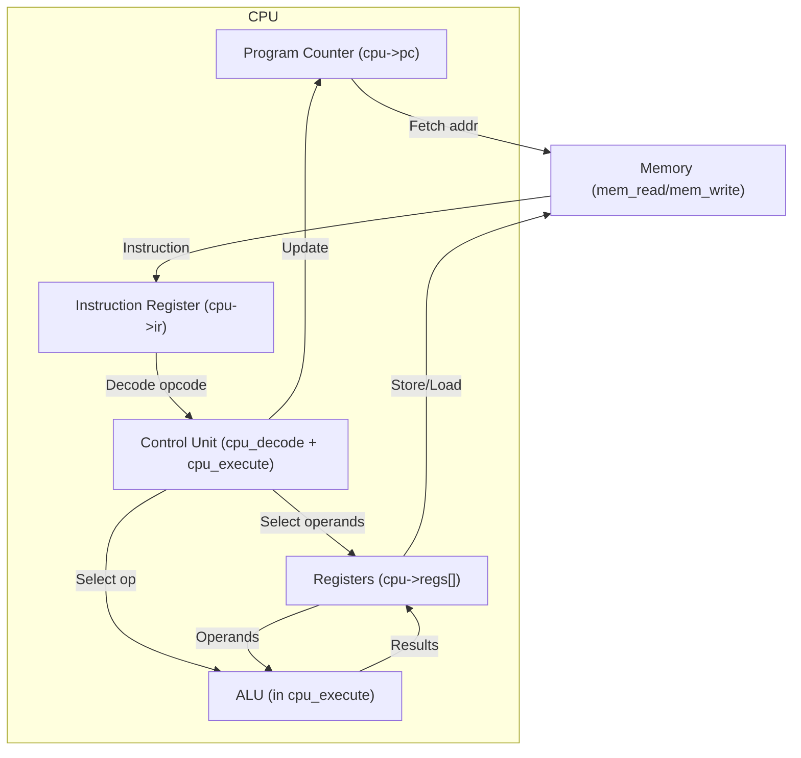

## Introduction to the CPU

A Central Processing Unit (CPU) is the core of a computer system.
It executes instructions from memory by going through a cycle commonly
described as fetch–decode–execute.

At a high level:
1. Fetch. Get the next instruction from memory, using the program counter (PC).
2. Decode. Interpret the instruction, deciding what needs to be done.
3. Execute. Carry out the operation, which may involve arithmetic, moving data,
   or changing program flow.

This cycle repeats continuously, forming the basis of all computation.


### CPU Components in General

- Program Counter (PC): Holds the address of the next instruction.

- Instruction Register (IR): Holds the current instruction after it
  has been fetched.

- Registers: Small, fast memory locations inside the CPU for temporary
  storage (operands, results).

- Arithmetic Logic Unit (ALU): Performs arithmetic (add, subtract,
  multiply) and logical (and, or, compare) operations.

- Control Unit: Directs the flow of operations: it decodes the
  instruction and activates the right parts of the CPU.

- Memory: Not part of the CPU proper, but it stores both instructions
  and data.


### How This Maps to *This* Code

#### Program Counter

In the code:
```c
cpu->pc
```
Always points to the next instruction in memory. After `cpu_fetch()`,
it is incremented unless the instruction is a jump or branch.

#### Instruction Register (IR)

In the code:
```c
cpu->ir
```
Filled by `cpu_fetch()` with whatever instruction was at the address `cpu->pc`.

#### Registers

In the code:
```c
cpu->regs[...]
```
An array representing the register file. These are used in instructions
like `ADD r1, r2`.

#### ALU

Not a separate function, but *embedded* in `cpu_execute()`, typically as a 
witch statement handling arithmetic and logic instructions (`ADD`, `SUB`, `CMP`, etc.).


#### Control Unit

Spread between `cpu_decode()` and `cpu_execute()`. In reality, your decode step
is the switch (opcode) logic, and control is just the program deciding which case to run.


####  Memory Interface

Via helper functions:
```c
mem_read(mem, addr);
mem_write(mem, addr, value);
```
which connect the CPU to the simulated memory.





### Subtle Points on What You Might Have to Change .. Read: Projects!

- *PC update is automatic*: In the code, after fetching, `cpu->pc` is incremented.
  Branches or jumps overwrite it with a new address.

- *Instruction = number*: In real CPUs, an instruction is a binary word.
  In the code, it’s often just an int where bits encode the opcode and operands.

- Control flow is simplified: Real hardware has microcoded or pipelined
  control units; your code uses structured C logic (switch),
  which is easier to follow but conceptually the same.

