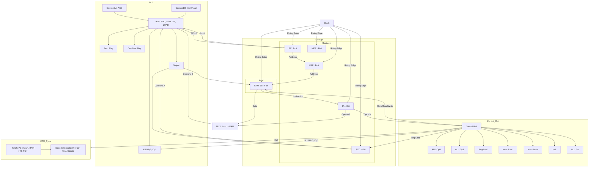

## Gate-Level CPU and ALU Simulator Components

The following points summarise the key components of the gate-level CPU and ALU simulator,
with corresponding code snippets to illustrate their implementation. Each component is built
from basic logic gates (NOT, AND, OR, XOR) to emulate hardware behaviour in a 4-bit architecture,
with a focus on fetch-decode-execute cycles and gate-level memory.

- *Logic Gates*: The foundation of the simulator, these functions perform single-bit operations.
  NOT inverts a bit, AND requires both inputs to be 1, OR needs at least one 1, and XOR outputs 1
  for differing inputs. These are used in all higher-level circuits.
  ```c
  uint8_t gate_not(uint8_t a) { return ~a & 1; }
  uint8_t gate_and(uint8_t a, uint8_t b) { return (a & b) & 1; }
  uint8_t gate_or(uint8_t a, uint8_t b) { return (a | b) & 1; }
  uint8_t gate_xor(uint8_t a, uint8_t b) { return (a ^ b) & 1; }
  ```

- *Adders*: Arithmetic starts with half adders (sum via XOR, carry via AND) and full adders (two
  half adders plus OR for carry). A ripple-carry adder chains full adders for 4-bit addition,
  tracking overflow.
  ```c
  HalfAdderResult half_adder(uint8_t a, uint8_t b) {
      HalfAdderResult res = {gate_xor(a, b), gate_and(a, b)};
      return res;
  }
  FullAdderResult full_adder(uint8_t a, uint8_t b, uint8_t cin) {
      HalfAdderResult ha1 = half_adder(a, b);
      HalfAdderResult ha2 = half_adder(ha1.sum, cin);
      FullAdderResult res = {ha2.sum, gate_or(ha1.carry, ha2.carry)};
      return res;
  }
  void adder(uint8_t x, uint8_t y, uint8_t* result, uint8_t* overflow) {
      uint8_t carry = 0;
      *result = 0;
      for (int i = 0; i < WORD_SIZE; i++) {
          FullAdderResult fa = full_adder((x >> i) & 1, (y >> i) & 1, carry);
          *result |= (fa.sum << i);
          carry = fa.carry;
      }
      *overflow = carry;
  }
  ```



```mermaid
graph TD
    subgraph Basic_Gates
        NOT[NOT Gate: Inverts bit]
        AND[AND Gate: 1 if both inputs 1]
        OR[OR Gate: 1 if any input 1]
        XOR[XOR Gate: 1 if inputs differ]
    end

    subgraph Half_Adder
        HA_Sum[Sum: XOR]
        HA_Carry[Carry: AND]
        AND --> HA_Carry
        XOR --> HA_Sum
        InputA[Input A] --> HA_Sum
        InputA --> HA_Carry
        InputB[Input B] --> HA_Sum
        InputB --> HA_Carry
    end

    subgraph Full_Adder
        FA_HA1[Half Adder 1: A, B]
        FA_HA2[Half Adder 2: Sum1, Cin]
        FA_OR[OR: Carry1, Carry2]
        AND --> FA_HA1
        XOR --> FA_HA1
        AND --> FA_HA2
        XOR --> FA_HA2
        OR --> FA_OR
        FA_A[Input A] --> FA_HA1
        FA_B[Input B] --> FA_HA1
        FA_Cin[Carry In] --> FA_HA2
        FA_HA1 -->|Sum| FA_HA2
        FA_HA1 -->|Carry| FA_OR
        FA_HA2 -->|Carry| FA_OR
        FA_HA2 --> FA_Sum[Sum]
        FA_OR --> FA_Carry[Carry Out]
    end

    subgraph 4_Bit_Adder
        FA0[Full Adder 0]
        FA1[Full Adder 1]
        FA2[Full Adder 2]
        FA3[Full Adder 3]
        A0[Bit 0 A] --> FA0
        B0[Bit 0 B] --> FA0
        Cin0[0] --> FA0
        FA0 -->|Carry| FA1
        A1[Bit 1 A] --> FA1
        B1[Bit 1 B] --> FA1
        FA1 -->|Carry| FA2
        A2[Bit 2 A] --> FA2
        B2[Bit 2 B] --> FA2
        FA2 -->|Carry| FA3
        A3[Bit 3 A] --> FA3
        B3[Bit 3 B] --> FA3
        FA0 --> Sum0[Bit 0 Sum]
        FA1 --> Sum1[Bit 1 Sum]
        FA2 --> Sum2[Bit 2 Sum]
        FA3 --> Sum3[Bit 3 Sum]
        FA3 --> Ovf[Overflow]
        FA0 --> FA_HA1
        FA0 --> FA_HA2
        FA0 --> FA_OR
        FA1 --> FA_HA1
        FA1 --> FA_HA2
        FA1 --> FA_OR
        FA2 --> FA_HA1
        FA2 --> FA_HA2
        FA2 --> FA_OR
        FA3 --> FA_HA1
        FA3 --> FA_HA2
        FA3 --> FA_OR
    end

    subgraph Multiplexer_2to1
        MUX_NOT[NOT: Invert Select]
        MUX_AND1[AND: Input 0 & ~Select]
        MUX_AND2[AND: Input 1 & Select]
        MUX_OR[OR: Combine ANDs]
        NOT --> MUX_NOT
        AND --> MUX_AND1
        AND --> MUX_AND2
        OR --> MUX_OR
        MUX_In0[Input 0] --> MUX_AND1
        MUX_In1[Input 1] --> MUX_AND2
        MUX_Sel[Select] --> MUX_NOT
        MUX_Sel --> MUX_AND2
        MUX_NOT --> MUX_AND1
        MUX_AND1 --> MUX_OR
        MUX_AND2 --> MUX_OR
        MUX_OR --> MUX_Out[Output]
    end
```

- *ALU Operations*: The ALU performs ADD, AND, OR, or pass-through (for LOAD), selected by
  two control bits. It processes 4-bit inputs, sets zero and overflow flags, and is built
  from gate-based adders and bitwise operations.
  ```c
  ALUResult alu(uint8_t a, uint8_t b, uint8_t op0, uint8_t op1) {
      ALUResult res = {0, 0, 0};
      if (!op1 && !op0) adder(a, b, &res.result, &res.ovf);
      else if (!op1 && op0) res.result = bitwise_and(a, b);
      else if (op1 && !op0) res.result = bitwise_or(a, b);
      else res.result = b;  // LOAD
      res.zero = (res.result == 0);
      return res;
  }
  uint8_t bitwise_and(uint8_t x, uint8_t y) {
      uint8_t result = 0;
      for (int i = 0; i < WORD_SIZE; i++) result |= (gate_and((x >> i) & 1, (y >> i) & 1) << i);
      return result;
  }
  ```

- *Registers*: Each register is an array of D flip-flops (DFFs), storing 4 bits. DFFs capture input
  on a clock edge if enabled, simulated behaviourally but gate-compatible. Registers include PC, ACC, IR, MAR, and MDR.
  ```c
  typedef struct { uint8_t q; } DFF;
  void dff_clock(DFF* ff, uint8_t d, uint8_t clk, uint8_t enable) {
      if (clk && enable) ff->q = d;
  }
  typedef struct {
      DFF bits[WORD_SIZE];
      uint8_t value;
  } Register;
  void reg_load(Register* reg, uint8_t data, uint8_t load, uint8_t clk) {
      if (load) {
          for (int i = 0; i < WORD_SIZE; i++) dff_clock(&reg->bits[i], (data >> i) & 1, clk, 1);
          reg->value = reg_read(reg);
      }
  }
  ```

- *RAM*: Memory consists of 16 4-bit registers, with a gate-based address decoder selecting one for
  read/write. Reading outputs the selected register’s value; writing updates it on the clock edge.
  ```c
  typedef struct { Register words[MEM_SIZE]; } RAM;
  void decode_address(uint8_t addr, uint8_t* decoder) {
      for (int i = 0; i < MEM_SIZE; i++) {
          uint8_t match = 1;
          for (int b = 0; b < 4; b++) match = gate_and(match, ((addr >> b) & 1) == ((i >> b) & 1));
          decoder[i] = match;
      }
  }
  uint8_t ram_read(RAM* ram, uint8_t addr) {
      uint8_t dec[MEM_SIZE];
      decode_address(addr, dec);
      uint8_t out = 0;
      for (int i = 0; i < MEM_SIZE; i++) if (dec[i]) out = reg_read(&ram->words[i]);
      return out;
  }
  void ram_write(RAM* ram, uint8_t addr, uint8_t data, uint8_t write, uint8_t clk) {
      uint8_t dec[MEM_SIZE];
      decode_address(addr, dec);
      for (int i = 0; i < MEM_SIZE; i++) reg_load(&ram->words[i], data, gate_and(dec[i], write), clk);
  }
  ```

- *Control Unit*: Generates signals (ALU ops, register load, memory read/write, halt) from the 2-bit
  opcode using gates. For example, ADD (00) sets ALU to add and enables ACC load.
  ```c
  ControlSignals control_unit(uint8_t opcode) {
      ControlSignals sig = {0};
      uint8_t op0 = opcode & 1;
      uint8_t op1 = (opcode >> 1) & 1;
      sig.alu_op0 = op0;
      sig.alu_op1 = op1;
      sig.reg_load = gate_not(gate_and(op1, op0));
      sig.mem_read = gate_and(op1, op0);
      sig.mem_write = 0;
      sig.halt = gate_and(op1, op0);
      sig.alu_src = sig.mem_read;
      return sig;
  }
  ```

- *CPU Cycle*: Each cycle fetches (PC to MAR, RAM to IR, PC++), then decodes and executes (ALU operation,
  update ACC/flags, possible memory write). HALT stops the cycle.
  ```c
  void fetch() {
      uint8_t pc_val = reg_read(&pc);
      reg_load(&mar, pc_val, 1, clk);
      uint8_t instr = ram_read(&ram, reg_read(&mar));
      reg_load(&ir, instr, 1, clk);
      uint8_t pc_inc, ovf;
      adder(pc_val, 1, &pc_inc, &ovf);
      reg_load(&pc, pc_inc, 1, clk);
  }
  int decode_execute() {
      uint8_t instr = reg_read(&ir);
      uint8_t opcode = (instr >> 2) & 3;
      uint8_t operand = instr & 3;
      ControlSignals sig = control_unit(opcode);
      if (sig.halt) return 1;
      uint8_t alu_b = sig.alu_src ? ram_read(&ram, operand) : operand;
      ALUResult alu_res = alu(reg_read(&acc), alu_b, sig.alu_op0, sig.alu_op1);
      if (sig.mem_write) ram_write(&ram, operand, reg_read(&acc), 1, clk);
      if (sig.reg_load) {
          reg_load(&acc, alu_res.result, 1, clk);
          zero_flag = alu_res.zero;
          ovf_flag = alu_res.ovf;
      }
      return 0;
  }
  ```




- *Program Execution*: The sample program (ADD 1, AND 3, OR 2, HALT) runs in three cycles, producing
  ACC=1, 1, 3, with JSON output capturing all states for emulator visualisation.
  ```c
  void load_program() {
      ram_write(&ram, 0, 0b0001, 1, 1);  // ADD 1
      ram_write(&ram, 1, 0b0111, 1, 1);  // AND 3
      ram_write(&ram, 2, 0b1010, 1, 1);  // OR 2
      ram_write(&ram, 3, 0b1100, 1, 1);  // HALT
  }
  ```

- *JSON Output*: Each cycle’s state (PC, ACC, flags, IR, MAR, control signals, memory) is logged in
  JSON, with added instruction names and binary values for emulator compatibility.
  ```c
  printf("    \"instruction\": \"%s %d\",\n", opcode == 0 ? "ADD" : opcode == 1 ? "AND" : opcode == 2 ? "OR" : "HALT", instr & 3);
  printf("    \"acc_binary\": \"%s\",\n", acc_bin);
  ```

- *HTML/JS Emulator*: A secondary component, the emulator loads the JSON to display cycle states in a
  browser table, with buttons to step through cycles, showing decimal/binary values and instructions.
  It’s a visualisation tool, not core to the gate-level design.
  ```html
  <table id="stateTable">
      <tr><th>Register/Flag</th><th>Value</th><th>Binary</th></tr>
  </table>
  <script>
      function updateDisplay() {
          const cycleData = data[currentCycle];
          document.getElementById('instrDisplay').innerText = cycleData.instruction;
          // Table updates with binary and decimal values
      }
  </script>
  ```

