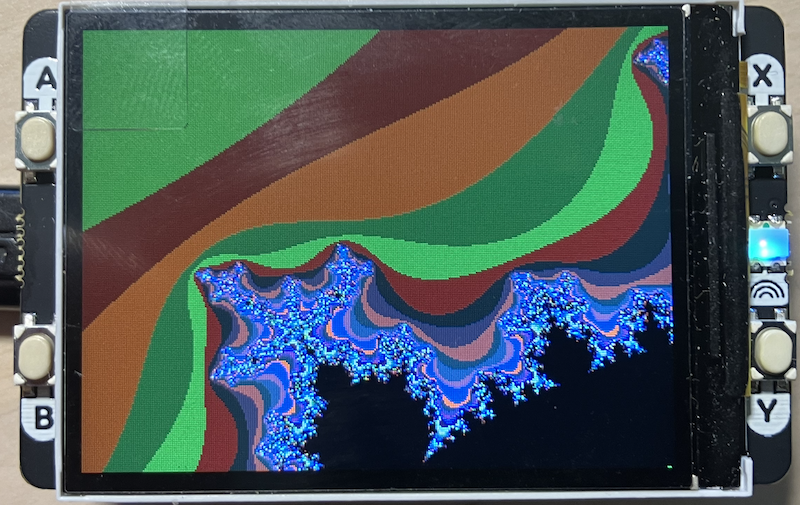

## Mandelbrot Set Renderer (Single Core)

Interactive Mandelbrot set explorer for Raspberry Pi Pico with display pack.


### Features

- Real-time Mandelbrot set rendering at 240x240 resolution
- 64 iteration depth with smooth color gradients
- Interactive zoom and pan controls
- Single-core rendering (baseline performance)


### Controls

- *Button A*: Zoom in (1.5x)
- *Button B*: Zoom out (1.5x)
- *Button X*: Pan up
- *Button Y*: Pan down


### Technical Details

- *Resolution*: 240x240 pixels
- *Color depth*: RGB565 (16-bit color)
- *Max iterations*: 64
- *Rendering*: Sequential, single-threaded
- *Memory*: ~115KB framebuffer


### Performance

Typical render time: *~4-8 seconds* per frame
(depending on zoom level and iteration complexity)


### How It Works

The renderer maps screen pixels to points on the complex plane
and iterates the Mandelbrot function `z = z² + c` until either:
1. The magnitude exceeds 2 (escapes), or
2. MAX_ITERATIONS is reached (part of the set)

The number of iterations determines the pixel color using a smooth gradient function.


### Navigation Tips

- Start at the default view to see the full Mandelbrot set
- Zoom in on the interesting boundary regions for detailed fractals
- The set is symmetric across the real axis
- Try zooming into the "valleys" between bulbs for intricate patterns


### Compilation

```bash
cmake -B build
cmake --build build
```

Flash `mandelbrot.uf2` to your Pico in BOOTSEL mode.
