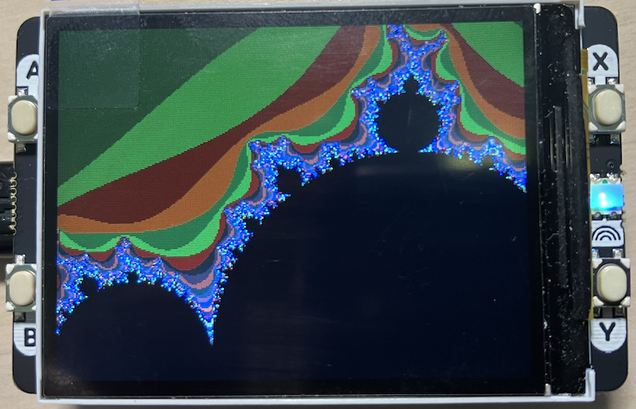

## Mandelbrot Set Renderer (Dual Core)

Interactive Mandelbrot set explorer for Raspberry Pi Pico with
display pack, utilizing *both CPU cores* for parallel rendering.


### Features

- Real-time Mandelbrot set rendering at 240x240 resolution
- 64 iteration depth with smooth color gradients
- Interactive zoom and pan controls
- *Dual-core parallel rendering* for ~2x performance boost
- Synchronized multi-core computation using Pico SDK primitives


### Controls

- *Button A*: Zoom in (1.5x)
- *Button B*: Zoom out (1.5x)
- *Button X*: Pan up
- *Button Y*: Pan down


### Technical Details

- *Resolution*: 240x240 pixels
- *Color depth*: RGB565 (16-bit color)
- *Max iterations*: 64
- *Rendering*: Parallel, dual-threaded
  - *Core 0*: Renders top half (lines 0-119)
  - *Core 1*: Renders bottom half (lines 120-239)
- *Memory*: ~115KB framebuffer (shared)
- *Synchronization*: Volatile flags + busy-wait coordination


### Performance

Typical render time: *~2-4 seconds* per frame

*Performance gain over single-core: ~2x faster*

Serial console shows timing for each render and
per-core progress indicators.


#### Multi-Core Architecture

1. *Core 0* (main):
   - Handles button input and UI
   - Renders top half of screen
   - Coordinates with Core 1 via shared state
   - Displays completed framebuffer

2. *Core 1* (worker):
   - Launched at startup via `multicore_launch_core1()`
   - Waits for render requests
   - Renders bottom half of screen
   - Signals completion to Core 0


#### Mandelbrot Algorithm

Maps screen pixels to the complex plane and iterates `z = z² + c` until:
1. Magnitude exceeds 2 (escapes → colored), or
2. MAX_ITERATIONS reached (in set → black)

Color is determined by escape velocity using a smooth polynomial gradient.


### Navigation Tips

- Explore the boundary between black (the set) and colored regions
- Interesting coordinates to try:
  - *Default*: (-0.5, 0.0) - Classic view
  - *Seahorse Valley*: (-0.75, 0.1) at high zoom
  - *Elephant Valley*: (0.28, 0.008) at high zoom
- The fractal is self-similar - zoom reveals infinite detail
- Watch the serial console for render timings


### Synchronization Details

The dual-core version uses a simple signaling protocol:
- `render_requested`: Core 0 → Core 1 (start rendering)
- `core1_done`: Core 1 → Core 0 (finished rendering)

Both cores share the same framebuffer but write to non-overlapping
regions (no mutex needed for pixel writes).


### Compilation

```bash
cmake -B build
cmake --build build
```

Flash `mandelbrot_dual.uf2` to your Pico in BOOTSEL mode.


*Note*: Connect via serial console (115200 baud) to see
detailed timing information and core activity logs.
