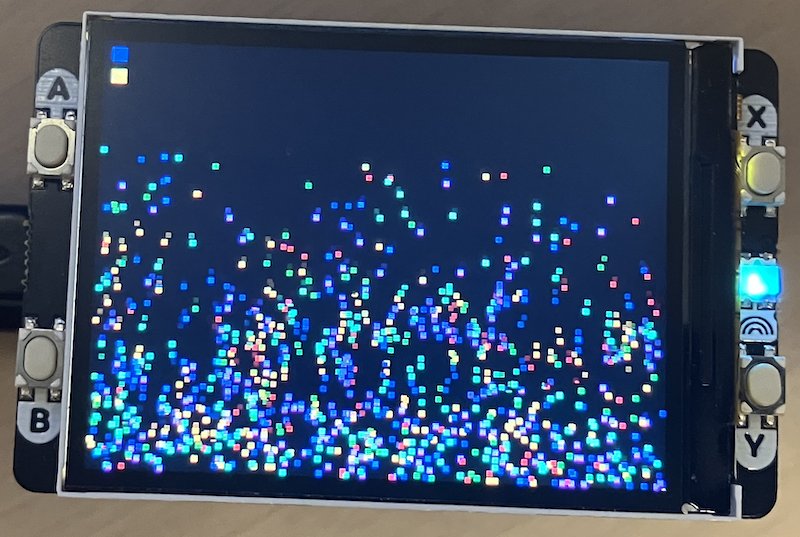

## Particle System

### Multiple cores

The main purpose of this code is to illustrate multiple cores. 

Main Loop: Core 0:
```
  1. Check button inputs
  2. Update first half of particles (0 to mid)
  3. Signal Core 1 to start
  4. Wait for Core 1 to finish
  5. Render all particles to framebuffer
  6. Draw status bar to framebuffer
  7. Blit entire framebuffer to display (one operation!)
  8. Update FPS counter
  9. Sleep 16ms (~60 FPS)
```

Core 1 Loop:
```
  1. Wait for signal from Core 0
  2. Update second half of particles (mid to end)
  3. Signal completion
  4. Repeat
```


### Simulation

A particle system is a computer graphics technique used to simulate complex visual
phenomena by managing large numbers of small, simple objects called particles.
Instead of trying to model something complicated like fire or smoke as a single entity,
you break it down into hundreds or thousands of tiny individual elements that each
follow simple rules.

Each particle typically has basic properties like position, velocity, color, and
sometimes a lifespan. The system updates all these particles every frame according
to physics rules like gravity, wind, or collision detection. When you see all these
particles moving together, they create the illusion of more complex phenomena like
flowing water, billowing smoke, or cascading sparkles.

Particle systems are widely used in games and visual effects for things like fire,
explosions, rain, snow, magic spells, and smoke trails. They're efficient because
each particle is simple, but when you have many of them working together, they can
create convincing and dynamic effects.

In this code specifically, you have a particle system where colored dots bounce
around the screen. Each particle has a position and velocity, and they all respond
to gravity pulling them down. When they hit the edges of the screen, they bounce
back with some energy loss. You can also apply wind forces to push them around.
The system uses both processor cores on the Pico to handle the physics calculations
for all 800 particles efficiently, and the double buffering ensures you see smooth,
flicker-free animation as they all move around.


#### Double Buffering (Eliminates Flickering)

The main improvement to the display driver is the addition of a framebuffer that
eliminates screen flickering:

```c
static uint16_t framebuffer[DISPLAY_WIDTH * DISPLAY_HEIGHT];  // 320x240 = 153,600 bytes
```

- All drawing operations is render to the `framebuffer` in RAM
- Once the entire frame is complete, it's transferred to the display in one operation
- The display never sees partial frames, eliminating flicker


### Framebuffer Helper Functions

Some inline functions for fast framebuffer manipulation:

```c
// Set a single pixel in framebuffer
fb_set_pixel(int x, int y, uint16_t color)

// Fill a rectangle in framebuffer
fb_fill_rect(int x, int y, int w, int h, uint16_t color)
```

#### Chunked DMA Transfer

The `display_blit_full()` handle large transfers reliably:

```c
const size_t chunk_size = 32768;  // 16K pixels at a time
// Sends framebuffer in manageable chunks
```


### Memory

Framebuffer:
- Size: 320 × 240 × 2 bytes = *153,600 bytes* (~150 KB)
- Location: Static RAM
- Pico has 264 KB RAM total, so this uses ~58% for the framebuffer.
  In testing the Pico 2 was used, which have 512 KB RAM.

Particle Array:
- 800 particles × ~20 bytes each = *~16 KB*

Total RAM Usage: ~170 KB (leaves ~94 KB free)


### Performance Tips

1. *Reduce particle count* if RAM is tight:
   ```c
   #define MAX_PARTICLES 500  // Instead of 800
   ```

2. *Smaller framebuffer* (if you don't need full screen):
   ```c
   static uint16_t framebuffer[240 * 200];  // Smaller buffer
   ```

3. *Increase SPI speed* (if your display can handle it):
   ```c
   spi_init(spi0, 62500000);  // Double the speed
   ```

4. *Reduce frame rate* for stability:
   ```c
   sleep_ms(33);  // ~30 FPS instead of 60
   ```


### Controls

- *X Button*: Wind sideways
- *Y Button*: Wind vertically
- *A Button*: Reset all particles to random positions
- *B Button*: Cycle particle count (100, 200, 300... 800)

The status bar shows:
- *Green/Yellow/Red square (left)*: FPS indicator
- *Red bar (middle)*: Core 0 load
- *Blue bar (right)*: Core 1 load
- *Cyan square (bottom left)*: Particle count indicator


### Troubleshooting

Display shows nothing:
- Check SPI connections (pins 17-19)
- Verify display power
- Check serial output for error messages

Flickering still present:
- Ensure `display_blit_full()` is being called (not individual draw functions)
- Verify framebuffer is large enough
- Check DMA initialization succeeded

Performance issues:
- Monitor serial output for FPS
- Reduce particle count
- Check for memory issues (heap corruption)

Crashes or freezes:
- Check stack size is sufficient for framebuffer
- Verify both cores are synchronized properly
- Look for race conditions in particle updates


### Project Initiatives!

1. *Add particle collisions*: Detect when particles touch each other
2. *Interactive drawing*: Use touch/buttons to spawn particles
3. *Different particle types*: Varying sizes, behaviors, physics
4. *Background image*: Load and display a sprite/image
5. *Save/load states*: Store particle configurations
6. *Performance profiling*: Add detailed timing measurements

