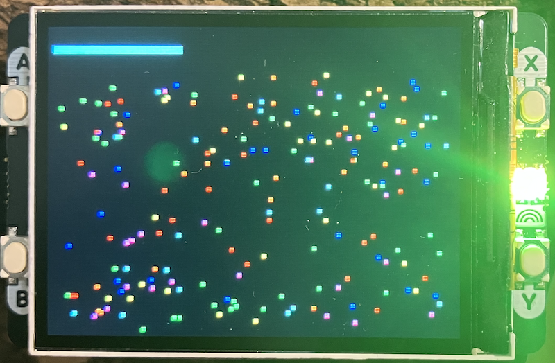

## Pico Particle System

A real-time particle physics simulation for the Raspberry Pi Pico with Display Pack 2.0,
utilising both cores for optimised performance.

### Hardware Requirements

- Raspberry Pi Pico (RP2040) or Raspberry Pi Pico 2 (RP2350)
- Pimoroni Display Pack 2.0 (320x240 ST7789 display)

### Features

- Up to 200 colourful particles with physics simulation
- Gravity and wind effects
- Boundary collision detection with bounce damping
- Dual-core processing for improved performance
- Real-time FPS monitoring

### Controls

- *Button A*: Reset particles to random positions
- *Button B*: Cycle particle count (100, 200)
- *Button X*: Apply wind force to the right (hold)
- *Button Y*: Apply wind force upward (hold)

## Performance

The simulation targets 60 FPS and uses both CPU cores:
- Core 0: First half of particles + rendering
- Core 1: Second half of particles

