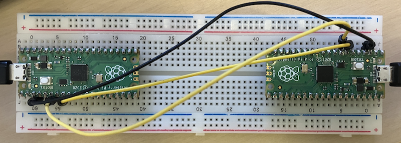

## Dual-Core Encryption/Decryption System for Raspberry Pi Pico 2

This project consists of two Python programs that work together to encrypt and decrypt
messages using both cores of the Raspberry Pi Pico 2. Data is encrypted on one Pico,
transmitted via UART, and decrypted on another Pico.

*Educational Use Only*: This implementation uses XOR encryption, which is NOT secure
for real-world applications. Use industry-standard cryptographic libraries for production
systems.


### Features

- *Dual-core processing*: Both programs leverage Core 0 and Core 1 for parallel encryption/decryption
- *UART communication*: Encrypted data transmission between two Pico boards
- *Split workload*: Data is divided between cores for demonstration of parallel processing
- *Real-time monitoring*: USB serial output shows the encryption/decryption process


### Hardware Requirements

- 2x Raspberry Pi Pico 2 boards
- USB cables for programming and serial monitoring
- Jumper wires for UART connection


### Wiring

Connect the two Pico boards as follows:

```
Pico 1 (Encryptor)          Pico 2 (Decryptor)
------------------          ------------------
GP0 (UART TX)      ------>  GP1 (UART RX)
GND                ------>  GND
```

NB: The image shows a cross-wiring where both could act as encryptor or decryptor.


### Encryptor (Pico 1)
1. Accepts text input via USB serial
2. Splits the data in half
3. Core 0 encrypts the first half
4. Core 1 encrypts the second half (in parallel)
5. Combines encrypted chunks and sends via UART with a length header

### Decryptor (Pico 2)
1. Listens for incoming UART data
2. Reads length header and encrypted payload
3. Splits encrypted data in half
4. Core 0 decrypts the first half
5. Core 1 decrypts the second half (in parallel)
6. Combines and displays the original message


### Encryption Method

- *Algorithm*: XOR cipher with key rotation
- *Key*: 16-byte shared secret (must match on both devices)
- *Process*: Each byte is XORed with a rotating key byte, with offset applied to second half

### Setup Instructions

1. *Flash the Encryptor*:
   - Connect Pico 1 via USB
   - Upload `encryptor.py` to the board
   - Rename to `main.py` if you want it to run on boot

2. *Flash the Decryptor*:
   - Connect Pico 2 via USB
   - Upload `decryptor.py` to the board
   - Rename to `main.py` if you want it to run on boot

3. *Wire the boards* according to the wiring diagram above

4. *Power both boards* and open serial monitors for each


### Usage

1. Open a serial terminal for the Encryptor (Pico 1)
2. Open a serial terminal for the Decryptor (Pico 2)
3. Type a message in the Encryptor terminal and press Enter
4. Watch the encryption process on Pico 1
5. Watch the decryption process on Pico 2
6. Verify the original message appears on Pico 2


### Configuration

Both programs use matching settings:
- *Baud rate*: 115200
- *Encryption key*: `SecretKey123!@#$` (must be identical on both devices)
- *UART instance*: UART1

To change the encryption key, modify the `ENCRYPTION_KEY` and `DECRYPTION_KEY` variables in both files.


### Technical Details

- *Threading*: Uses `_thread` module for dual-core processing
- *Synchronization*: Lock mechanism ensures thread-safe data sharing
- *Protocol*: 2-byte big-endian length header followed by encrypted payload
- *Encoding*: UTF-8 for text, with fallback to hex display for non-text data


### Limitations

- XOR encryption is cryptographically weak
- No authentication or integrity checking
- Single-direction communication only
- Buffer management is simplified for demonstration
- Not suitable for production security applications


### Learning Objectives

This project demonstrates:
- Multi-core programming on microcontrollers
- Thread synchronisation with locks
- UART serial communication
- Data serialisation and protocols
- Basic encryption concepts (for educational purposes)

