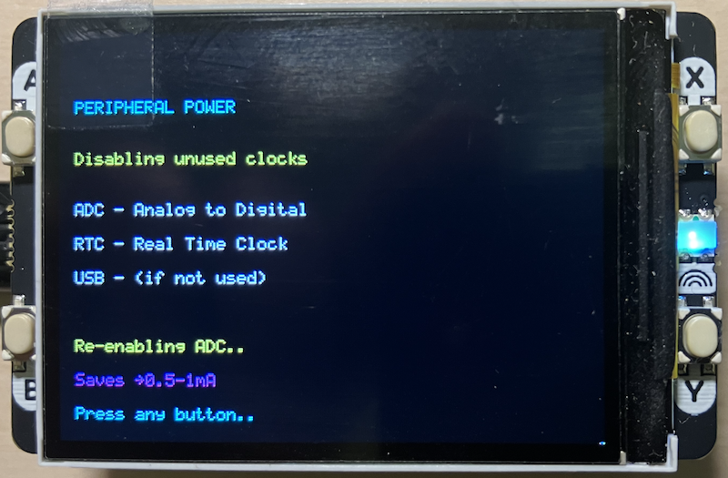

## Raspberry Pi Pico Power Management Demo

A comprehensive demonstration of power-saving techniques for the Raspberry Pi Pico,
featuring an interactive menu system on the Pimoroni Display Pack 2.0 with built-in
protection against system hangs.

- Raspberry Pi Pico or Pico W (Pico 2/2W recommended for better framebuffer performance)
- Pimoroni Display Pack 2.0 (320×240 ST7789 LCD with 4 buttons)

Optional:
- Push button for hardware reset (connected between GPIO 22, or approriate, and GND)

### Power Management Demos

- *DVFS (Dynamic Voltage and Frequency Scaling)*: Shows how reducing CPU frequency
  and voltage can dramatically reduce power consumption
- *WFI (Wait For Interrupt)*: Demonstrates CPU idle states that save approximately
  50% power during periods of inactivity
- *Peripheral Power Control*: Illustrates selective clock gating to disable unused
  hardware peripherals
- *Duty Cycle Operation*: Simulates sensor applications with intermittent wake/sleep
  cycles
- *Combined Strategy*: Demonstrates how multiple techniques can achieve up to 85%
  power reduction

### Safety Features

- *Watchdog Timer Protection*: Automatic system recovery from hang states within 8 seconds
- *Hardware Reset Button*: Manual reset capability via GPIO button
- *Safe Clock Transitions*: Validated frequency changes with automatic rollback on failure
- *WFI Timeout Protection*: Prevents infinite sleep states with 10-second timeout
- *Continuous Monitoring*: Regular watchdog feeding throughout all operations

### Navigation
The main menu appears on startup with five demo options:

- *Button A*: DVFS demonstration
- *Button B*: WFI idle mode
- *Button X*: Peripheral power control
- *Button Y*: Duty cycle operation
- *Buttons A+B* (hold both): Combined strategy

After each demo completes, press any button to return to the main menu.

### Reset Options
Two methods are available to reset the system:

1. *Automatic Reset*: If the system hangs, the watchdog timer
   triggers an automatic reset after 8 seconds
2. *Manual Reset*: Press the external button connected to GPIO 22 (or
   apropriate pin) at any time for immediate reset

## Power Consumption Estimates

Based on typical Pico operation at various states:

| Mode | Frequency | Voltage | Est. Power | Savings |
|------|-----------|---------|------------|---------|
| Max Performance | 250 MHz | 1.20V | ~100% | 0% |
| Normal | 125 MHz | 1.10V | ~50% | 50% |
| Low Power | 48 MHz | 0.95V | ~30% | 70% |
| Ultra Low | 24 MHz | 0.90V | ~20% | 80% |
| Combined (with WFI) | 48 MHz | 0.95V | ~15% | 85% |

*Note: Actual power consumption varies based on workload and peripheral usage*

### DVFS Demo
Steps through four frequency/voltage combinations, performing identical work
at each level to demonstrate the speed/power tradeoff. You'll observe that lower
frequencies take longer to complete tasks but consume significantly less power.

### WFI Demo
Puts the CPU into a low-power wait state until an interrupt occurs. The processor
wakes on button press or after a 10-second timeout. This technique is ideal for
event-driven applications.

### Peripheral Power Demo
Demonstrates selective clock gating by disabling the ADC peripheral. In a real
application, you would disable all unused peripherals (USB, PWM, I2C, etc.)
to minimize power consumption.

### Duty Cycle Demo
Simulates a typical sensor application pattern: brief periods of activity followed
by extended sleep. This 10% duty cycle reduces average power to approximately 10%
of continuous operation.

### Combined Strategy Demo
Applies multiple techniques simultaneously:
1. Reduces frequency to 48 MHz
2. Lowers voltage to 0.95V
3. Disables unused peripherals
4. Uses WFI during idle periods

This achieves the maximum demonstrated power savings of approximately 85%.

### System Hangs or Freezes
- The watchdog timer should automatically recover within 8 seconds
- If repeated hangs occur, check for proper button wiring (may cause false triggers)
- Connect hardware reset button to GPIO 22 for manual recovery

### Buttons Not Responding
- Buttons require internal pull-ups (configured automatically)
- Ensure Display Pack is properly connected
- Check for button debounce issues (20ms debounce is implemented)

### Clock Change Failures
The system includes automatic recovery for failed clock changes. If you see
failure messages, the system should restore default 125 MHz operation automatically.

### Serial Output Not Working After Clock Changes
USB serial may become unreliable after frequency changes. This is expected
behavior as USB requires specific clock rates. The system reinitializes stdio
after each clock change to maintain connectivity where possible.

### Watchdog Configuration
- *Timeout*: 8000 milliseconds (8 seconds)
- *Feeding Interval*: Every major loop iteration, typically every 10-100ms
- *Reboot Detection*: System detects and reports watchdog-caused reboots

### Safety Mechanisms
The code includes multiple layers of protection:

1. Regular watchdog feeding prevents accidental resets during normal operation
2. All long-running operations include periodic watchdog updates
3. Clock changes are validated and rolled back on failure
4. WFI operations include timeout protection
5. DMA transfers include timeout and abort mechanisms

### Memory Usage
- Display driver uses DMA for efficient transfers
- Optional framebuffer mode available (requires ~153KB RAM on Pico 2)
- Current implementation uses direct rendering (no framebuffer allocation)

### Adding New Power Modes
Additional demonstrations can be added by creating new demo functions following this pattern:

- Include regular watchdog feeding
- Add reset button checking
- Validate all clock/voltage changes
- Provide visual feedback on the display
- Return system to safe defaults before exiting

### Measuring Actual Power
To measure real power consumption:
1. Connect ammeter in series with Pico's VSYS or 3V3 pin
2. Run each demo and record current draw
3. Calculate power using measured voltage and current
4. Compare results with estimates in this document

