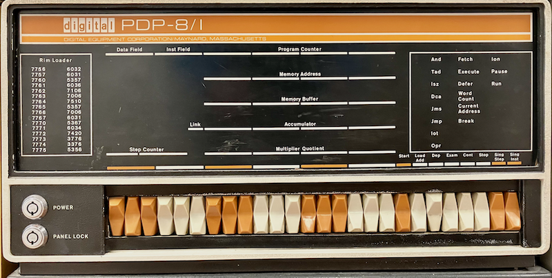

## Project

This is a continuation from the project in the book ..

For inspiration, see e.g.
* https://eater.net/
* https://www.youtube.com/@DrMattRegan
* and the many numerous people building simpler computers .. search!

### Part 1: Course Plan (Syllabus-Style)

Module 1: Raspberry Pi Pico as an Electronics Trainer
- Theory: GPIO, binary, Ohm’s law, breadboards.
- Practice: Blink LEDs, binary counter, button inputs.
- Components: Pico, breadboard, LEDs, resistors, pushbuttons.

Module 2: Digital Logic Foundations
- Theory: Logic gates (AND, OR, NOT), truth tables.
- Practice: Implement in Pico software, then with 74HC00, 74HC08, 74HC32 ICs.
- Components: Logic ICs, jumper wires.

Module 3: Arithmetic Circuits
- Theory: Half adder, full adder, ripple carry.
- Practice: Build adders with gates, visualise carry propagation with LEDs.
- Components: 74HC86 (XOR), 74HC08 (AND), 74HC32 (OR).

Module 4: Sequential Circuits
- Theory: Latches, flip-flops, registers, clocks.
- Practice: Build SR latch, D flip-flop, 4-bit register.
- Components: 74HC74 (D flip-flop), oscillator module or 555 timer.

Module 5: Registers & Buses
- Theory: Data storage, tri-state buffers, buses.
- Practice: Controlled register (load/clear), bus wiring.
- Components: 74HC245 (bus transceiver).

Module 6: ALU (Arithmetic Logic Unit)
- Theory: Datapath, operation selection.
- Practice: 4-bit ALU (ADD, SUB, AND, OR).
- Components: 74HC283 (adder), 74HC157 (mux).

Module 7: Control Unit
- Theory: Datapath vs control, microprogramming.
- Practice: Pico generates control signals → replace with EEPROM sequencer.
- Components: 28C16/28C64 EEPROM, binary counter.

Module 8: Memory & Program Counter
- Theory: RAM, address decoding, program sequencing.
- Practice: Program counter, simple RAM interface.
- Components: 6264 SRAM, 74HC161 (counter).

Module 9: The Blinkenlights Computer
- Theory: Fetch-decode-execute, instruction set architecture.
- Practice: Assemble full CPU with front panel LEDs + switches.
- Components: Toggle switches, LED array, resistors.

### Part 2: Project Logbook (Build Milestones)

Milestone 1: Pico LED Trainer
- Breadboard a Pico with 4 LEDs and 4 resistors.
- Program binary counter output (0–15).

Milestone 2: Add Switches
- Breadboard 4 pushbuttons with pull-down resistors.
- Program Pico to echo button states on LEDs.

Milestone 3: First Logic Gate (NAND)
- Use 74HC00. Connect inputs to switches, outputs to LEDs.
- Verify truth table manually.

Milestone 4: Half & Full Adder
- Wire XOR + AND gates for half adder, then expand to full adder.
- Feed inputs via switches, outputs on LEDs.

Milestone 5: Flip-Flops
- Build SR latch from NAND gates.
- Upgrade to D flip-flop using 74HC74.
- Toggle LED storage bit on clock edge.

Milestone 6: 4-bit Register
- Chain 4 flip-flops.
- Load 4-bit number from switches.
- Display stored value on LEDs.

Milestone 7: ALU Prototype
- Wire 4-bit ripple adder with 74HC283.
- Add function select with mux.
- LEDs show results.

Milestone 8: Control via Pico
- Use Pico GPIOs to drive control signals (load register, select ALU op).
- Write small “microcode” program in Pico C/Python to automate.

Milestone 9: Replace Pico Control
- Breadboard binary counter + EEPROM with microcode.
- Program microinstructions into EEPROM.

Milestone 10: Memory + Program Counter
- Add RAM chip + simple addressing logic.
- Build program counter from counters.

Milestone 11: Front Panel Blinkenlights
- Wire switches for input, LEDs for registers + ALU + PC.
- Manually enter programs, run them, watch execution.

Milestone 12: Self-Contained Computer
- Run first “program” (e.g., load constant → add → output).
- Debug with single-step clock.
- Celebrate — you’ve built a working blinkenlights computer!

