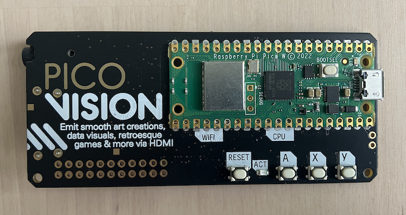
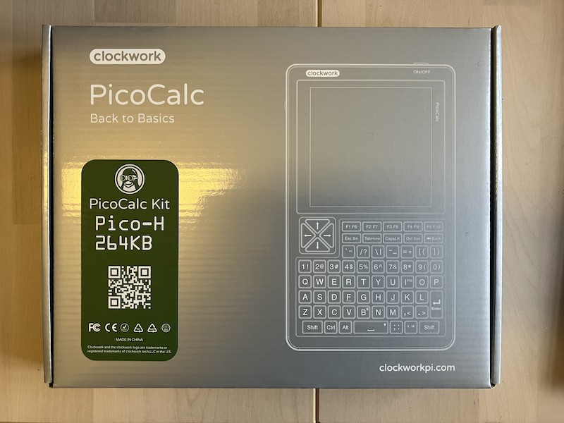
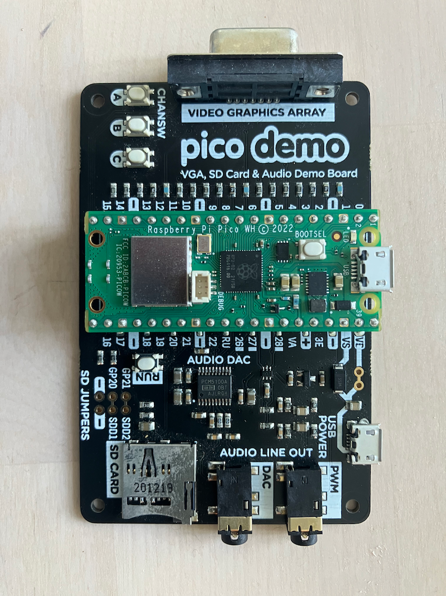
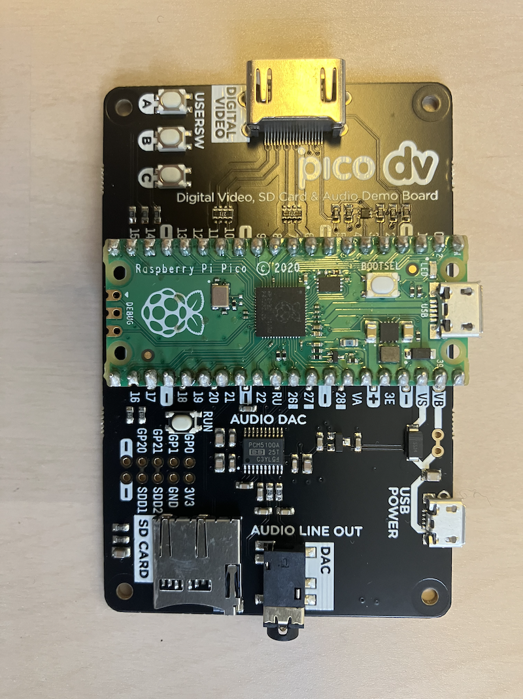

## Ready-Made Projects ..

There are many projects that showcase the incredible versatility of the Raspberry Pi Pico, 
a tiny yet powerful microcontroller that’s perfect for students diving into electronics,
coding, and creative problem-solving. With its low cost, flexible GPIO pins, and support
for languages like MicroPython and C++, the Pico is a playground for innovation. Whether you’re
dreaming of building retro games, portable computers, or stunning visual displays, projects
like PicoVision, PicoCalc, PicoDemo, and PicoDV demonstrate just how far this little board
can take you.

#### PicoVision

Imagine building your own retro arcade game or a dazzling digital art display with a
microcontroller smaller than a credit card. PicoVision, crafted by Pimoroni, is a board
that turns your Raspberry Pi Pico into a mini graphics powerhouse. It uses two RP2040
chips--one acting as a "CPU" for logic and another as a "GPU" for rendering visuals--delivering
HDMI video output and crystal-clear audio through a stereo jack. With resolutions up to
720p (if you’re feeling adventurous with overclocking), you can create homebrew games,
animated screensavers, or even run classics like *Doom*. Program it with beginner-friendly
MicroPython or dive into C++ for max performance, using libraries like PicoGraphics for
shapes or PicoSynth for chiptune music. For a student, PicoVision is your ticket to
blending coding with creativity--think of designing a pixel-art music visualiser or a mini
game console for your friends. Start small, like displaying your name in colorful text,
and soon you’ll be crafting projects that wow everyone.

PicoVision is a compact digital video output board developed by Pimoroni, designed
for creative audio-visual projects using Raspberry Pi Pico hardware. It features
dual RP2040 microcontrollers: one (from a pre-soldered Raspberry Pi Pico W) acts as
the "CPU" for processing tasks like game logic or data visualization, while the
second serves as a "GPU" for rendering graphics. The board uses two 8MB PSRAM chips
as frame buffers, allowing the CPU to write to one buffer while the GPU reads from
the other, enabling smooth high-resolution output (up to 1280x720, though this requires
overclocking and may not work on all units due to hardware tolerances).

Key features include:
- HDMI output for video (digital video or DV signals).
- 3.5mm stereo line-out jack for audio (via PCM5100A DAC over I2S; no audio over HDMI).
- MicroSD card slot for loading assets like images or games.
- Three user buttons, a reset button, status LED, and exposed GPIO pins for expansion
 (including serial debug).
- Support for C++ (for performance) or MicroPython (for beginners), with libraries
 like PicoGraphics (for shapes, text, and images), PicoVector (vector graphics),
 and PicoSynth (audio synthesis).

* Use cases: Homebrew games (e.g., running Doom via rp2040-doom port), digital art, demo
 recreations, screensavers, data visualization, or signage. It's priced around £34.50
 and is aimed at retro gaming enthusiasts and old-school programmers.
* Limitations: Higher resolutions push the RP2040 beyond specs, so compatibility varies;
 it's not a full Linux device like a Raspberry Pi Zero. Getting started involves Thonny
 IDE for MicroPython or the Pico SDK for C++.

#### PicoCalc

Ever wanted a gadget that’s part calculator, part computer, and all awesome? PicoCalc,
from ClockworkPi, is a handheld kit powered by the Raspberry Pi Pico, combining a vibrant
4-inch IPS screen, a QWERTY keyboard, and speakers into a portable package. It’s like a
modern take on 1980s pocket computers, but with the power to run BASIC, MicroPython,
C++, or even a UNIX-like OS. You can code on the go, play retro games, or turn it into
an MP3 player. With open-source designs, you can 3D-print your own case or add sensors
for IoT projects. For students, PicoCalc is a dream tool for learning programming
hands-on--imagine coding a math solver during a bus ride or building a text-based adventure
game in BASIC. It’s a perfect blend of retro charm and modern versatility, encouraging
you to experiment, hack, and make it your own.

PicoCalc is a portable handheld computing kit from ClockworkPi, essentially a Raspberry
Pi Pico-powered "calculator" that's far more versatile, evoking the spirit of 1980s
computing with modern MCU capabilities. It uses the ClockworkPi v2.0 mainboard, which
hosts a Raspberry Pi Pico (or Pico 2/W variants) as the core processor (ARM Cortex-M0+
dual-core at up to 133MHz, with 264KB SRAM and 2MB flash). An additional STM32
microcontroller handles peripherals like the keyboard and backlight.

Key features include:
- 4-inch IPS display (320x320 resolution, SPI interface).
- Backlit QWERTY keyboard (I2C-connected, ultra-portable).
- Dual PWM speakers for audio.
- 8MB PSRAM for extended memory, microSD slot (up to 32GB included in kits),
 and 18650 battery support (batteries not included).
- USB Type-C for power/debugging (defaults to Pico's serial port).
- Expandable via SPI/I²C/UART GPIO for peripherals.
- Schematics and designs released under GPL v3 for DIY modifications (e.g., 3D-printed cases).

It ships with optimised BASIC firmware for interactive programming, but supports MicroPython,
C/C++ (via Pico SDK), Arduino IDE, and languages like Lua, Golang, JavaScript, Rust. Other tested
modes include a UNIX v7 clone (Fuzix OS), LISP interpreter, MP3 player (using YAHAL library), and
retro games. Priced at around $75 for the kit (including Pico H core, tempered glass screen cover,
and ABS shell), it's positioned as a cost-effective MCU development platform for education,
IoT, or portable coding. It's compact for on-the-go use but relies on community firmware for
advanced features, as ClockworkPi's software support can be limited.

#### PicoDemo

PicoDemo, often tied to the Pimoroni Pico VGA Demo Base, is all about showing off what the
Raspberry Pi Pico can do with minimal fuss. This board lets you experiment with analog VGA
video (up to 640x480) and digital audio, using the Pico’s Programmable I/O (PIO) to create
signals without overloading the CPU. It’s like a sandbox for learning how microcontrollers
talk to displays and speakers. You can run pre-built demos from the Raspberry Pi Pico SDK,
like drawing colorful patterns or playing sound effects, or code your own projects. For a
student, PicoDemo is an inspiring entry point--think of it as your first step toward building
a retro computer display or a custom dashboard for a robot. Start by tweaking example code
to display your own graphics, and you’ll quickly see how hardware and software come together
to make magic happen.

"PicoDemo" isn't a standalone product but likely refers to demonstration projects, code examples,
or boards used to showcase the capabilities of the Raspberry Pi Pico series. The most direct match
is the Pimoroni Pico VGA Demo Base, a reference design board from Raspberry Pi (adapted by Pimoroni)
for experimenting with video and audio output. It highlights the RP2040's Programmable I/O (PIO)
state machines, which offload tasks like signal generation from the CPU cores.

Key features include:
- VGA output (analog video up to 640x480) via a D-sub connector.
- MicroSD card slot for loading media/files.
- Digital I2S audio output (line-level).
- User buttons for interaction.
- Compatible with the Raspberry Pi Pico SDK's examples (C/C++ only; no MicroPython support for video yet).

It's built to run Raspberry Pi's official pico-examples repository demos, such as generating solid
VGA signals without taxing the CPU, displaying graphics, or playing audio. Priced affordably (around
£10-15), it's ideal for beginners exploring RP2040 features like PIO for custom peripherals. For digital
video demos, it ties into PicoDVI (see below). Broader "pico demo" contexts include GitHub repos like
raspberrypi/pico-examples (covering USB, PIO, and more) or community projects like boot demos in
ReileyB/picoDemo. Use it to prototype displays, sound, or I/O without needing full development setups.

#### PicoDV

Ready to take things up a notch? PicoDV, built around the PicoDVI library and the Pimoroni Pico DV
Demo Base, lets you generate digital video (DVI/HDMI) straight from a Pico. By overclocking the
RP2040, you can push out visuals to modern TVs or monitors, creating everything from simple animations
to emulated retro operating systems. It’s a bit experimental, but that’s what makes it exciting--you’re
hacking the Pico to do things it wasn’t originally designed for! With a microSD card for assets and
support for CircuitPython or C++, you can prototype a digital signage system or even a tiny video
player. For students, PicoDV is a challenge to think big: imagine coding a mini movie player or a
dynamic art display for a school project. It’s a chance to dive into advanced microcontroller tricks
and show off your skills.

PicoDV (short for Pico Digital Video) refers to hardware and software for generating digital video
output from the Raspberry Pi Pico, primarily through the PicoDVI library and compatible boards like
the Pimoroni Pico DV Demo Base. This is an evolution of analog VGA demos, using the RP2040's PIO to
bit-bang DVI/HDMI signals (differential serial data at ~252 Mbps via GPIO pads with 220-270Ω resistors).
It's experimental and requires an overclocked RP2040 for higher resolutions.

Key features of the Pico DV Demo Base:
- HDMI connector for DVI/HDMI output (digital, up to 1280x720 experimental modes).
- MicroSD card slot and line-level I2S audio (similar to VGA base).
- Buttons for user input; exposed pins for GPIO expansion.
- Works with PicoDVI library (by Luke Wren/Wren6991) for C/C++ apps, or CircuitPython's DVI
 support (alpha/beta stages).

The library enables projects like video playback, animations, or emulations (e.g., Windows 1.0 via
custom emulator). It's an "all-digital conversion" of the VGA reference design, perfect for modern
monitors/TVs. Priced around £15-20, it's for advanced users comfortable with SDK builds and overclocking;
expect bugs, as it's not production-ready. Download examples from GitHub (PicoDVI repo) and flash UF2
files via BOOTSEL mode. For audio/video syncing, pair with SD card assets. Note: Pico W variants need
extra config for wireless integration.

### Summary

| Aspect | PicoVision | PicoCalc | PicoDemo (VGA Base) | PicoDV (DV Base) |
|--|--|--|--|--|
| *Primary Focus* | Audio-visual projects/games | Portable computing/programming | VGA video/audio demos | Digital video (DVI/HDMI) demos |
| *Key Hardware* | Dual RP2040, PSRAM buffers, HDMI | Pico + STM32, IPS screen, keyboard | RP2040, VGA port, SD/I2S | RP2040, HDMI, SD/I2S |
| *Output* | HDMI video, line-out audio | 320x320 IPS, speakers | VGA video, I2S audio | HDMI/DVI video, I2S audio |
| *Programming* | MicroPython/C++, Pico libs | BASIC/MicroPython/C++, multi-lang | C/C++ SDK examples | C/C++/CircuitPython, PicoDVI lib |
| *Price (approx.)* | £34.50 | $75 (kit) | £10-15 | £15-20 |
| *Best For* | Retro games, art/visualization | On-the-go coding, education | Beginner PIO/video experiments | Advanced digital display hacking |

Each of these projects--PicoVision, PicoCalc, PicoDemo, and PicoDV--shows how a $4 Raspberry Pi
Pico can become a tool for creativity. They’re affordable, accessible, and packed with potential,
making them perfect for students eager to explore coding, electronics, and design. Whether you’re
into gaming, portable gadgets, or cutting-edge video hacks, there’s a project here to ignite your
passion. Grab a Pico, start with MicroPython tutorials on the Raspberry Pi website, or join
communities on GitHub and forums to share your ideas.

