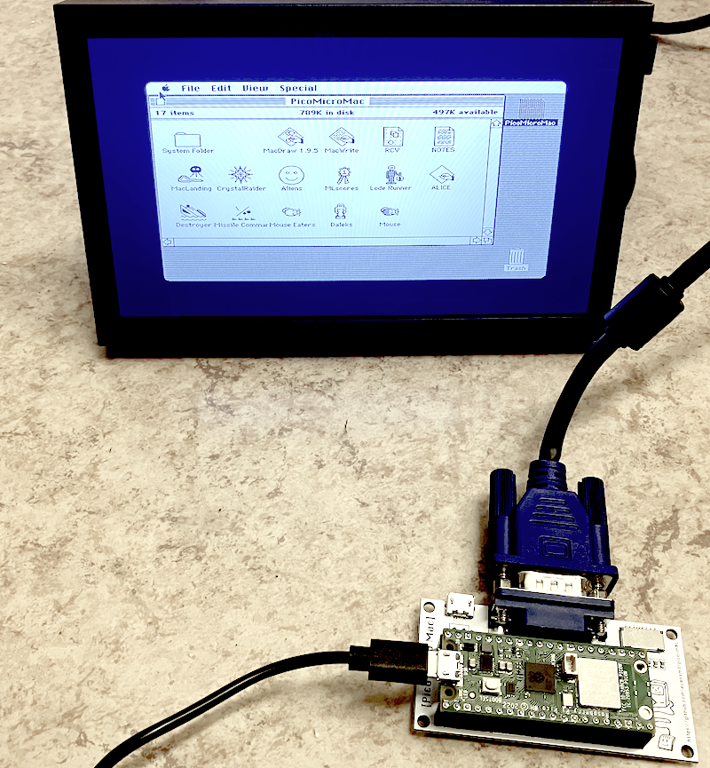

## Building and Experimenting

> [!NOTE]
> __Progression of microcontroller hardware and recommendations have changed during the writing of this book and creating this repository.__
> For greater performance, we have choosen the use of the Raspberry Pi Pico 2 (RP2350: dual-core Cortex-M33 or dual Hazard3 RISC-V cores, 150 MHz, 520 KB SRAM, 4 MB flash), or the version 2W for wireless. If you are using alternative hardware (e.g. Pico 2 or boards with the RP2350/RP2350A), minor code adjustments may be required.
> The original Raspberry Pi Pico may work with many examples still, but as of today not recommended.
> For display work and miuch of the code elsewhere, we primarily use the Pimoroni Display Pack 2.0, though the older Display Pack often works with small modifications. Note that displays commonly demand significant power, substantial memory, and high update speed--especially for applications like games or animations. If you wish to pursue developments such as games, larger LCD screens, or more demanding applications, these will be considerably easier on more capable hardware, rather than struggling with heavy optimisation on less powerful boards.

> [!IMPORTANT]
> To distinguish between running C and Python (specifically MicroPython) on the Raspberry Pi Pico and programming on your main computer (whether Windows, macOS, or Linux), the repositories here are marked with either "c" or "micropython" (occationally "pico") to indicate their intended use on the Pico. Some areas, such as *device drivers*, are better handled in C, while topics like *wireless* communication are more easily demonstrated in MicroPython. As a result, not every concept is shown in both languages, and the language labels are applied selectively. The aim is to explore how computers behave as systems, not just how they are wired.

The code in these folders is __not__ about electronics in the strict sense--we’re
not building circuits from scratch. Instead, the Raspberry Pi Pico is used as a
small, *practical model of a complete computer*. It has memory, I/O, communication,
timing, power, and error handling--all the same pieces larger systems have.

### Approaches to Hardware and Computing

In teaching and writing about computers, two broad traditions can be distinguished.

The first is the *electronics-oriented approach*, which begins with the physical
substrate of computation: circuits, transistors, logic gates, and the design of
processors at the register-transfer level. This path treats the computer as an
engineered artefact, emphasising measurement, precision, and the construction of
working devices. Code, when introduced, is seen largely as a way of exercising or
testing the underlying hardware.

The second is the *computational* or *systems-oriented approach*, where hardware
is used less as an end in itself and more as a lens for exploring the concepts of
computing. Here, a microcontroller such as the Raspberry Pi Pico serves as a small,
accessible model of a complete computer system. Rather than focusing on electronic
detail, the emphasis is on how the device illustrates key ideas: memory and storage,
input/output, communication, timing, concurrency, error handling, and resource
management.

The material collected here follows the __second path__. The Pico and its peripherals
are used as a concrete, practical anchor, but the real aim is to highlight general
principles of computing.

### Reference

- Smith, Stephen. *RP2040 Assembly Language Programming: ARM Cortex-M0+ on the Raspberry Pi Pico*. Apress, 2021.  
  - A comprehensive guide to programming the RP2040 microcontroller using
    assembly language. This book provides clear explanations of assembly
    language concepts and practical examples, helping developers understand
    low-level programming for embedded systems. It's an essential resource
    for anyone looking to get hands-on experience with assembly programming
    on the RP2040 platform.

#### Running a Macintosh 128k on a original Raspberry Pi Pico ..

