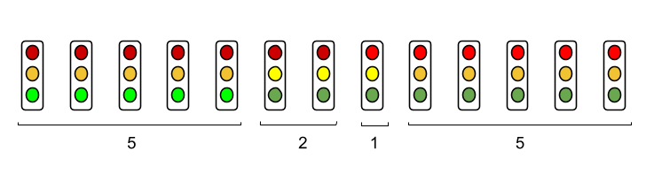

## Introduction to State Machines

A state machine is a computational model used to design systems that transition between a
finite number of states based on inputs or events. Each state represents a specific condition
or mode of the system, and transitions define how the system moves from one state to another.
State machines are widely used in software and hardware design, such as in embedded systems,
user interfaces, and protocol implementations.

### Concepts

- States: Distinct conditions or modes the system can be in (e.g., "Green", "Yellow", "Red" in a traffic light system).
- Transitions: Rules or conditions that dictate how the system moves from one state to another (e.g., after a timer expires).
- Events: Triggers that cause transitions (e.g., a timer or user input).
- Actions: Operations performed when entering, exiting, or staying in a state (e.g., turning on an LED).

### Example: Traffic Light System

The provided Python code `traffic.py`demonstrates a simple state machine for a traffic light
system using a microcontroller (Raspberry Pi Pico). It defines four states: Green, Yellow,
Yellow_Red, and Red. The system transitions between these states based on predefined timing
intervals, controlling LEDs to simulate traffic light behavior.

#### How It Works

- States: Defined as constants (STATE_GREEN, STATE_YELLOW, etc.).
- Transitions: Controlled by a while loop that checks the current state and switches to the next after a specific duration (e.g., green_time).
- Actions: The set_traffic_lights function sets the appropriate LED states (on/off) for each light.
- Execution: The traffic_light function runs an infinite loop, cycling through states to mimic a real traffic light sequence.

This example illustrates a finite state machine (FSM), where the system is always in one
of a finite number of states, and transitions are deterministic based on time.

#### The Benefits of State Machines

* Clarity: Clearly defines system behavior for each state.
* Reliability: Ensures predictable transitions and actions.
* Modularity: Easy to extend with new states or transitions.
* Debugging: Simplifies troubleshooting by isolating behavior to specific states.

State machines are ideal for systems with well-defined modes, like traffic lights, vending machines,
or protocol handlers, making them a powerful tool in both software and hardware design.
