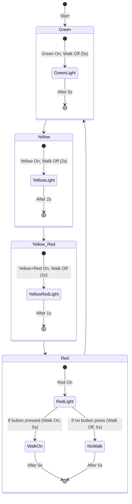

## Further Analysis of the Traffic Light State Machine with Pedestrian Crossing

This code represents a more robust finite state machine (FSM) for a traffic light system
with an integrated pedestrian crossing, building on the concepts of state-driven design
and event handling. Below is a continued exploration of its functionality, design
considerations, and potential improvements, tailored for clarity and practical insight.

### Breakdown

The state machine controls a traffic light system with three LEDs (red, yellow, green)
and a pedestrian walk signal, triggered by a button press. It uses a microcontroller,
a Raspberry Pi Pico and MicroPython to manage hardware interactions.

### Components and Logic

#### Hardware Setup:

- Traffic Lights: LEDs on pins 0 (red), 1 (yellow), and 2 (green)
  represent the traffic light states.
- Pedestrian Signal: An onboard LED (pin 25) indicates "Walk" (on)
  or "Don't Walk" (off).
- Button Input: A button on pin 15, configured with a pull-down resistor,
  triggers an interrupt on a rising edge to set the button_pressed flag.

- States: Four states (STATE_GREEN, STATE_YELLOW, STATE_YELLOW_RED, STATE_RED)
  define the traffic light sequence.
- Transitions: Timed transitions occur after fixed durations (green_time,
  yellow_time, etc.), with the STATE_RED state conditionally handling pedestrian
  crossing based on the button_pressed flag.
- Event Handling: The interrupt-driven button press allows asynchronous pedestrian
  requests, processed during the STATE_RED state.

#### State Behaviour

- Green (STATE_GREEN): Green light on for 5 seconds, walk signal off.
  Transitions to STATE_YELLOW.
- Yellow (STATE_YELLOW): Yellow light on for 2 seconds, walk signal off.
  Transitions to STATE_YELLOW_RED.
- Yellow_Red (STATE_YELLOW_RED): Yellow and red lights on for 1 second,
  walk signal off. Transitions to STATE_RED.
- Red (STATE_RED): Red light on. If button_pressed is True, the walk signal
  turns on for 5 seconds (walk_time); otherwise, the red light persists
  for 5 seconds (red_time). Transitions to STATE_GREEN.

### Design Strengths

- Modularity: The set_traffic_lights and set_walk_signal functions encapsulate
  hardware control, making the code reusable and maintainable.
- Asynchronous Input: Using an interrupt for the button press avoids polling,
  reducing CPU usage and improving responsiveness.
- Deterministic Behaviour: The FSM ensures predictable state transitions,
  critical for safety in traffic control systems.
- Simplicity: The code is concise yet functional, suitable for educational
  purposes or small-scale embedded projects.

### Projects: Potential Improvements

- Button Debouncing: The interrupt handler lacks debouncing, which could lead to
  multiple triggers from a single press. Adding a software debounce (e.g., ignoring
  rapid successive interrupts within a short time) would improve reliability.
- Flag Reset: The button_pressed flag is not explicitly reset in the code, relying
  on the state transition to STATE_GREEN to prepare for the next cycle. Explicitly
  resetting the flag after handling the pedestrian request would enhance clarity.
- Extended States: Adding a flashing "Don't Walk" signal before transitioning from
  STATE_RED to STATE_GREEN could improve pedestrian safety.
- Configurable Timing: Making timing constants adjustable (e.g., via a configuration
  file or external input) would allow flexibility for different traffic scenarios.
- Error Handling: The code assumes ideal hardware behaviour. Adding checks for hardware
  faults (e.g., LED failure detection) could make it more robust.

### Visualisation of State Transitions

To illustrate the state machine's flow, consider the following chart showing the number
of seconds spent in each state per cycle, assuming no pedestrian button press:

This chart visualises the duration of each state in a full cycle (13 seconds total
without pedestrian input). If the pedestrian button is pressed, the Red state duration
extends to walk_time (5 seconds), maintaining the same total cycle time in this case.

### Projects: Applications and Extensions

This state machine is a practical example for embedded systems education, demonstrating FSMs,
interrupt handling, and hardware control. It could be extended for:

- Multi-Directional Traffic: Coordinating multiple traffic lights for intersections.
- Sensor Integration: Adding sensors (e.g., vehicle detection) to adjust timing dynamically.
- Emergency Override: Introducing a priority state for emergency vehicles.
- Networked Control: Synchronising multiple traffic lights over a network for smarter traffic
  management.

This implementation showcases the power of state machines in managing complex, event-driven
systems with predictable behaviour, making it a foundation for further exploration in your
embedded programming.

