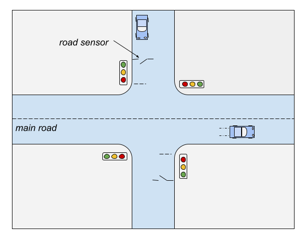

## Project: Smart Traffic Crossing Simulation + Pico Hardware Integration

#### 1. Goals

- Build a real-time simulation of a two-road intersection:
    - Main road (priority road).
    - Secondary road (stop-controlled unless cars are detected).
- Represent cars, traffic lights, and sensors visually in a browser.
- Allow adjustable control rules:
    - Time delays.
    - Priority logic.
    - Sensor sensitivity.
- Link simulation logic to a Raspberry Pi Pico with LEDs, buttons, and possibly sensors for a physical demo.

#### 2. Features

1. Traffic Light Logic
    - Independent light sets for each road (red/yellow/green).
    - Safety delay to prevent both roads from having green at once.
    - Configurable timing parameters.
    - Priority system: main road stays green unless there is a car on the secondary road.

2. Car Simulation
    - Cars spawn randomly on both roads.
    - Each car moves forward and queues at a red light.
    - On green, cars pass through the intersection.

3. Sensor Simulation
    - A "sensor zone" on the secondary road detects queued cars.
    - In hardware, this maps to a physical button, IR sensor, or ultrasonic sensor.

4. Adjustable Parameters
    - Car spawn probability per tick.
    - Green light duration.
    - Yellow light duration.
    - Minimum green for main road.
    - Sensor detection threshold.

5. Statistics / Debug Output
    - Number of cars passed.
    - Average wait time per road.
    - Light state timeline.

#### 4. Simulation

Light Control Algorithm (simplified)

```python
state = MAIN_GREEN

loop every tick:
    if state == MAIN_GREEN:
        if car waiting on secondary AND min_main_green_elapsed:
            switch to MAIN_YELLOW
    if state == MAIN_YELLOW:
        after yellow_time --> switch to SIDE_GREEN
    if state == SIDE_GREEN:
        if no more cars on secondary AND min_side_green_elapsed:
            switch to SIDE_YELLOW
    if state == SIDE_YELLOW:
        after yellow_time --> switch to MAIN_GREEN
```

Car Movement
- Cars move at constant speed unless stopped.
- Queue forms behind red lights.
- Once light turns green, cars pass through intersection and are removed.


#### 5. Pico Hardware Integration Plan

Hardware Components
- Raspberry Pi Pico.
- 6 LEDs (2× red, 2× yellow, 2× green) for main road.
- 6 LEDs (2× red, 2× yellow, 2× green) for secondary road.
- 2 push buttons (simulate sensors).
    - Optional IR/ultrasonic sensors for real detection.
- Resistors for LEDs.
- Breadboard + jumper wires.

Pico Code Flow (MicroPython)
```python
while True:
    if state == MAIN_GREEN:
        if secondary_sensor_triggered():
            switch_to(MAIN_YELLOW)
    # .. other state transitions
    update_leds(state)
```




#### 6. Extensions

- Add pedestrian crossings.
- Use real car arrival data for simulation.
- Add traffic congestion metrics and adaptive control.
- Run multiple intersections and coordinate them.

