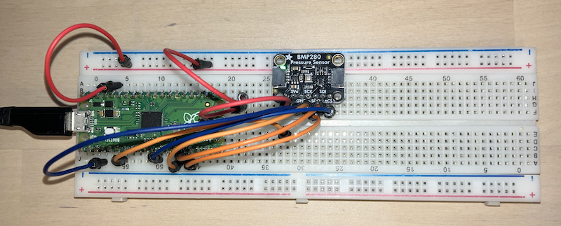

## Temperature from BMP280

External sensor for temperature measurements.

__1. What the BMP280 actually does__
- The BMP280 is a pressure and temperature sensor.
- Inside, it has an ADC (analog-to-digital converter) that measures raw sensor data (called uncompensated values).
- These raw values are not directly usable (they look like big integers with no relation to °C or hPa).
- Bosch provides calibration constants stored in the sensor’s internal registers.
- To get a real temperature (°C), you must:
    1. Read the calibration constants.
	2. Read the raw temperature data.
	3. Apply Bosch’s compensation formula (from the datasheet).

__2. Calibration registers__
- At power-up, the BMP280 has a block of registers (0x88 to 0x9F) that store factory calibration values.
- These constants are unique per chip (set during manufacturing).
- Examples: dig_T1, dig_T2, dig_T3 (for temperature).

For example, you might read:
- dig_T1 = 27504
- dig_T2 = 26435
- dig_T3 = -1000

(These are just example values from Bosch’s datasheet.)

__3. Raw temperature measurement__
- The sensor continuously measures and stores the uncompensated
  temperature in registers 0xFA (MSB), 0xFB (LSB), and 0xFC (XLSB).
- Together, these 3 bytes form a 20-bit integer (adc_T).
- Example: adc_T = 519888 (again, datasheet example).

__4. Bosch’s compensation formula__

The datasheet gives this algorithm (integer-based to save resources on microcontrollers):
```
var1 = ((((adc_T >> 3) - ((int32_t)dig_T1 << 1))) *
        ((int32_t)dig_T2)) >> 11;

var2 = (((((adc_T >> 4) - ((int32_t)dig_T1)) *
          ((adc_T >> 4) - ((int32_t)dig_T1))) >> 12) *
        ((int32_t)dig_T3)) >> 14;

t_fine = var1 + var2;

T = (t_fine * 5 + 128) >> 8;
```
- T is the actual temperature in 0.01 °C (so T = 5190 means 51.90 °C).
- t_fine is an intermediate value also used for pressure compensation.


__5. Putting it together__
Here’s the sequence in plain terms:
1. Read calibration registers 0x88–0x9F → get dig_T1, dig_T2, dig_T3.
2. Read raw temperature registers 0xFA–0xFC → get adc_T.
3. Apply Bosch’s formula → calculate real °C.
4. Convert result: T / 100.0 = degrees Celsius.


__6. Why this could be done manually__
Bosch designed the chip to be very precise, but not waste silicon area on calculations.
By giving you the calibration constants and formula, they let the host microcontroller
do the math. This makes the sensor smaller, cheaper, and lower power, at the cost of some
code complexity. So when you see libraries (like Adafruit’s), they’re just wrapping exactly
this procedure: read constants, read raw data, apply formula, return C (degrees Celsius).
Doing it "raw metal" here means following the datasheet and writing the math yourself.


### MicroPython (no external libs)

Handle the chip directly on the Pico via SPI.

```python
from machine import Pin, SPI
import time

# BMP280 SPI setup
CS_PIN = Pin(8, Pin.OUT, value=1)  # GPIO 8 (Physical Pin 11)
spi = SPI(1, baudrate=1000000, polarity=0, phase=0, bits=8, firstbit=SPI.MSB,
          sck=Pin(10), mosi=Pin(11), miso=Pin(12))  # SPI1: Pins 14, 15, 16

# BMP280 register addresses
REG_DIG_T1 = 0x88
REG_CTRL_MEAS = 0xF4
REG_TEMP = 0xFA

# SPI read/write functions
def read_reg(reg, num_bytes):
    CS_PIN.value(0)  # Select chip
    spi.write(bytes([reg | 0x80]))  # Read mode (MSB=1)
    data = spi.read(num_bytes)
    CS_PIN.value(1)  # Deselect chip
    return data

def write_reg(reg, data):
    CS_PIN.value(0)  # Select chip
    spi.write(bytes([reg & 0x7F]))  # Write mode (MSB=0)
    spi.write(bytes([data]))
    CS_PIN.value(1)  # Deselect chip

# Read an unsigned short (little endian)
def read_u16(reg):
    d = read_reg(reg, 2)
    return d[0] | (d[1] << 8)

# Read a signed short
def read_s16(reg):
    val = read_u16(reg)
    return val if val < 32768 else val - 65536

# Get calibration data for temperature
dig_T1 = read_u16(REG_DIG_T1)
dig_T2 = read_s16(REG_DIG_T1 + 2)
dig_T3 = read_s16(REG_DIG_T1 + 4)

# Configure sensor: oversampling x1, normal mode
write_reg(REG_CTRL_MEAS, 0x27)

def read_temperature():
    data = read_reg(REG_TEMP, 3)
    raw = (data[0] << 12) | (data[1] << 4) | (data[2] >> 4)
    # Compensation formula from datasheet
    var1 = (((raw >> 3) - (dig_T1 << 1)) * dig_T2) >> 11
    var2 = (((((raw >> 4) - dig_T1) * ((raw >> 4) - dig_T1)) >> 12) * dig_T3) >> 14
    t_fine = var1 + var2
    T = (t_fine * 5 + 128) >> 8
    return T / 100.0

# Main loop
while True:
    temp = read_temperature()
    print("Temperature:", temp, "°C")
    time.sleep(1)
```


### C (Raspberry Pi Pico SDK, no external libs)

```c
#include "pico/stdlib.h"
#include "hardware/i2c.h"
#include <stdio.h>

#define BME280_ADDR 0x76

uint16_t read_u16(uint8_t reg) {
    uint8_t buf[2];
    i2c_write_blocking(i2c0, BME280_ADDR, &reg, 1, true);
    i2c_read_blocking(i2c0, BME280_ADDR, buf, 2, false);
    return buf[0] | (buf[1] << 8);
}

int16_t read_s16(uint8_t reg) {
    int16_t val = (int16_t)read_u16(reg);
    return val;
}

int main() {
    stdio_init_all();
    i2c_init(i2c0, 100 * 1000);
    gpio_set_function(4, GPIO_FUNC_I2C); // SDA
    gpio_set_function(5, GPIO_FUNC_I2C); // SCL
    gpio_pull_up(4);
    gpio_pull_up(5);

    // Read calibration
    uint16_t dig_T1 = read_u16(0x88);
    int16_t dig_T2 = read_s16(0x8A);
    int16_t dig_T3 = read_s16(0x8C);

    // Set ctrl_meas register: oversampling x1, normal mode
    uint8_t buf[2] = {0xF4, 0x27};
    i2c_write_blocking(i2c0, BME280_ADDR, buf, 2, false);

    while (1) {
        uint8_t reg = 0xFA;
        uint8_t data[3];
        i2c_write_blocking(i2c0, BME280_ADDR, &reg, 1, true);
        i2c_read_blocking(i2c0, BME280_ADDR, data, 3, false);

        int32_t raw = (data[0] << 12) | (data[1] << 4) | (data[2] >> 4);

        int32_t var1 = ((((raw >> 3) - ((int32_t)dig_T1 << 1))) * dig_T2) >> 11;
        int32_t var2 = (((((raw >> 4) - (int32_t)dig_T1) *
                          ((raw >> 4) - (int32_t)dig_T1)) >> 12) *
                        dig_T3) >> 14;

        int32_t t_fine = var1 + var2;
        int32_t T = (t_fine * 5 + 128) >> 8;

        printf("Temperature: %.2f C\n", T / 100.0);

        sleep_ms(1000);
    }
}
```




Connection Notes:
- VIN to Physical Pin 36 (3V3_OUT, 3.3V). Alt: Pin 40 (VBUS, 5V).
- GND to Physical Pin 3 (or any GND: 8, 13, 18, 23, 28, 33, 38).
- CS to Physical Pin 11 (GPIO 8, SPI1 CS).
- SCK to Physical Pin 14 (GPIO 10, SPI1 SCK).
- SDI (MOSI) to Physical Pin 15 (GPIO 11, SPI1 MOSI).
- SDO (MISO) to Physical Pin 16 (GPIO 12, SPI1 MISO).
- 3Vo: Not connected (NC).
- No pull-up resistors needed for SPI.
- Use a breadboard or soldered connections for stability.

