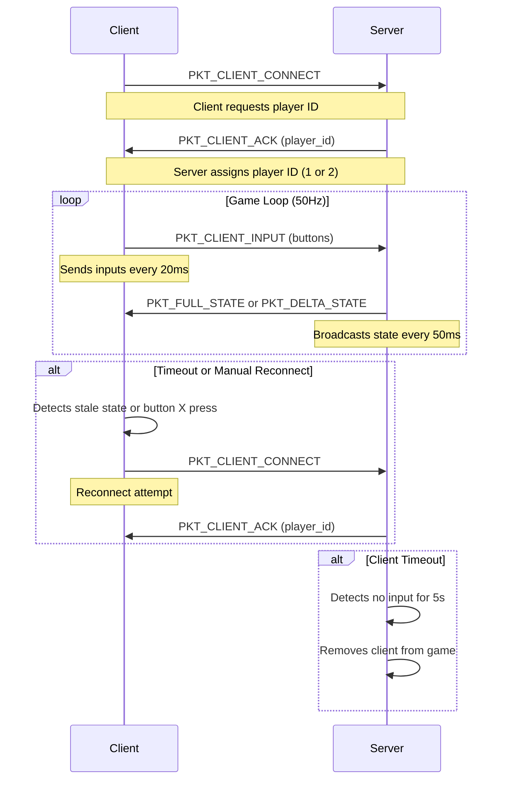

## Networking

The Dogfight game uses a client-server architecture where the server (running on a RPi Pico W
configured as a WiFi Access Point) manages the game state and communicates with up to two clients
(RPi Pico W 2). The communication is handled via UDP sockets, with a custom protocol defined
in the `protocol` module. The networking is designed for low-latency, real-time interaction,
with mechanisms for connection establishment, state synchronization, input handling,
and timeout recovery.

### Networking Features
- *UDP-based communication*: Uses UDP for low-latency, non-blocking communication suitable for real-time gameplay.
- *Connection management*: Robust connection establishment with retries and player ID assignment.
- *State synchronization*: Supports both full and delta state updates to optimize bandwidth.
- *Timeout handling*: Detects and handles client disconnections and stale game states.
- *Manual reconnect*: Allows clients to manually trigger reconnection via a button press.
- *Debugging*: Extensive logging for network events and errors.

### Client Networking (`main.py` - Client)

The client establishes a connection to the server, sends player inputs, and receives game state updates.
It runs a dedicated network thread to handle communication asynchronously, ensuring the main thread can
focus on rendering and input processing.

#### WiFi Connection
- *Function*: `connect_wifi()`
- *Description*: Connects to the server's WiFi Access Point (AP) with the
  SSID "DOGFIGHT_SERVER" and password "dogfight123".
- *Process*:
  - Activates the WLAN interface in Station mode (`network.STA_IF`).
  - Attempts to connect to the AP, retrying up to 10 times with a 1-second
    delay between attempts.
  - Raises a `RuntimeError` if the connection fails.
- *Key Parameters*:
  - `SSID`: "DOGFIGHT_SERVER"
  - `PASSWORD`: "dogfight123"

#### Player ID Request
- *Function*: `request_player_id(sock, server_addr)`
- *Description*: Requests a unique player ID (1 or 2) from the server
  to identify the client in the game.
- *Process*:
  - Sends a `PKT_CLIENT_CONNECT` packet to the server (`192.168.4.1:8888`)
    up to `CONNECT_RETRIES` (5) times.
  - Waits for a `PKT_CLIENT_ACK` response with a player ID within `CONNECT_TIMEOUT`
    (3 seconds).
  - Uses non-blocking socket operations with a 100ms poll interval.
  - Returns the assigned player ID (1 or 2) or `None` if the connection
    fails after retries.
- *Key Parameters*:
  - `CONNECT_TIMEOUT`: 3000ms
  - `CONNECT_RETRIES`: 5
  - `UDP_PORT`: 8888
  - `SERVER_IP`: "192.168.4.1"

#### Network Thread
- *Function*: `network_thread(shared_state)`
- *Description*: Runs in a separate thread to handle all network communication,
  ensuring non-blocking operation.
- *Process*:
  - *WiFi Connection*: Calls `connect_wifi()` if not connected or if the connection is lost.
  - *Socket Creation*: Creates a non-blocking UDP socket if none exists.
  - *Player ID Assignment*: Calls `request_player_id()` to obtain a player ID if not connected.
  - *Input Sending*: Sends `PKT_CLIENT_INPUT` packets at 50Hz (every 20ms) containing
    button states (A, B, X, Y) for the assigned player ID.
  - *State Receiving*: Polls for incoming packets (up to 5 per cycle) and processes:
    - `PKT_FULL_STATE`: Full game state updates.
    - `PKT_DELTA_STATE`: Incremental state updates.
  - *Timeout Handling*: Checks if the game state is stale (`STATE_TIMEOUT` = 2000ms)
    and triggers reconnection if no updates are received.
  - *Reconnect Handling*: Monitors for manual reconnect requests (via button X)
    and resets the connection if requested.
  - *Error Handling*: Closes the socket and retries after 2 seconds on errors.
- *Key Parameters*:
  - `STATE_TIMEOUT`: 2000ms (triggers reconnect if no state update received)
  - Send rate: 50Hz (20ms interval)
  - Receive poll timeout: 10ms

#### Shared State
- *Class*: `SharedState`
- *Description*: A thread-safe class to share network and game state between
  the network thread and the main rendering thread.
- *Key Networking Fields*:
  - `connected`: Boolean indicating connection status.
  - `player_id`: Assigned player ID (1 or 2).
  - `reconnect_request`: Flag to trigger manual reconnection.
  - `last_state_time`: Timestamp of the last received state update for timeout detection.
- *Methods*:
  - `set_connected(connected, player_id)`: Updates connection status and player ID.
  - `request_reconnect()`: Sets the reconnect flag.
  - `check_reconnect_request()`: Checks and clears the reconnect flag.
  - `is_state_stale()`: Checks if the last state update is older than `STATE_TIMEOUT`.

### Server Networking (`main.py` - Server)

The server manages the game state, assigns player IDs, processes client inputs,
and broadcasts game state updates. It runs as a WiFi Access Point and listens
for UDP packets from clients.

#### WiFi Access Point Setup
- *Function*: `setup_ap()`
- *Description*: Configures the Raspberry Pi Pico W as a WiFi Access Point.
- *Process*:
  - Activates the WLAN interface in AP mode (`network.AP_IF`).
  - Sets the SSID to "DOGFIGHT_SERVER" and password to "dogfight123".
  - Assigns the static IP "192.168.4.1".
  - Waits until the AP is active.
- *Key Parameters*:
  - `SSID`: "DOGFIGHT_SERVER"
  - `PASSWORD`: "dogfight123"
  - `SERVER_IP`: "192.168.4.1"

#### Client Connection Management
- *Class*: `ClientConnection`
- *Description*: Tracks individual client connections with their address,
  player ID, and last activity time.
- *Key Fields*:
  - `addr`: Client's IP address and port.
  - `player_id`: Assigned player ID (1 or 2).
  - `last_seen`: Timestamp of the last received packet for timeout detection.
- *Methods*:
  - `update_activity()`: Updates `last_seen` to the current time.
  - `is_timeout()`: Returns `True` if no packets received within `CLIENT_TIMEOUT` (5000ms).

#### Game Server Logic
- *Class*: `GameServer`
- *Description*: Manages game state, client connections, and state synchronization.
- *Key Networking Methods*:
  - *assign_player_id(addr)*:
    - Assigns a unique player ID (1 or 2) to a client.
    - Checks for existing assignments and handles timeouts to free up IDs.
    - Returns `None` if no IDs are available.
  - *cleanup_disconnected_clients()*:
    - Removes clients that haven't sent packets within `CLIENT_TIMEOUT` (5000ms).
    - Updates `clients` and `player_assignments` dictionaries.
  - *handle_input(data, addr)*:
    - Processes incoming packets:
      - `PKT_CLIENT_CONNECT`: Assigns a player ID and sends a `PKT_CLIENT_ACK` response.
      - `PKT_CLIENT_INPUT`: Updates the corresponding player's input state (buttons A, B, X, Y).
      - `PKT_PING`: Responds with a `PKT_PONG` packet for latency measurement.
    - Updates client activity timestamp.
  - *get_state_packet(force_full)*:
    - Generates either a `PKT_FULL_STATE` or `PKT_DELTA_STATE` packet.
    - Full state sent every `full_sync_interval` (30 frames) or on game over.
    - Delta state includes only changed player positions, new shots, and removed shots.
  - *get_full_state_packet()*:
    - Packs the complete game state: player positions, directions, shots,
      game over status, and winner.
    - Updates `prev_state` and `prev_shots` for delta calculations.
  - *get_delta_packet()*:
    - Packs incremental updates: changed player positions, new shots,
      removed shots, game over status, and winner.
    - Tracks changes since the last state to minimize data sent.

#### Main Loop
- *Function*: `main()`
- *Description*: Runs the server loop, handling incoming packets, updating the
  game state, and broadcasting updates.
- *Process*:
  - Sets up the WiFi AP and binds a UDP socket to `SERVER_IP:UDP_PORT` ("192.168.4.1:8888").
  - Listens for incoming packets (up to 10 per frame) with non-blocking reads.
  - Processes each packet using `game.handle_input()`.
  - Updates the game state with `game.update()`.
  - Broadcasts state packets to all connected clients every frame (target 20fps, 50ms per frame).
  - Updates the display every 5 frames.
  - Handles game reset requests via button Y.
- *Key Parameters*:
  - `CLIENT_TIMEOUT`: 5000ms (client disconnection threshold)
  - `HEARTBEAT_INTERVAL`: 1000ms (not explicitly used in the provided code but defined)
  - Frame rate: 20fps (50ms per frame)
  - `full_sync_interval`: 30 frames (full state sent every 1.5 seconds at 20fps)

### Network Protocol

The `protocol` module defines the packet structures for communication.

- *PKT_CLIENT_CONNECT*: Sent by the client to request a player ID.
- *PKT_CLIENT_ACK*: Sent by the server with the assigned player ID.
- *PKT_CLIENT_INPUT*: Sent by the client with button states (A, B, X, Y).
- *PKT_FULL_STATE*: Sent by the server with the complete game state (player positions, shots, game over status).
- *PKT_DELTA_STATE*: Sent by the server with incremental updates (changed positions, new/removed shots).
- *PKT_PING*: Sent by the client to measure latency.
- *PKT_PONG*: Sent by the server in response to a ping.

Each packet includes a type identifier as the first byte, followed by serialized data (likely using a format like `struct` or JSON).

The following sequence diagram illustrates the typical network interaction between a client and the server:

### Key Networking Characteristics

- *UDP Usage*: Chosen for low latency, suitable for real-time games. No guaranteed
  delivery, so the protocol relies on frequent updates and timeouts to maintain consistency.
- *State Synchronization*:
  - Full state updates every 30 frames (1.5 seconds at 20fps) or on game over.
  - Delta updates for efficiency, sending only changed data (player positions, new/removed shots).
- *Timeout Handling*:
  - Client: Reconnects if no state update received within 2000ms.
  - Server: Disconnects clients if no input received within 5000ms.
- *Reconnect Mechanism*:
  - Clients can manually reconnect by pressing button X.
  - Automatic reconnection on state timeout or network errors.
- *Scalability*: Designed for exactly two players, with player IDs 1 and 2.
  The server rejects additional connections if both slots are taken.
- *Error Handling*:
  - Non-blocking sockets prevent hangs.
  - Extensive logging for debugging (e.g., connection attempts, packet receipt, errors).
  - Retries for player ID requests and WiFi connections.

## Projects: Potential Improvements

- *Reliable Connection Handshake*: Add a confirmation step to ensure the client received the `PKT_CLIENT_ACK`.
- *Ping/Pong Latency Monitoring*: Use `PKT_PING` and `PKT_PONG` to display network latency on the client.
- *Packet Loss Mitigation*: Implement sequence number checks to detect and handle missing packets.
- *Dynamic Frame Rate*: Adjust the client's input send rate based on network conditions.
- *Security*: Add basic authentication or packet validation to prevent unauthorized clients.

This networking implementation provides a foundation for a two-player real-time game, 
balancing some simplicity with reliability for the constraints of the Raspberry Pi Pico W/2 W.

