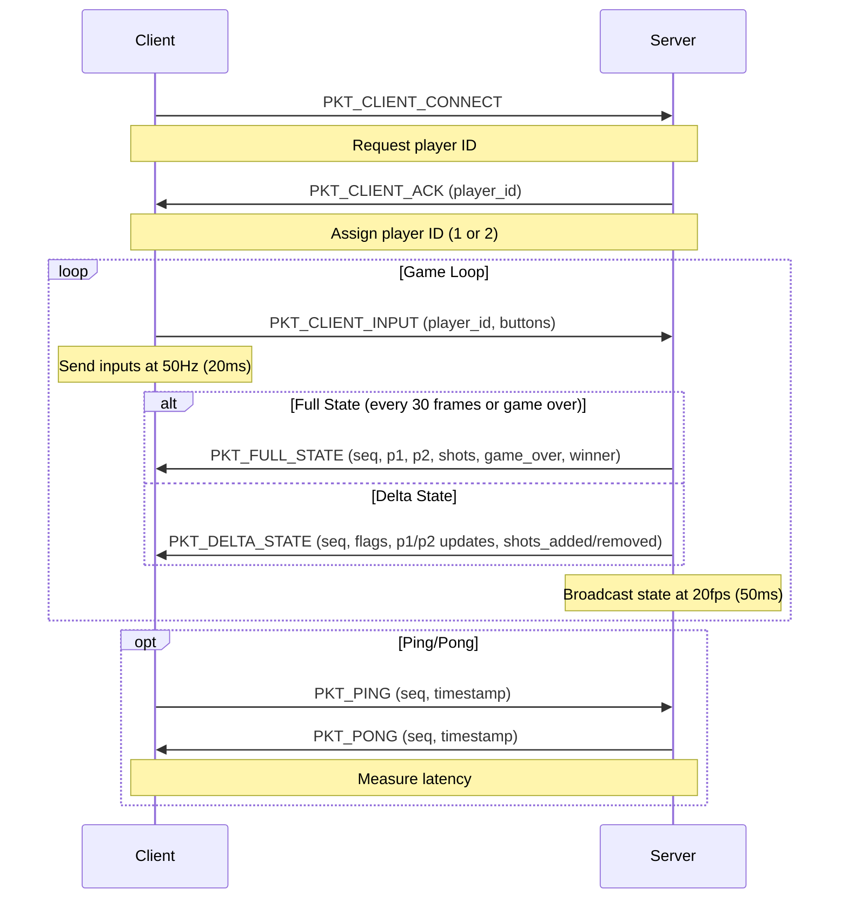

## Protocol Description

The Dogfight game protocol is a binary protocol using UDP for communication, defined in `protocol.py`
(common for both client and server). It includes a set of packet types for specific purposes, such as
connecting clients, sending player inputs, updating game state, and monitoring connection health.
The protocol uses the `struct` module for efficient binary serialization and deserialization, with
fixed-format packets to minimise overhead on the resource-constrained Raspberry Pi Pico W.

### Protocol Features
- *Binary Encoding*: Uses `struct` for compact, fixed-size packet formats.
- *Packet Types*: Distinct packet types for connection handshake, input, full/delta state updates, and ping/pong.
- *Validation*: Includes size checks and error handling to prevent malformed packets.
- *Efficiency*: Supports delta state updates to reduce bandwidth usage.
- *Game Constants*: Defines game world dimensions and movement directions.
- *Error Handling*: Returns `None` or raises exceptions for invalid packets, with debug logging.

The protocol is implemented in `protocol.py` and includes game constants, direction definitions, and five packet classes, each with methods for packing and unpacking data.

### Game Constants
- *GAME_WIDTH*: 100 (game world width in pixels)
- *GAME_HEIGHT*: 80 (game world height in pixels)
- *Direction Constants*:
  - Directions: `DIR_N` (0), `DIR_NE` (1), `DIR_E` (2), `DIR_SE` (3),
    `DIR_S` (4), `DIR_SW` (5), `DIR_W` (6), `DIR_NW` (7)
  - `DIR_DX`: X-axis movement deltas for each direction `[0, 1, 1, 1, 0, -1, -1, -1]`
  - `DIR_DY`: Y-axis movement deltas for each direction `[-1, -1, 0, 1, 1, 1, 0, -1]`

### Packet Types
The protocol defines seven packet types, each identified by a unique byte value:
- `PKT_CLIENT_INPUT` (0x01): Client sends button states to the server.
- `PKT_FULL_STATE` (0x02): Server sends complete game state to clients.
- `PKT_DELTA_STATE` (0x03): Server sends incremental game state updates.
- `PKT_PING` (0x04): Client sends a ping to measure latency.
- `PKT_PONG` (0x05): Server responds to a ping.
- `PKT_CLIENT_CONNECT` (0x06): Client requests a player ID.
- `PKT_CLIENT_ACK` (0x07): Server acknowledges connection with a player ID.

### Packet Classes

Each packet type is implemented as a class with `pack` and `unpack` methods for
serialization and deserialization, respectively. The `struct` module is used with
specific format strings to ensure consistent data encoding.

#### 1. ClientInputPacket
- *Purpose*: Sends player button states from client to server.
- *Direction*: Client → Server
- *Format*: `!BBBBBBxx` (8 bytes total)
  - `!`: Network byte order (big-endian)
  - `B`: Packet type (`PKT_CLIENT_INPUT`, 1 byte)
  - `B`: Player ID (1 or 2, 1 byte)
  - `B`: Button A state (0 or 1, 1 byte)
  - `B`: Button B state (0 or 1, 1 byte)
  - `B`: Button X state (0 or 1, 1 byte)
  - `B`: Button Y state (0 or 1, 1 byte)
  - `xx`: Padding (2 bytes for alignment)
- *Size*: 8 bytes
- *Methods*:
  - `pack(player_id, btn_a, btn_b, btn_x, btn_y)`:
    - Converts button states to binary (0 or 1) and packs into a binary string.
    - Example: `struct.pack("!BBBBBBxx", 0x01, 1, 1, 0, 1, 0)` for Player 1
      with buttons A and X pressed.
  - `unpack(data)`:
    - Validates packet length (≥ 8 bytes).
    - Unpacks data into a dictionary with `player_id`, `btn_a`, `btn_b`, `btn_x`, `btn_y`
      (boolean values).
    - Raises `ValueError` if the packet is too short.
- *Usage*: Sent by clients at 50Hz (every 20ms) to report button states
  (e.g., A for turn left, B for turn right, X for fire).

#### 2. ConnectPacket
- *Purpose*: Handles connection handshake between client and server.
- *Direction*:
  - `PKT_CLIENT_CONNECT`: Client → Server
  - `PKT_CLIENT_ACK`: Server → Client
- *Format*: `!BB6x` (8 bytes total)
  - `!`: Network byte order
  - `B`: Packet type (`PKT_CLIENT_CONNECT` or `PKT_CLIENT_ACK`, 1 byte)
  - `B`: Player ID (0 for request, 1 or 2 for ACK, 1 byte)
  - `6x`: Padding (6 bytes for alignment)
- *Size*: 8 bytes
- *Methods*:
  - `pack_request()`:
    - Packs a `PKT_CLIENT_CONNECT` packet with player ID 0.
    - Example: `struct.pack("!BB6x", 0x06, 0)`
  - `pack_ack(player_id)`:
    - Validates `player_id` (must be 1 or 2).
    - Packs a `PKT_CLIENT_ACK` packet with the assigned player ID.
    - Example: `struct.pack("!BB6x", 0x07, 1)` for Player 1.
    - Raises `ValueError` for invalid player ID.
  - `unpack(data)`:
    - Validates packet length (≥ 8 bytes).
    - Returns a dictionary with `type` (packet type) and `player_id`.
    - Raises `ValueError` if the packet is too short.
- *Usage*: Used during connection establishment. The client sends a connect request,
  and the server responds with an ACK containing the assigned player ID.

#### 3. FullStatePacket
- *Purpose*: Sends the complete game state from server to clients.
- *Direction*: Server → Client
- *Format*: Variable length
  - *Header*: `!BHBBBB` (6 bytes)
    - `!`: Network byte order
    - `B`: Packet type (`PKT_FULL_STATE`, 1 byte)
    - `H`: Sequence number (2 bytes)
    - `B`: Player 1 alive (0 or 1, 1 byte)
    - `B`: Player 2 alive (0 or 1, 1 byte)
    - `B`: Game over (0 or 1, 1 byte)
    - `B`: Winner (0, 1, or 2, 1 byte)
  - *Player Data* (per player): `BBB` (3 bytes)
    - `B`: X position (1 byte)
    - `B`: Y position (1 byte)
    - `B`: Direction (0–7, 1 byte)
  - *Shot Counts*: `BB` (2 bytes)
    - `B`: Player 1 shot count (1 byte)
    - `B`: Player 2 shot count (1 byte)
  - *Shot Data* (per shot): `BBBBB` (5 bytes)
    - `B`: X position (1 byte)
    - `B`: Y position (1 byte)
    - `B`: Direction (0–7, 1 byte)
    - `B`: Range (remaining distance, 1 byte)
    - `B`: Owner (1 or 2, 1 byte)
- *Size*: Minimum 11 bytes (header + 2 players + shot counts, no shots)
- *Methods*:
  - `pack(seq, p1_state, p2_state, p1_shots, p2_shots, game_over, winner)`:
    - Packs header with sequence number, player alive states, game over, and winner.
    - Packs player positions and directions for both players.
    - Packs shot counts and shot data (x, y, dir, range, owner) for each player’s shots.
    - Example: For a state with Player 1 at (50, 40, DIR_N), Player 2 at
      (20, 30, DIR_E), one Player 1 shot, and game not over:
      - Header: `struct.pack("!BHBBBB", 0x02, seq, 1, 1, 0, 0)`
      - Players: `struct.pack("BBB", 50, 40, 0) + struct.pack("BBB", 20, 30, 2)`
      - Shots: `struct.pack("BB", 1, 0) + struct.pack("BBBBB", shot_x, shot_y, shot_dir, shot_range, 1)`
  - `unpack(data)`:
    - Validates packet length at each stage (header, players, shot counts, shots).
    - Unpacks header, player data, and shots into a dictionary with
      `seq`, `p1`, `p2`, `shots`, `game_over`, and `winner`.
    - Returns `None` and logs an error if unpacking fails (e.g., due
      to insufficient data or format errors).
- *Usage*: Sent by the server every 30 frames (1.5 seconds at 20fps)
  or on game over to ensure clients have the complete game state.

#### 4. DeltaStatePacket
- *Purpose*: Sends incremental game state updates to reduce bandwidth.
- *Direction*: Server → Client
- *Format*: Variable length
  - *Header*: `!BHB` (4 bytes)
    - `!`: Network byte order
    - `B`: Packet type (`PKT_DELTA_STATE`, 1 byte)
    - `H`: Sequence number (2 bytes)
    - `B`: Flags (bitmask for included data, 1 byte)
      - `FLAG_P1_POS` (0x01): Player 1 position included
      - `FLAG_P2_POS` (0x02): Player 2 position included
      - `FLAG_P1_DIR` (0x04): Player 1 direction included
      - `FLAG_P2_DIR` (0x08): Player 2 direction included
      - `FLAG_GAME_OVER` (0x10): Game over and winner included
  - *Player Position* (if flag set): `BB` (2 bytes)
    - `B`: X position (1 byte)
    - `B`: Y position (1 byte)
  - *Player Direction* (if flag set): `B` (1 byte)
    - `B`: Direction (0–7)
  - *Game Over* (if flag set): `B` (1 byte)
    - `B`: Winner (0, 1, or 2)
  - *Shots Added*: `B` (1 byte) + `BBBBB` per shot (5 bytes)
    - `B`: Number of added shots
    - `BBBBB`: Shot data (x, y, dir, range, owner)
  - *Shots Removed*: `B` (1 byte) + `BB` per shot (2 bytes)
    - `B`: Number of removed shots
    - `BB`: Shot coordinates (x, y)
- *Size*: Minimum 4 bytes (header only)
- *Methods*:
  - `pack(seq, p1_pos, p2_pos, shots_added, shots_removed, game_over, winner)`:
    - Sets flags based on included data (player positions, directions, game over).
    - Packs header with sequence number and flags.
    - Conditionally packs player positions, directions, game over status,
      added shots, and removed shots.
    - Example: For a delta with Player 1 position update and one new shot:
      - Header: `struct.pack("!BHB", 0x03, seq, FLAG_P1_POS)`
      - Position: `struct.pack("BB", p1_x, p1_y)`
      - Shots: `struct.pack("B", 1) + struct.pack("BBBBB", shot_x, shot_y, shot_dir, shot_range, owner) + struct.pack("B", 0)`
  - `unpack(data)`:
    - Validates packet length at each stage.
    - Unpacks header to get sequence number and flags.
    - Conditionally unpacks player positions, directions, game over status,
      added shots, and removed shots based on flags.
    - Returns a dictionary with `seq`, `p1`, `p2`, `shots_added`,
      `shots_removed`, `game_over`, and `winner`.
    - Returns `None` and logs an error if unpacking fails.
- *Usage*: Sent by the server for most frames (20fps) to update only changed
  game state, minimizing bandwidth.

#### 5. PingPacket
- *Purpose*: Monitors connection latency and health.
- *Direction*:
  - `PKT_PING`: Client → Server
  - `PKT_PONG`: Server → Client
- *Format*: `!BxHI` (8 bytes total)
  - `!`: Network byte order
  - `B`: Packet type (`PKT_PING` or `PKT_PONG`, 1 byte)
  - `x`: Padding (1 byte)
  - `H`: Sequence number (2 bytes)
  - `I`: Timestamp (4 bytes)
- *Size*: 8 bytes
- *Methods*:
  - `pack(seq, timestamp)`: Packs a ping packet.
  - `pack_pong(seq, timestamp)`: Packs a pong packet with the same sequence and timestamp.
  - `unpack(data)`:
    - Validates packet length (≥ 8 bytes).
    - Returns a dictionary with `type`, `seq`, and `timestamp`.
    - Raises `ValueError` if the packet is too short.
- *Usage*: Used by clients to measure latency (though not fully utilised
  in the provided client code). The server responds to pings with pongs
  to confirm connectivity.

The following sequence diagram illustrates the protocol interactions between a client and the server:

### Key Protocol Characteristics
- *Binary Efficiency*: Uses compact `struct` formats to minimize packet size,
  critical for the low-bandwidth Pico W.
- *Fixed vs. Variable Length*:
  - Fixed: `ClientInputPacket`, `ConnectPacket`, `PingPacket` (8 bytes each).
  - Variable: `FullStatePacket`, `DeltaStatePacket` (depend on shot counts).
- *Validation*: Length checks and exception handling ensure robustness against malformed packets.
- *State Synchronization*:
  - Full state for initialization or recovery.
  - Delta state for bandwidth efficiency.
- *Sequence Numbers*: Included in state packets (`seq`) to track update order,
  though not used for retransmission in this UDP-based protocol.
- *Error Handling*: Returns `None` or raises `ValueError` for invalid packets,
  with debug logging for diagnostics.
- *Direction-Based Movement*: `DIR_DX` and `DIR_DY` arrays define movement vectors
  for eight directions, used in game logic and shot updates.

## Example Packet Sizes
- *ClientInputPacket*: Always 8 bytes.
- *ConnectPacket*: Always 8 bytes.
- *PingPacket/Pong*: Always 8 bytes.
- *FullStatePacket*:
  - Minimum: 11 bytes (header + 2 players + shot counts, no shots).
  - With shots: 11 + 5 * (p1_shots + p2_shots) bytes.
  - Example: 2 shots per player = 11 + 5 * (2 + 2) = 31 bytes.
- *DeltaStatePacket*:
  - Minimum: 4 bytes (header only, no updates).
  - Typical: 4 (header) + 2–3 (player pos/dir) + 1 (shots added count) +
    5 * shots_added + 1 (shots removed count) + 2 * shots_removed.
  - Example: Update Player 1 position and add 1 shot = 4 + 2 + 1 + 5 = 12 bytes.

### Projects: Potential Improvements
- *Sequence Number Validation*: Add checks to detect out-of-order or duplicate state packets.
- *Compression*: Use bit-packing or alternative encoding for even smaller packets.
- *Reliable Handshake*: Ensure `PKT_CLIENT_ACK` delivery with retries.
- *Latency Utilization*: Use `PingPacket` data to display or adapt to network latency.
- *Security*: Add a simple checksum or authentication code to prevent tampering.
- *Shot Validation*: Add range checks for shot coordinates and player positions to prevent invalid data.

This protocol provides a lightweight, efficient, and framework for the Dogfight game,
balancing the hard constraints of the Raspberry Pi Pico W/2 W with the needs of real-time
multiplayer gameplay.
