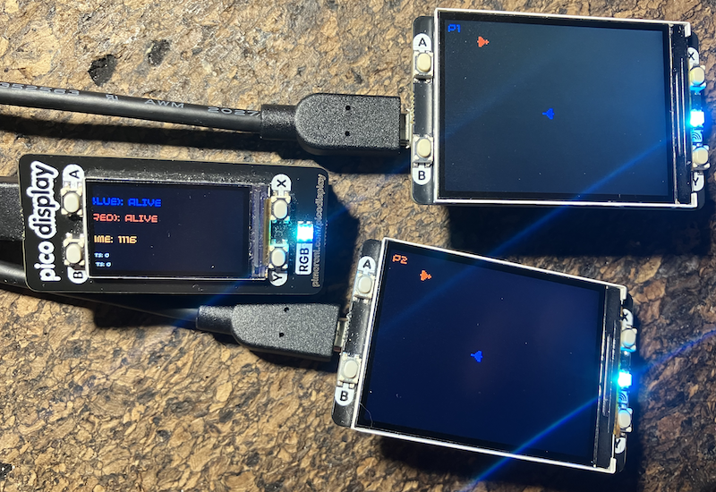

> [!IMPORTANT]  
> The example in this folder requires two *Raspberry Pi Pico 2 W* (or wireless expansion to RPI Pico 2) for use as clients, and a RPi Pico W for server. But you can use other setups as well, if you slightly modify the code. It also assumes two Pimoroni Display Pack 2.0, if you do not want to rewrite the samples for other displays. The display for the server is more optional. The code has consistently been built with __MicroPython only__, which have often good support for networking in libraries. You might enjoy enhancing some projects, with building them in C as they do not build on each other, but are separated in different Picos and communication is not programming language dependent. You could start with porting the server to C ..

## Projects for the 2 Player Dogfight Game

*This game is not strong in terms of gameplay; its main purpose is to demonstrate networking code
and protocol. If you wish, you may take on projects to enhance the gameplay itself. Once the gameplay
provides a better basis for testing, you can move on to one of the other projects listed below.*

__The Dogfight Game__

Dogfight is a two-player, real-time aerial combat game for Raspberry Pi Pico 2 W (preferably, as
memory and speed can be limits, but might work with Pico W). The two players control planes on
separate screens, navigating in eight directions using buttons (A to turn left, B to turn right,
Y to fire). Each plane can fire up to three shots, which travel in the direction the plane is
facing and have a limited range (barely visible, change that!?). The objective is to hit the
opponent's plane with a shot, scoring a point and ending the round. The game features a client-server
architecture, with one Pico W (alt. 2 W) acting as the server (hosting the game) and two clients
(players) connecting via WiFi. The server manages game state, collision detection, and synchronisation,
while clients display the game and handle input. Visual feedback includes a graphical display showing
planes, shots, and game status, with LED indicators for connection, firing, and win/loss states.
Players can reset the game (server-side) or reconnect (client-side) if needed.

### Project 1: Implement Sequence Number Validation for Reliable Updates
This project addresses potential issues with UDP's unreliability, such as out-of-order or duplicate
packets, which can cause "jumpy" game states. By validating sequence numbers (`seq` from PROTOCOL.md),
you'll ensure clients process updates in order, improving synchronisation without adding retransmissions
(keeping it lightweight for the Pico W/2 W).

*Steps to Implement:*
1. In `protocol.py`, modify the `unpack` methods of `FullStatePacket` and `DeltaStatePacket` to return
   `None` if the unpacked `seq` is less than or equal to the last known `seq` (add a parameter for the
   current last_seq to these methods).
2. In `main.py` (Client), update the `SharedState` class to store `last_seq` (initialise to 0). In the
   network thread's receive loop, after unpacking a state or delta, check if the new `seq` > `last_seq`;
   if not, discard it and log a warning. If valid, update `last_seq` and apply the state via `update_game_state`.
3. On the server in `main.py` (Server), ensure `seq` increments monotonically in `get_state_packet`
   (it's already there, but add a reset on game reset).
4. Test by introducing artificial delays: In the client network thread, add `time.sleep(0.1)` randomly
   before processing some packets. Observe the display for smoother state transitions. Use debug logging
   from protocol.py to count discarded packets.

*Challenges:* Handling wrap-around for large `seq` values (use a 16-bit unsigned int, as in the `!H` format).
If packets are lost, the client might stall—mitigate by forcing a full sync request if `seq` jumps too far
(e.g., >10).

*Learning Outcomes:* Understand ordered delivery in unreliable protocols, similar to TCP sequence numbers
but without ACKs. This ties into PROTOCOL.md's note on sequence numbers not being used for retransmission.

*Estimated Time:* 2-4 hours.

### Project 2: Add Packet Compression for Bandwidth Optimization
Inspired by PROTOCOL.md's suggestions for compression and additionally some bandwidth optimisation
(e.g., packing multiple deltas), this project reduces packet sizes to handle weak WiFi signals better.
You'll use Python's `zlib` (available in the code_execution environment, but for Pico, ensure MicroPython
supports it or use bit-packing as a fallback).

*Steps to Implement:*
1. In `protocol.py`, add a compression flag to packet headers (e.g., modify `HEADER_FORMAT` in
   `FullStatePacket` and `DeltaStatePacket` to include a bit in flags for compression). In `pack`
   methods, if the data exceeds a threshold (e.g., 50 bytes), compress with `zlib.compress(data, level=1)`
   and set the flag.
2. In `unpack` methods, check the flag and decompress with `zlib.decompress(data)` if set. Fall back
   to bit-packing for positions (e.g., pack x/y as a single 16-bit int since GAME_WIDTH/HEIGHT are small).
3. In `main.py` (Server), in `get_full_state_packet` and `get_delta_packet`, compute packet length
   before sending and enable compression dynamically. Log average packet sizes.
4. On the client, update the receive loop to handle compressed packets. Test with varying shot counts
   (e.g., fire rapidly to increase `FullStatePacket` size) and measure bandwidth using print statements
   for len(data). Simulate high load by increasing the full_sync_interval in IDEAS.md to force more full states.

*Challenges:* zlib might increase CPU load on Pico W—profile with `time.ticks_ms()` and switch to custom
bit-packing (e.g., use 3 bits for directions instead of 1 byte). Ensure decompression handles errors gracefully,
raising `ValueError` as in existing validation.

*Learning Outcomes:* Learn about trade-offs in compression for embedded systems, aligning with NETWORK.md's
efficiency focus. You'll see how delta updates (already in the code) combine with compression for better performance.

*Estimated Time:* 3-5 hours.

### Project 3: Build a Reliable Handshake with Retries
Building on NETWORK.md's connection management and additional handshake, this project ensures reliable player
ID assignment despite packet loss. You'll add retries and confirmations, preventing issues like duplicate IDs
during reconnects (as in the manual reconnect via button X in client main.py).

*Steps to Implement:*
1. In `protocol.py`, extend `ConnectPacket` to include a nonce (random 4-byte int) in requests and ACKs
   (update FORMAT to `!BBI4x`). Add a new packet type for confirmation (e.g., `PKT_CLIENT_CONFIRM = 0x08`).
2. In `main.py` (Client), in `request_player_id`, generate a nonce, send `PKT_CLIENT_CONNECT` with it, and
   retry up to 10 times every 500ms if no ACK. On ACK, verify nonce and send a `PKT_CLIENT_CONFIRM` back.
3. In `main.py` (Server), in `handle_input` for `PKT_CLIENT_CONNECT`, store nonce per addr temporarily.
   On ACK send, wait for `PKT_CLIENT_CONFIRM` (add a timeout check in cleanup). Only mark connected on confirmation.
4. Test by dropping packets artificially (e.g., add random `continue` in server receive loop). Use LEDs
   for debug: flash yellow on retry, green on success. Monitor with IDEAS.md's connection count display.

*Challenges:* Managing state for pending connections (use a dict in GameServer). Handle nonce collisions
(unlikely but add checks). This adds latency—tune retry intervals based on CONNECT_TIMEOUT (3000ms).

*Learning Outcomes:* Grasp three-way handshakes (like TCP SYN-ACK), improving robustness as suggested
in PROTOCOL.md's reliable handshake improvement.

*Estimated Time:* 4-6 hours.

### Project 4: Integrate Latency Monitoring with Ping/Pong
This leverages the existing but underused `PKT_PING`/`PKT_PONG` from protocol.py and PROTOCOL.md to measure
and display latency, addressing some latency measurements. You'll adapt gameplay (e.g., slow input
rates on high latency) for better user experience.

*Steps to Implement:*
1. In `protocol.py`, ensure `PingPacket` uses accurate timestamps (already `!I` for 4-byte uint). Add
   averaging in unpack to compute RTT.
2. In `main.py` (Client), in the network thread, send a ping every 1000ms (as in HEARTBEAT_INTERVAL).
   On pong, calculate RTT = current_time - timestamp, store in `SharedState` as a rolling average
   (e.g., over 5 pings).
3. In `main.py` (Server), in `handle_input`, respond to pings immediately with `pack_pong`.
4. Update client rendering to show RTT (e.g., color-coded text: green <50ms, yellow 50-200ms, red >200ms).
   If RTT >100ms, dynamically increase input sleep to 30ms (from 20ms) as per IDEAS.md's tunable variables.
   Test by adding server-side delays (e.g., `time.sleep(0.05)` in update) and observe display changes.

*Challenges:* Clock skew between devices—use relative ticks_ms(). High latency might cause timeouts;
integrate with STATE_TIMEOUT for auto-reconnect.

*Learning Outcomes:* Learn network diagnostics, similar to ping tools, and adaptive protocols.
This fulfills PROTOCOL.md's latency utilization suggestion.

*Estimated Time:* 2-4 hours.

### Project 5: Add Checksums for Packet Integrity and Basic Security
Inspired by PROTOCOL.md's security improvements, this adds CRC checksums to detect corruption or tampering,
crucial for wireless networks prone to interference.

*Steps to Implement:*
1. In `protocol.py`, import `binascii` and append a 2-byte CRC (`binascii.crc_hqx(data, 0xFFFF)`) to
   all `pack` methods (update FORMATs, e.g., add `!H` at end).
2. In `unpack` methods, compute CRC on data[:-2] and compare to unpacked CRC; if mismatch, return None
   and log error.
3. For basic security, add a shared secret (hardcode a key in code) and use HMAC-SHA1 (if available
   in MicroPython) instead of plain CRC. Update all packet classes.
4. In client and server main.py, discard invalid packets in receive loops. Test by corrupting data
   manually (e.g., flip bits in a proxy script or add noise simulation). Log integrity failures and
   ensure game recovers via full syncs.

*Challenges:* Overhead on small packets—make optional for inputs. MicroPython's binascii might vary;
test compatibility. For tampering, simulate attacks by modifying packets mid-transit (use a
man-in-the-middle setup if advanced).

*Learning Outcomes:* Understand data integrity in protocols (like IP checksums) and basic authentication,
aligning with PROTOCOL.md's checksum suggestion.

*Estimated Time:* 3-5 hours.

These expanded projects provide hands-on experience with real-world networking challenges.
Start with Project 1 for foundational improvements, then progress. Document your changes in
a Markdown file, e.g., inspired by the existing docs.

