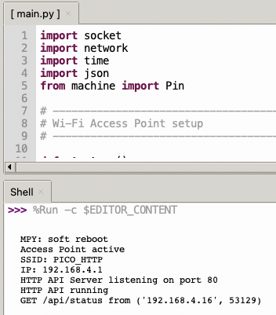
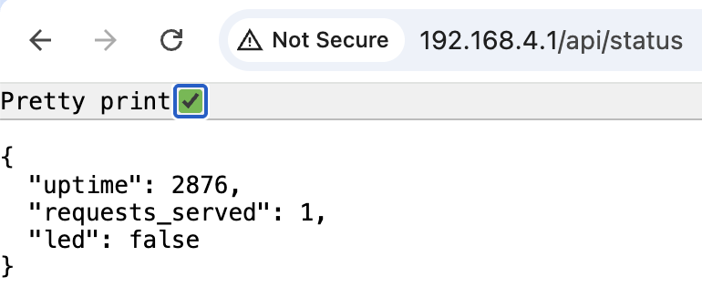

## Pico W HTTP API Server (MicroPython)

Simple JSON HTTP API server running on Raspberry Pi Pico W
(or other MicroPython Wi-Fi boards). The device creates its
own Wi-Fi Access Point and offers a small REST-like API to
control an LED and read device status.


#### Features

- Creates Wi-Fi Access Point (`PICO_HTTP` / password: `pico1234`)
- Lightweight HTTP server on port 80
- JSON API endpoints
- Control onboard LED (GPIO 25)
- Reports device uptime & request counter
- CORS enabled (works well with web apps & mobile browsers)


#### Available Endpoints

| Method   | Path            | Description               | Response example                                 |
|----------|-----------------|---------------------------|--------------------------------------------------|
| GET      | `/api/status`   | Get current device state  | `{"led":false,"uptime":123,"requests_served":4}` |
| POST     | `/api/led`      | Toggle LED state          | same as status                                   |
| GET/POST | `/api/led/on`   | Turn LED on               | same as status                                   |
| GET/POST | `/api/led/off`  | Turn LED off              | same as status                                   |


#### Requirements

- MicroPython firmware for Pico W (or other supported Wi-Fi board)
- Modules: `socket`, `network`, `time`, `json`, `machine`


#### How to use

1. Flash recent MicroPython to your Pico W
2. Save the script as `main.py` on the board
3. Reset / power cycle the board
4. Connect to Wi-Fi network:  
   *SSID:* `PICO_HTTP`  
   *Password:* `pico1234`
5. Find the IP address printed in the REPL (usually `192.168.4.1`)
6. Open browser or use curl/Postman:

```bash
# Check status
curl http://192.168.4.1/api/status

# Toggle LED
curl -X POST http://192.168.4.1/api/led

# Turn LED on (also works with GET)
curl http://192.168.4.1/api/led/on
```

#### Running Server through Thonny




#### Viewing Replies from Server after Request



