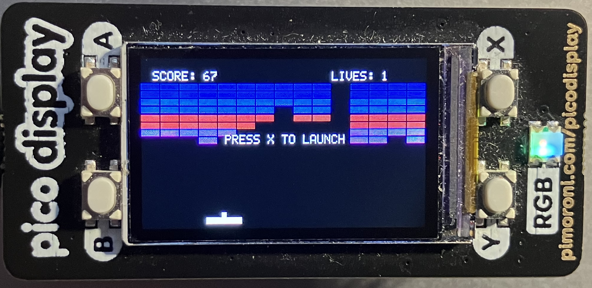

## Breakout Game

A classic Breakout/Arkanoid-style game implementation for the
Raspberry Pi Pico with Pimoroni Display Pack.

- Raspberry Pi Pico or Pico W
- Pimoroni Display Pack (240x135 ST7789V2 LCD with buttons)
  - Display: 240x135 pixels, 16-bit RGB565 color
  - 4 buttons: A, B, X, Y

__Display Connections__
- *CS (Chip Select)*: GPIO 17
- *CLK (SPI Clock)*: GPIO 18
- *MOSI (SPI Data)*: GPIO 19
- *DC (Data/Command)*: GPIO 16
- *RESET*: GPIO 21
- *Backlight*: GPIO 20

__Button Connections__
- *Button A*: GPIO 12
- *Button B*: GPIO 13
- *Button X*: GPIO 14
- *Button Y*: GPIO 15


### Game Controls

- *Button B*: Move paddle left
- *Button Y*: Move paddle right
- *Button X*: Launch ball / Restart game
- *Button A*: Toggle backlight on/off

__Objective__
Break all the bricks by bouncing the ball off your paddle.
Don't let the ball fall off the bottom of the screen!


__Scoring__
Bricks award different points based on their row (color):
- *Red bricks* (top 2 rows): 7 points each
- *Orange bricks* (rows 3-4): 5 points each
- *Green bricks* (rows 5-6): 3 points each
- *Yellow bricks* (bottom 2 rows): 1 point each

__Lives__
- Start with 5 lives
- Lose a life when the ball falls off the bottom
- Game over when all lives are lost

__Ball Speed__
The ball automatically speeds up during gameplay:
- *Initial speed*: 2 pixels/frame
- *After 4 brick hits*: Speed increases to 3
- *After 12 brick hits*: Speed increases to 4
- *Hitting top red rows*: Speed jumps to 5

__Paddle Control__
- The ball's horizontal velocity changes based on where it hits the paddle
- Hit near the edges for steeper angles
- Hit near the center for straighter shots


### Display

Hardware abstraction layer for the Display Pack, providing:

__Display Functions__
- `display_pack_init()` - Initialize display and SPI
- `display_clear(color)` - Clear screen to solid color
- `display_fill_rect(x, y, w, h, color)` - Draw filled rectangle
- `display_draw_pixel(x, y, color)` - Draw single pixel
- `display_blit_full(pixels)` - Blit entire frame buffer (DMA-accelerated)
- `display_draw_char(x, y, c, color, bg)` - Draw single character
- `display_draw_string(x, y, str, color, bg)` - Draw text string
- `display_set_backlight(on)` - Control backlight

__Button Functions__
- `buttons_init()` - Initialize button GPIO pins
- `buttons_update()` - Poll button states (call every frame)
- `button_pressed(button)` - Check if button is currently held
- `button_just_pressed(button)` - Check for button press event
- `button_just_released(button)` - Check for button release event
- `button_set_callback(button, callback)` - Set interrupt-style callback

__Utility Functions__
- `display_is_initialized()` - Check init status
- `display_dma_busy()` - Check if DMA transfer in progress
- `display_wait_for_dma()` - Wait for DMA completion
- `display_cleanup()` - Clean shutdown
- `display_error_string(error)` - Get error message

__Features__
- *DMA acceleration* for fast screen updates
- *Hardware SPI* at 31.25 MHz
- *Error handling* with detailed error codes
- *Debounced buttons* (50ms debounce time)
- *5x8 pixel font* for text rendering
- *RGB565 color format* (16-bit)


- Frame buffer rendering for smooth graphics
- 8 rows × 15 columns of bricks (120 total)
- Physics-based paddle collision with angle variation
- Progressive difficulty with automatic speed increases
- Score and lives tracking
- Game over and restart functionality

__Constants__
- `PADDLE_WIDTH`: 30 pixels
- `PADDLE_HEIGHT`: 5 pixels
- `BALL_SIZE`: 4×4 pixels
- `BRICK_WIDTH`: 16 pixels
- `BRICK_HEIGHT`: 6 pixels
- `INITIAL_LIVES`: 5
- Target framerate: ~60 FPS (16ms per frame)


__Color Definitions (RGB565)__

```c
#define COLOR_BLACK     0x0000
#define COLOR_WHITE     0xFFFF
#define COLOR_RED       0xF800
#define COLOR_GREEN     0x07E0
#define COLOR_BLUE      0x001F
#define COLOR_YELLOW    0xFFE0
#define COLOR_CYAN      0x07FF
#define COLOR_MAGENTA   0xF81F
#define COLOR_ORANGE    0xFEA0
```

- Display updates use DMA for optimal performance
- Frame buffer rendering eliminates flicker
- SPI runs at 31.25 MHz for fast data transfer
- Target frame rate: 60 FPS (16ms per frame)
- Full screen blit: ~5ms with DMA


### Trouble Shooting

__Display not working__
- Check SPI pin connections (GPIO 17-19)
- Verify power supply (Pico needs 5V for stable operation)
- Ensure Display Pack is properly seated

__Buttons not responding__
- Verify button pin connections (GPIO 12-15)
- Check that `buttons_update()` is called in main loop
- Buttons use internal pull-ups (active low)

__Slow performance__
- Ensure DMA is initialising properly (check error messages)
- Verify SPI clock speed in `display_pack_init()`
- Check for excessive `display_wait_for_dma()` calls

__DMA timeout errors__
- Indicates stuck DMA transfer
- Code includes automatic recovery (1-second timeout)
- May indicate hardware issue or incorrect wiring



