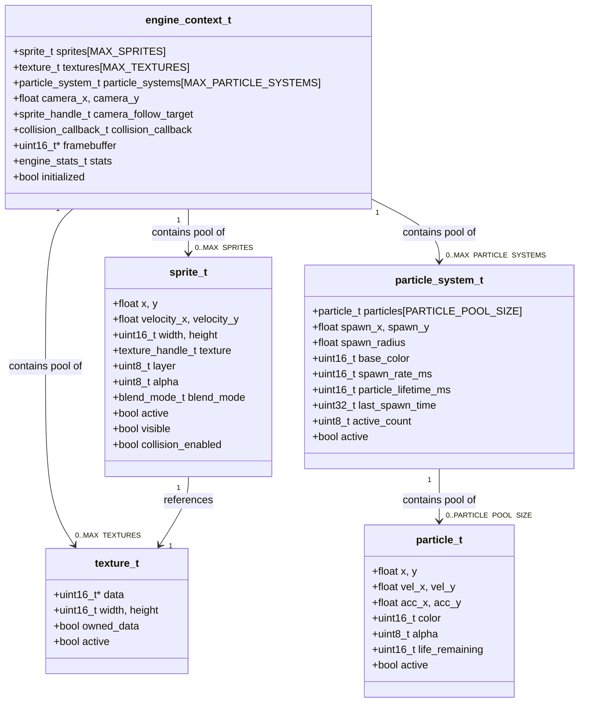
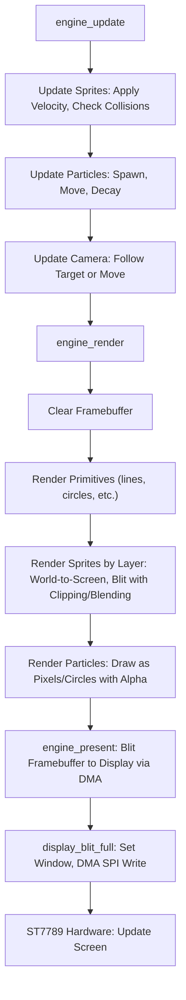
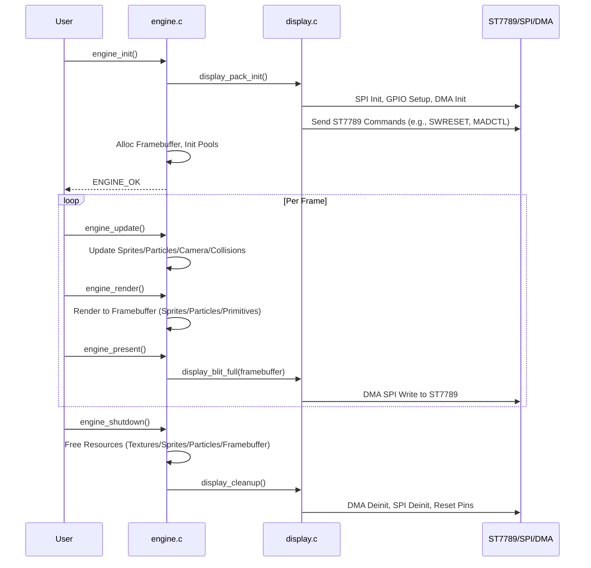
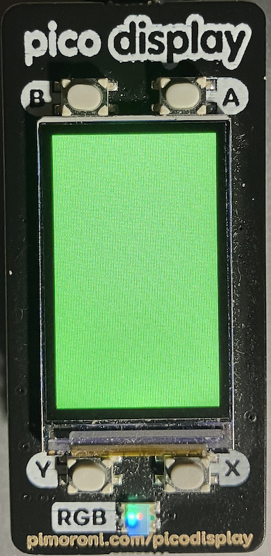

> [!TIP]
> Use Raspberry Pi Pico 2/2W as it has much more memory for a hungry display,
> if you intend to develop this further. For this example we've used a
> RPI Pico and the older Pimironi Display Pack.


## Graphics Engine Code

The code is for a Raspberry Pi Pico with a ST7789-based Display Pack (240x135 pixels,
RGB565 color, SPI interface with DMA acceleration). It includes low-level display
control, button handling, and a higher-level engine for sprites, particles, camera,
and primitives. Safety features (e.g., watchdog timers, bounds checking) prevent
crashes in embedded environments.


### 1. Overview
- *Low-Level Layer (`display.h` and `display.c`)*: Handles direct interaction
  with the ST7789 LCD controller via SPI (with DMA for efficiency). Includes
  button input, font rendering, and basic drawing primitives. Focuses on hardware
  initialization, error handling, and safe DMA operations.
- *High-Level Layer (`engine.h` and `engine.c`)*: Builds on the display layer
  to provide a game-like engine with resource management (sprites, textures,
  particles), camera system, collision detection, and rendering primitives.
  Uses a singleton pattern for state management and includes memory safety checks.
- *Key Themes*:
  - *Safety*: Bounds checking, watchdog timers for DMA, memory integrity checks, and error codes.
  - *Performance*: DMA for fast SPI transfers, pooling for resources (e.g., sprites limited to 16).
  - *Embedded Constraints*: Fixed pools to avoid dynamic allocation issues; no internet or advanced libs.
- *Dependencies*: Relies on Pico SDK (e.g., `hardware/spi.h`, `pico/time.h`).


### 2. Mermaid Diagrams

#### 2.1 Class Diagram: Key Structures and Relationships
This diagram shows the main structs and their fields/relationships. Note: C structs
aren't classes, but Mermaid's class diagram works well for visualization. `engine_context_t`
is the central singleton holding pools.




#### 2.2 Flowchart: Rendering Pipeline
This shows the flow from update to present, including low-level display calls.




#### 2.3 Sequence Diagram: Initialisation and Frame Cycle
This illustrates the sequence for init, update, and shutdown.




### 3. Detailed Documentation by Module

#### 3.1 Low-Level Display Module (`display.h` and `display.c`)
This module interfaces directly with the ST7789 LCD controller (240x135 pixels, SPI bus).
It uses DMA for efficient data transfer to avoid blocking the CPU. Buttons are handled
with debouncing and callbacks.


##### Key Components:
- *Pins and Hardware*: Fixed pins for CS, CLK, MOSI, DC, RESET, BL, and buttons (A/B/X/Y).
- *DMA Setup*: Uses a single DMA channel with interrupt handler. Includes watchdog to detect
  stuck transfers and safe disable/abort functions.
- *Font*: Fixed 5x8 pixel font for ASCII chars (space to Z).
- *Error Handling*: Enum `display_error_t` with string mappings. Functions return errors for
  invalid params, uninitialized state, etc.
- *Safety Features*:
  - Bounds checking in all drawing functions (e.g., clamp rect to screen).
  - Timeout and watchdog in DMA waits.
  - Atomic callback updates with interrupt disable.


##### Functions:
- *Initialization*:
  - `display_pack_init()`: Sets up SPI (4MHz), GPIOs, DMA. Sends ST7789 init sequence
    (e.g., SWRESET, SLPOUT, COLMOD for RGB565). Turns on backlight.
- *Drawing Primitives*:
  - `display_clear(color)`: Fills entire screen (calls `display_fill_rect`).
  - `display_fill_rect(x, y, w, h, color)`: Sets window, uses DMA for large fills or
    blocking SPI for small. Clamps to bounds.
  - `display_draw_pixel(x, y, color)`: Single-pixel fill (bounds-checked).
  - `display_blit_full(pixels)`: DMA blits entire framebuffer to display.
  - `display_draw_char(x, y, c, fg, bg)`: Renders 5x8 font glyph with bounds checking.
  - `display_draw_string(x, y, str, fg, bg)`: Draws string char-by-char with spacing.
- *Backlight*: `display_set_backlight(on)`: Controls BL pin.
- *Buttons*:
  - `buttons_init()`: Sets up pull-up inputs.
  - `buttons_update()`: Debounced read (every 50ms), calls callbacks on press.
  - `button_pressed(button)`, `button_just_pressed(button)`, `button_just_released(button)`:
    State queries.
  - `button_set_callback(button, cb)`: Registers press callback.
- *Utilities*:
  - `display_is_initialized()`, `display_dma_busy()`, `display_wait_for_dma()`: State checks.
  - `display_cleanup()`: Safe deinit (sleep display, reset, free DMA).
  - `display_error_string(error)`: Human-readable error.


##### ST7789-Specific Interactions:
- Commands sent via `display_write_command(cmd)` (e.g., 0x01 for SWRESET, 0x36 for MADCTL rotation).
- Data via `display_write_data(data)` or DMA for bulk.
- Window setting: `display_set_window(x1, y1, x2, y2)` uses CASET/RASET + RAMWR.

#### 3.2 High-Level Engine Module (`engine.h` and `engine.c`)
This provides abstracted graphics atop the display layer. Uses fixed pools for resources
(e.g., 16 sprites max) with free lists for O(1) allocation. Singleton `engine_context_t` manages state.

##### Key Components:
- *Resources*: Pools for sprites, textures, particles. Handles are indices (uint8_t).
- *Framebuffer*: In-memory buffer (240x135 RGB565) for compositing before blit.
- *Camera*: Supports position, movement, sprite following.
- *Collisions*: AABB checks with optional callback.
- *Particles*: Simple systems with pooling, random spawn, velocity/acceleration.
- *Primitives*: Lines (Bresenham), rects, circles (with fill).
- *Safety Features*:
  - Memory integrity checks every 100 frames.
  - Bounds checking in rendering (clipping, valid coords).
  - Caps on values (e.g., particle lifetime <= 30s).
  - Safe free: Clears memory, checks pointers before free.

##### Functions:
- *Lifecycle*:
  - `engine_init()`: Inits display, allocs framebuffer, sets up pools/stats.
  - `engine_update()`: Updates sprites (move by velocity), particles (spawn/decay), camera,
    collisions (checks all pairs, calls callback).
  - `engine_render()`: Clears framebuffer, renders primitives/sprites/particles (layer-sorted,
    world-to-screen).
  - `engine_present()`: Blits framebuffer to display.
  - `engine_shutdown()`: Frees all, cleans display.
- *Textures*:
  - `texture_create(data, w, h, copy)`: Allocates handle, optionally copies data.
  - `texture_create_solid(color, w, h)`: Creates uniform texture.
  - `texture_destroy(handle)`: Frees data if owned.
- *Sprites*:
  - `sprite_create(x, y, texture)`: Allocates from pool.
  - Position/Velocity: `sprite_set_position`, `sprite_get_position`, `sprite_set_velocity`, `sprite_move`.
  - Appearance: `sprite_set_texture`, `sprite_set_alpha`, `sprite_set_blend_mode`, `sprite_set_layer`, `sprite_set_visibility`.
  - Collision: `sprite_enable_collision`, `sprite_check_collision` (AABB), `sprite_set_collision_callback`.
- *Particles*:
  - `particles_create(x, y, color)`: Allocates system.
  - Config: `particles_set_position`, `particles_set_spawn_rate`, `particles_set_lifetime`, `particles_set_spawn_radius`.
  - Emission: `particles_emit_burst(count)`, `particles_set_continuous(bool)`.
- *Camera*:
  - `camera_set_position`, `camera_get_position`, `camera_move`, `camera_follow_sprite`.
- *Primitives*:
  - `graphics_draw_line` (Bresenham with iteration limit).
  - `graphics_draw_rect`, `graphics_draw_circle`, `graphics_fill_circle` (all bounds-checked).
- *Colors*:
  - `color_rgb(r,g,b)`, `color_blend(c1,c2,alpha)`, `color_lerp(c1,c2,t)`.
- *Stats/Utilities*:
  - `engine_get_stats()`: FPS, counts, etc.
  - `engine_error_string(error)`: Human-readable.


### 4. Usage Example
```c
// Basic init and loop
engine_init();
texture_handle_t tex = texture_create_solid(COLOR_RED, 10, 10);
sprite_handle_t spr = sprite_create(100, 100, tex);
while (true) {
    engine_update();
    engine_render();
    engine_present();
}
engine_shutdown();
```


.

