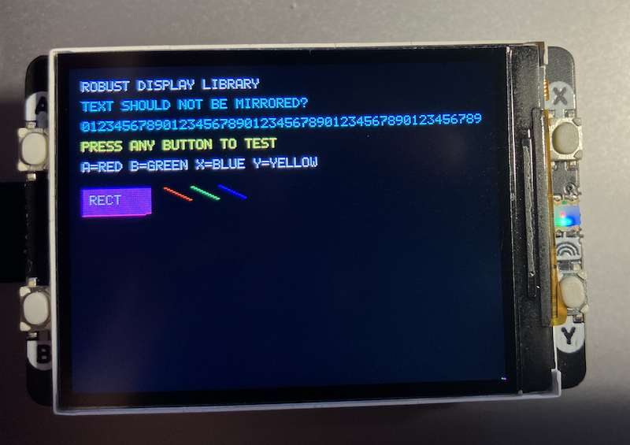

## Display Pack Library

A robust, production-ready C library for controlling the Pimoroni Display Pack 2.0
(320x240 ST7789V2 LCD) on the Raspberry Pi Pico, featuring DMA-accelerated graphics,
hardware button support, and comprehensive error handling.

- *320×240 RGB565 Display Support* - Full-color ST7789V2 LCD controller
- *DMA-Accelerated Graphics* - Hardware-accelerated rendering with automatic fallback
- *Hardware Button Interface* - Four buttons (A, B, X, Y) with debouncing and callbacks
- *Comprehensive Error Handling* - Detailed error codes and recovery mechanisms
- *Robust Safety Features* - Bounds checking, timeout protection, and safe cleanup
- *Text Rendering* - Built-in 5×8 pixel font for displaying text
- *Optimised Performance* - Smart DMA usage with 31.25 MHz SPI bus


### Quick Start

```c
#include "pico/stdlib.h"
#include "display.h"

int main() {
    stdio_init_all();
    
    // Init display
    if (display_pack_init() != DISPLAY_OK) {
        printf("Display init failed!\n");
        return 1;
    }
    
    // Init buttons
    if (buttons_init() != DISPLAY_OK) {
        printf("Button init failed!\n");
        return 1;
    }
    
    // Clear screen to black
    display_clear(COLOR_BLACK);
    
    // Draw some text
    display_draw_string(10, 10, "HELLO WORLD", COLOR_WHITE, COLOR_BLACK);
    
    // Draw a rectangle
    display_fill_rect(50, 50, 100, 80, COLOR_BLUE);
    
    // Main loop
    while (true) {
        buttons_update();
        
        if (button_pressed(BUTTON_A)) {
            display_clear(COLOR_RED);
        }
        
        sleep_ms(10);
    }
    
    return 0;
}
```


### Display Functions

#### `display_error_t display_pack_init(void)`
Initialises the display hardware, SPI interface, and DMA.
Must be called before any other display functions.

*Returns:* `DISPLAY_OK` on success, error code on failure.

#### `display_error_t display_clear(uint16_t color)`
Clears the entire screen to the specified color.

*Parameters:*
- `color` - RGB565 color value (use predefined COLOR_* constants)

#### `display_error_t display_fill_rect(uint16_t x, uint16_t y, uint16_t width, uint16_t height, uint16_t color)`
Fills a rectangle with the specified color. Automatically clamps to display bounds.

*Parameters:*
- `x, y` - Top-left corner coordinates
- `width, height` - Rectangle dimensions
- `color` - RGB565 fill color

#### `display_error_t display_draw_pixel(uint16_t x, uint16_t y, uint16_t color)`
Draws a single pixel at the specified coordinates.

#### `display_error_t display_draw_char(uint16_t x, uint16_t y, char c, uint16_t color, uint16_t bg_color)`
Draws a single character using the built-in 5×8 font.

*Parameters:*
- `x, y` - Top-left corner of character
- `c` - ASCII character to draw (32-90 supported)
- `color` - Foreground color
- `bg_color` - Background color

#### `display_error_t display_draw_string(uint16_t x, uint16_t y, const char* str, uint16_t color, uint16_t bg_color)`
Draws a text string with automatic character spacing.

#### `display_error_t display_set_backlight(bool on)`
Controls the display backlight.

*Parameters:*
- `on` - `true` to turn on, `false` to turn off


### Button Functions

#### `display_error_t buttons_init(void)`
Initializes the button hardware with pull-up resistors. Must be called before using buttons.

#### `void buttons_update(void)`
Updates button states and triggers callbacks. Call this regularly in your main loop (every 10-50ms).

#### `bool button_pressed(button_t button)`
Checks if a button is currently pressed.

*Parameters:*
- `button` - Button to check: `BUTTON_A`, `BUTTON_B`, `BUTTON_X`, or `BUTTON_Y`

*Returns:* `true` if pressed, `false` otherwise

#### `bool button_just_pressed(button_t button)`
Checks if a button was just pressed (edge detection).

#### `bool button_just_released(button_t button)`
Checks if a button was just released (edge detection).

#### `display_error_t button_set_callback(button_t button, button_callback_t callback)`
Sets a callback function to be called when a button is pressed.

*Parameters:*
- `button` - Button to attach callback to
- `callback` - Function pointer: `void callback(button_t button)`

*Example:*
```c
void on_button_a(button_t button) {
    display_clear(COLOR_RED);
}

button_set_callback(BUTTON_A, on_button_a);
```


### Utility Functions

#### `bool display_is_initialized(void)`
Returns `true` if display has been successfully initialised.

#### `bool display_dma_busy(void)`
Returns `true` if DMA transfer is in progress.

#### `void display_wait_for_dma(void)`
Blocks until current DMA transfer completes (with 1-second timeout).

#### `void display_cleanup(void)`
Safely cleans up display resources. Call before program exit.

#### `const char* display_error_string(display_error_t error)`
Returns human-readable error message for an error code.


### Predefined Colors

The library provides RGB565 color constants:

- `COLOR_BLACK` (0x0000)
- `COLOR_WHITE` (0xFFFF)
- `COLOR_RED` (0xF800)
- `COLOR_GREEN` (0x07E0)
- `COLOR_BLUE` (0x001F)
- `COLOR_YELLOW` (0xFFE0)
- `COLOR_CYAN` (0x07FF)
- `COLOR_MAGENTA` (0xF81F)

You can create custom RGB565 colors using:
`((R & 0xF8) << 8) | ((G & 0xFC) << 3) | (B >> 3)`


### Error Handling

All display and button functions return `display_error_t` codes:

- `DISPLAY_OK` - Operation successful
- `DISPLAY_ERROR_INIT_FAILED` - Hardware initialization failed
- `DISPLAY_ERROR_DMA_FAILED` - DMA operation failed
- `DISPLAY_ERROR_INVALID_PARAM` - Invalid parameter provided
- `DISPLAY_ERROR_NOT_INITIALIZED` - Function called before initialization

*Example:*
```c
display_error_t result = display_clear(COLOR_BLACK);
if (result != DISPLAY_OK) {
    printf("Error: %s\n", display_error_string(result));
}
```


### Safety Features

- *Bounds Checking* - All drawing functions automatically clamp to display boundaries
- *DMA Timeout Protection* - 1-second timeout prevents infinite hangs
- *Atomic Callback Updates* - Interrupt-safe button callback registration
- *Debouncing* - Built-in 50ms button debounce
- *Graceful Degradation* - Falls back to blocking SPI if DMA unavailable


### Performance Tips

1. *Use DMA for Large Operations* - Fills larger than 32 pixels automatically use DMA
2. *Batch Drawing Operations* - Group multiple draws between `buttons_update()` calls
3. *Check DMA Status* - Use `display_dma_busy()` to avoid blocking the main thread
4. *Optimize String Drawing* - Pre-calculate positions to minimize redraws


### Example: Button-Triggered Colors

```c
void on_button_a(button_t btn) { display_clear(COLOR_RED); }
void on_button_b(button_t btn) { display_clear(COLOR_GREEN); }
void on_button_x(button_t btn) { display_clear(COLOR_BLUE); }
void on_button_y(button_t btn) { display_clear(COLOR_YELLOW); }

int main() {
    display_pack_init();
    buttons_init();
    
    button_set_callback(BUTTON_A, on_button_a);
    button_set_callback(BUTTON_B, on_button_b);
    button_set_callback(BUTTON_X, on_button_x);
    button_set_callback(BUTTON_Y, on_button_y);
    
    display_draw_string(10, 10, "PRESS ANY BUTTON", COLOR_WHITE, COLOR_BLACK);
    
    while (true) {
        buttons_update();
        sleep_ms(10);
    }
}
```


### Troubleshooting

*Display shows nothing:*
- Check SPI connections and power
- Verify `display_pack_init()` returns `DISPLAY_OK`
- Ensure backlight is enabled: `display_set_backlight(true)`

*Buttons don't work:*
- Call `buttons_init()` before using buttons
- Call `buttons_update()` regularly in main loop
- Check GPIO pin connections

*DMA errors:*
- Library automatically falls back to blocking SPI
- Check `display_error_string()` for specific error messages
- Ensure no other code is using DMA channel 0

*Text appears mirrored/rotated:*
- Display rotation is set in initialization (MADCTL command)
- Modify `display_pack_init()` MADCTL value (0x36 command) if needed


