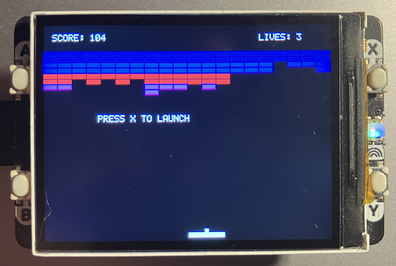

## Breakout Game

A fully-featured Breakout/Arkanoid clone running on the Raspberry Pi Pico
with Pimoroni Display Pack 2.0, featuring smooth 60 FPS gameplay, color-coded bricks,
dynamic ball physics, and progressive difficulty.


- *Classic Breakout Gameplay* - Break bricks, bounce the ball, score points
- *8 Rows of Color-Coded Bricks* - Different colors award different points
- *Dynamic Ball Physics* - Ball speed and angle vary based on paddle hit position
- *Progressive Difficulty* - Ball speed increases as you break more bricks
- *Lives System* - Start with 5 lives, game over when all are lost
- *60 FPS Rendering* - Smooth animation using full-screen buffer blitting
- *Score Tracking* - Real-time score display based on brick values
- *Hardware Controls* - Physical buttons for intuitive gameplay


- Raspberry Pi Pico (or compatible RP2040 board)
- Pimoroni Display Pack 2.0 (320×240 LCD with buttons)
- Pico SDK installed and configured


Bricks are arranged in 8 rows with different point values:

| Rows | Color | Points per Brick |
|------|-------|------------------|
| 1-2 (Top) | Red | 7 points |
| 3-4 | Orange | 5 points |
| 5-6 | Green | 3 points |
| 7-8 (Bottom) | Yellow | 1 point |

*Strategy Tip:* Target higher rows for more points, but beware—they make the ball faster!


### Game Mechanics

The ball speed increases dynamically during gameplay:

- *Initial speed:* 2 pixels per frame
- *After 4 brick hits:* Speed increases to 3
- *After 12 brick hits:* Speed increases to 4
- *Hit top row (red):* Speed immediately jumps to 5

The ball's horizontal velocity is determined by where it hits the paddle:
- *Center hit:* Ball bounces straight up
- *Edge hits:* Ball bounces at sharper angles
- *Normalized range:* Hit position maps to horizontal velocity (-speed to +speed)

Game:
- Start with *5 lives*
- Lose a life when the ball falls below the paddle
- Ball resets to paddle position after losing a life
- Game over when all lives are lost
- Press *X* to restart after game over


### Code Architecture

The game uses a full-screen frame buffer for smooth, flicker-free rendering:

```c
static uint16_t frame_buffer[DISPLAY_WIDTH * DISPLAY_HEIGHT];
```

Each frame:
1. Game logic updates (ball position, collisions, scoring)
2. Entire scene is drawn to the frame buffer
3. Buffer is transferred to display via DMA using `display_blit_full()`

This approach eliminates tearing and provides consistent 60 FPS performance.


*Wall Collisions:*
- Left/right walls: Ball reverses horizontal velocity
- Top wall: Ball reverses vertical velocity
- Bottom: Life lost, ball resets

*Paddle Collision:*
- Detected when ball overlaps paddle rectangle
- Ball direction set based on hit position
- Minimum horizontal velocity enforced to prevent vertical-only bouncing

*Brick Collisions:*
- Checks each active brick per frame
- First collision processed, then exits (one brick per frame)
- Brick deactivated, score increased, ball reversed
- Speed potentially increased based on brick position


```c
typedef struct {
    bool active;      // Is brick still present?
    uint16_t color;   // Brick color (RGB565)
    int score;        // Points awarded when broken
} brick_t;

static brick_t bricks[BRICK_ROWS][BRICK_COLS];
```


Custom drawing functions write directly to the frame buffer:
- `buffer_fill_rect()` - Draw filled rectangles
- `buffer_draw_char()` - Render text characters
- `buffer_draw_string()` - Render text strings

These are optimised for speed since they write to RAM, not the display.


You can adjust these in `main.c` to modify gameplay:

```c
#define PADDLE_WIDTH 40        // Paddle width in pixels
#define PADDLE_HEIGHT 5        // Paddle height in pixels
#define PADDLE_SPEED 8         // Pixels moved per frame when button held
#define BALL_SIZE 4            // Ball dimensions (square)
#define BALL_INITIAL_SPEED 2   // Starting ball speed
#define BRICK_ROWS 8           // Number of brick rows
#define BRICK_WIDTH 16         // Width of each brick
#define BRICK_HEIGHT 6         // Height of each brick
#define BRICK_START_Y 30       // Y position of top brick row
#define INITIAL_LIVES 5        // Starting number of lives
```


The game uses `display_blit_full()` to transfer the entire 320×240
frame buffer in one DMA operation. This provides:

- *Consistent frame timing* - No variable rendering time
- *No tearing* - Complete frames displayed atomically
- *Simplified code* - No need to track dirty regions
- *Maximum throughput* - DMA handles 153,600 bytes (76,800 pixels × 2 bytes) efficiently


Target: *60 FPS* (~16ms per frame)

Actual timing:
- Game logic: <1ms
- Buffer drawing: ~2ms
- DMA transfer: ~8-10ms
- Total: ~12-13ms per frame

The code sleeps for 16ms per iteration to maintain consistent timing.


### Extending

Power ups:
```c
typedef struct {
    int x, y;
    bool active;
    int type;  // 0=wider paddle, 1=extra life, etc.
} powerup_t;

static powerup_t powerups[MAX_POWERUPS];
```

Multiple Balls:
```c
typedef struct {
    int x, y;
    int vx, vy;
    bool active;
} ball_t;

static ball_t balls[MAX_BALLS];
```

Sound Effects: Add a buzzer and use GPIO PWM:
```c
#include "hardware/pwm.h"

void play_bounce_sound() {
    // Set PWM frequency and duty cycle
    // pwm_set_gpio_level(BUZZER_PIN, ...);
}
```

High Score Persistence:
Use Pico's flash memory to store high scores:
```c
#include "hardware/flash.h"
#include "hardware/sync.h"

#define FLASH_TARGET_OFFSET (256 * 1024)  // Beyond program

void save_high_score(int score) {
    // Write to flash with proper alignment
}
```


### Troubleshooting

*Game runs slowly:*
- Check that DMA is working: `display_is_initialized()` should return `true`
- Verify you're not getting error messages via USB serial
- Try reducing `BRICK_COLS` if frame buffer operations are slow

*Paddle doesn't move smoothly:*
- Ensure `buttons_update()` is being called every frame
- Check that `PADDLE_SPEED` isn't too high
- Verify button connections (pins 13 and 15)

*Ball physics feel wrong:*
- Adjust `BALL_INITIAL_SPEED` for different starting speeds
- Modify paddle collision code to change angle sensitivity
- Tweak speed increase thresholds for difficulty curve

*Display shows garbage:*
- Verify all pixels are initialized (frame buffer starts filled)
- Check that `display_blit_full()` returns `DISPLAY_OK`
- Ensure frame buffer is properly aligned in memory

*Buttons unresponsive:*
- Confirm `buttons_init()` is called before main loop
- Check physical connections to GPIO pins 12-15
- Test individual buttons with `button_pressed()` debug prints


### Technical Details

Memory Usage:
- *Frame buffer:* 153,600 bytes (76,800 pixels × 2 bytes RGB565)
- *Brick array:* ~80 bytes (8 rows × 20 cols × 4 bytes per struct)
- *Stack/heap:* <1KB for game state
- *Total:* ~155KB (well within Pico's 264KB RAM)

Display Protocol:
- *Interface:* SPI at 31.25 MHz
- *Color format:* RGB565 (16-bit, 5 red, 6 green, 5 blue)
- *Controller:* ST7789V2
- *Transfer method:* DMA for full frames, blocking SPI for commands


Game Loop Timing:
```
Frame 1: 16ms
├─ buttons_update(): <1ms
├─ update_game(): <1ms
├─ draw_game_to_buffer(): ~2ms
├─ display_blit_full(): ~10ms (DMA transfer)
└─ sleep_ms(16): Remainder to 16ms

Frame 2: 16ms
...
```


### Extend

Potential enhancements for advanced users:

1. *Particle Effects* - Add explosion particles when bricks break
2. *Animated Background* - Starfield or gradient backdrop
3. *Boss Levels* - Special brick patterns or moving targets
4. *Two-Player Mode* - Split screen or cooperative play
5. *Level Editor* - Custom brick arrangements
6. *Attract Mode* - Demo gameplay when idle
7. *Statistics Tracking* - Average score, fastest completion time



