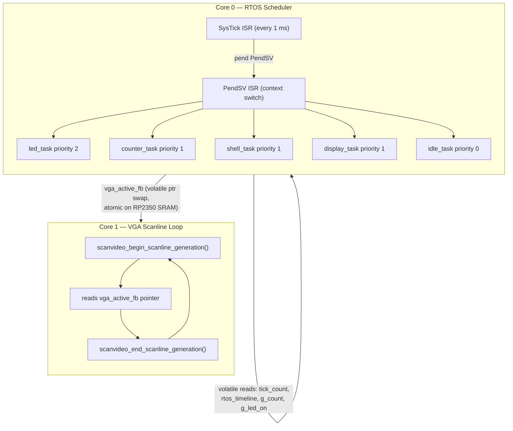
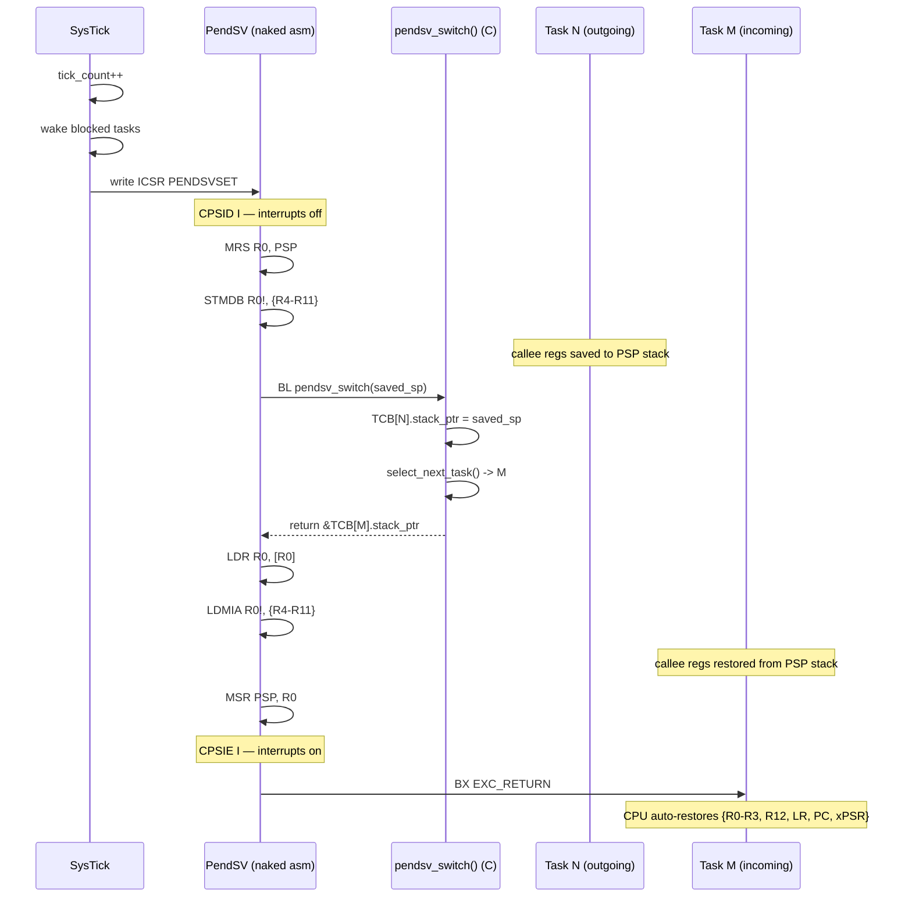
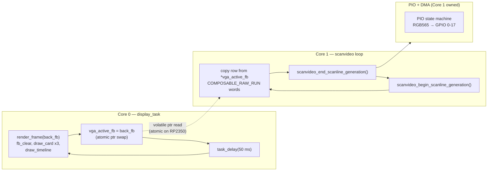
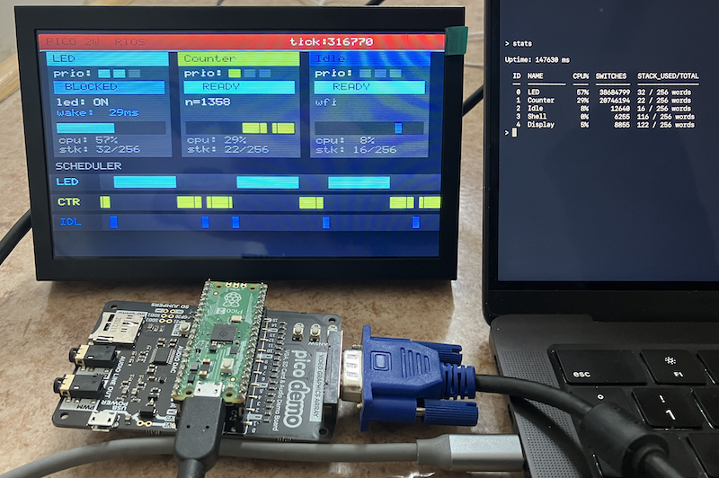

## Pico 2/2W RTOS — VGA Edition

A preemptive RTOS built from scratch for the Raspberry Pi Pico 2/2W (RP2350 / Cortex-M33),
with a live VGA visualisation that makes the scheduler's decisions visible in real time on
a standard monitor.

The primary goal is *educational*: every core concept — context switching, priority
preemption, task blocking, round-robin tie-breaking — can be watched happening on screen
rather than inferred from blinking LEDs or serial logs.

> *Hardware note:* The VGA output targets the *Pimoroni Pico VGA Demo Base* (identical
> hardware to the Raspberry Pi Pico VGA Demo Board). The board was originally designed for
> the RP2040 Pico; RP2350 (Pico 2W) compatibility via `pico_scanvideo_dpi` is functional
> but not officially certified.


### Display — VGA output

Output is generated by `pico_scanvideo_dpi` (from pico-extras) using PIO state machines
and a resistor-DAC on the GPIO pins. No external display controller chip is involved.

*Resolution:* 320 × 240 @ 60 Hz (640 × 480 VGA timing with hardware pixel-doubling)
*Colour:* RGB565 — standard format, no byte-swapping required (unlike the previous SPI approach)

*Task cards (top half)* — one 96 × 110 card per task:
- Name bar in the task's accent colour
- Priority dots (filled = has that level)
- State badge: `>>RUNNING<<` (green) / `READY` (yellow) / `BLOCKED` (orange)
- Live data: LED on/off, counter value, or `wfi`
- Wake countdown in ms when blocked
- Mini activity bar — last ~350 ms of execution history
- CPU % and stack high-watermark

*Scheduler timeline (bottom half)* — three rows scrolling left:
- Each pixel = one 4 ms sample
- Coloured pixel = that task owned the CPU; dark = blocked or preempted
- Window: 280 samples × 4 ms = *1120 ms of history*

```
time --------------------------------------------------------->

LED  ████████████████████░░░░░░░░░░░░░░░░░░░░░░████████████████
CTR  ░░░░░░░░░░░░░░░░░░░░████░░░░████░░░░████░░░░░░░░░░░░░░░░░░
IDL  ░░░░░░░░░░░░░░░░░░░░░░░░████░░░░████░░░░░░░░░░░░░░░░░░░░░░
     <-------------------------------------------------------->
                              1120 ms window
```


### VGA pin mapping

Fixed by the demo board's resistor-DAC hardware — plug the Pico into the board, connect
a VGA cable, no additional wiring needed.

| GPIO    | Signal       |
|---------|-------------|
| 0 – 4   | Blue  [4:0]  |
| 5 – 10  | Green [5:0]  |
| 11 – 15 | Red   [4:0]  |
| 16      | H-Sync (active low) |
| 17      | V-Sync (active low) |

GPIO 18–22, 26–28 remain free. GPIO 23–25, 29 are used internally by the CYW43 WiFi chip
on Pico 2W and must not be driven.


### Architecture

#### System overview



*Core 0* runs the entire RTOS plus a `display_task` that renders the framebuffer.
*Core 1* is permanently dedicated to the `pico_scanvideo_dpi` scanline output loop;
it reads from whichever framebuffer Core 0 has most recently made active.

#### Double-buffered VGA

```
fb_a [320×240 × 2 B = 150 KB]  ←  Core 1 reads from active buffer
fb_b [320×240 × 2 B = 150 KB]  ←  display_task renders into back buffer

display_task (Core 0):           Core 1 loop:
  render_frame(back)               buf = scanvideo_begin_scanline_generation()
  vga_active_fb = back   ------>   src = *vga_active_fb + line * 320
  back = other buffer              fill scanline words from src
  task_delay(50)                   scanvideo_end_scanline_generation(buf)
```

The pointer swap (`vga_active_fb = back`) is a single 32-bit aligned store, which is
atomic on RP2350 shared SRAM — no spinlock required for this one-writer / one-reader pattern.


#### Task state machine

```mermaid
stateDiagram-v2
    direction LR

    [*] --> READY : task_create()

    READY --> RUNNING : PendSV selects task\n(highest priority wins;\nround-robin on tie)

    RUNNING --> READY : task_yield()\nor preempted by\nhigher-priority task

    RUNNING --> BLOCKED : task_delay(ms)\nmutex / semaphore contention

    BLOCKED --> READY : SysTick: tick_count >= wake_time\nor semaphore signalled

    RUNNING --> SUSPENDED : stack overflow detected
```


#### Context switch sequence

Every SysTick pends PendSV, which performs the actual register save/restore:



Hardware exception stacking saves `{R0–R3, R12, LR, PC, xPSR}` automatically.
PendSV manually saves/restores the remaining callee-saved registers `{R4–R11}`.


#### VGA scanline pipeline




### Known issue — display_task at priority 1

`display_task` currently runs at the same priority (1) as `counter_task` and `shell_task`.
Because the framebuffer render loop (`fb_clear` + all draw calls) can take several
milliseconds without yielding, it competes heavily with Counter and Shell on every frame,
which causes the RTOS timeline to look uneven and the USB shell to feel sluggish.

*Fix — lower display_task to priority 0* in `main.c`:

```c
task_create(display_task, "Display", 0, NULL);   /* was 1 */
```

At priority 0 it round-robins with the idle task (which runs `WFI` and sleeps each tick),
so rendering takes roughly twice as long in wall time but the RTOS tasks at priority 1+
are completely unaffected. The 50 ms `task_delay` between frames keeps average CPU usage
low. This is the recommended setting once the display is confirmed working.


### RTOS Concepts

#### Priority-based preemption

Each task has a numeric priority (`0` = lowest). When a higher-priority task becomes READY
it immediately displaces whatever is running. Watch the timeline: the LED row pushes the
Counter row dark the instant the LED task wakes from `task_delay`.

#### Context switching

Switching tasks requires saving the complete CPU register state of the outgoing task and
restoring that of the incoming task, so each continues exactly where it left off.

On Cortex-M33 the `PendSV` exception handles this. The CPU auto-saves `{R0–R3, R12, LR, PC, xPSR}`
on exception entry; PendSV manually saves/restores `{R4–R11}`.

#### SysTick — the heartbeat

SysTick fires every 1 ms. It:
1. Increments `tick_count`
2. Unblocks any task whose `wake_time <= tick_count`
3. Pends PendSV to trigger the next context switch

#### The `active_ms()` pattern

Instead of blocking, tasks can *hold* the CPU for a timed window while staying preemptable:

```c
static void active_ms(uint32_t ms) {
    uint32_t end = tick_count + ms;
    while ((int32_t)(end - tick_count) > 0)
        task_yield();   /* re-schedule each tick, but stay READY */
}
```

A higher-priority task will immediately preempt a task inside `active_ms()` on the very
next tick. This makes preemption visually obvious on the timeline.

#### Idle task

When no other task is READY the idle task runs. It executes `WFI` (Wait For Interrupt),
halting the CPU until the next SysTick — saving power rather than spinning.


### RTOS API

#### Lifecycle

```c
void rtos_init(void);
void rtos_start(void);   /* configures SysTick + PendSV, never returns */
```

#### Task management

```c
void task_create(task_function_t fn,
                 const char      *name,
                 task_priority_t  priority,   /* 0 = lowest */
                 void            *param);

void task_yield(void);          /* stay READY, request reschedule */
void task_delay(uint32_t ms);   /* block for N milliseconds       */
```

#### Synchronisation

```c
/* Mutex — non-re-entrant, no priority inheritance */
void rtos_mutex_init(rtos_mutex_t *m);
void rtos_mutex_lock(rtos_mutex_t *m);    /* blocks with task_delay(1) on contention */
void rtos_mutex_unlock(rtos_mutex_t *m);

/* Counting semaphore */
void rtos_semaphore_init(rtos_semaphore_t *s, uint32_t initial, uint32_t max);
void rtos_semaphore_wait(rtos_semaphore_t *s);   /* blocks if count == 0 */
void rtos_semaphore_signal(rtos_semaphore_t *s);
```

#### Scheduler state (for introspection / display)

```c
extern task_control_block_t tasks[MAX_TASKS];
extern uint8_t              current_task;
extern volatile uint32_t    tick_count;
extern volatile uint8_t     rtos_timeline[RTOS_TIMELINE_LEN];  /* 280 samples */
extern volatile uint16_t    rtos_timeline_pos;
```


### Display API

#### VGA initialisation (called from Core 1)

```c
display_error_t display_vga_init(void);

/* Runs the scanline loop forever — never returns.
   active_fb_ptr is a pointer to the volatile framebuffer pointer;
   Core 0 swaps the pointer between frames for double-buffering. */
void display_vga_run(uint16_t * volatile *active_fb_ptr);
```

#### Framebuffer helpers (draw into RAM buffer, hand to VGA)

```c
void fb_clear(uint16_t *fb, uint16_t color);
void fb_draw_pixel(uint16_t *fb, int x, int y, uint16_t color);
void fb_fill_rect(uint16_t *fb, int x, int y, int w, int h, uint16_t color);
void fb_draw_char(uint16_t *fb, int x, int y, char c, uint16_t fg, uint16_t bg);
void fb_draw_string(uint16_t *fb, int x, int y, const char *str, uint16_t fg, uint16_t bg);
void fb_draw_line_aa(uint16_t *fb, float x0, float y0, float x1, float y1, uint16_t color);
void fb_blit_scaled(uint16_t *fb,
                    const uint16_t *src, int sw, int sh,
                    int dx, int dy, int dw, int dh);
```

#### Color transforms (Flash-style per-channel)

```c
/* out_channel = clamp(in_channel * mul/256 + add, 0, 255) */
void fb_apply_color_transform(uint16_t *fb, const fb_color_transform_t *cx);
void fb_apply_color_transform_rect(uint16_t *fb, const fb_color_transform_t *cx,
                                   int x, int y, int w, int h);

fb_color_transform_t fb_cx_identity(void);
fb_color_transform_t fb_cx_dim(uint8_t level);          /* 0=black, 255=full */
fb_color_transform_t fb_cx_tint(uint8_t r, uint8_t g, uint8_t b);
```

#### Color packing

```c
/* Pack 8-bit RGB into RGB565 — maps directly to VGA GPIO pins */
static inline uint16_t fb_rgb(uint8_t r, uint8_t g, uint8_t b);
```

Standard RGB565 constants: `COLOR_BLACK`, `COLOR_WHITE`, `COLOR_RED`, `COLOR_GREEN`,
`COLOR_BLUE`, `COLOR_YELLOW`, `COLOR_CYAN`, `COLOR_MAGENTA`.


### Demo Tasks

| Task    | Priority | Period   | Behaviour |
|---------|----------|----------|-----------|
| LED     | 2 (high) | 700 ms   | 200 ms active (LED on) → 200 ms blocked → 200 ms active (LED off) → 100 ms blocked |
| Counter | 1 (med)  | 100 ms   | Increments `g_count`, holds CPU 80 ms (`active_ms`), blocks 20 ms |
| Shell   | 1 (med)  | 10 ms    | USB CDC command shell; blocks between ticks |
| Display | 1 (med)* | 50 ms    | Renders framebuffer; swaps double-buffer; blocks 50 ms |
| Idle    | 0 (low)  | —        | `WFI` forever; runs only when all higher-priority tasks are blocked |

\* See [Known issue — display_task at priority 1](#known-issue--display_task-at-priority-1) above.


### Hardware

| Component | Detail |
|-----------|--------|
| Board     | Raspberry Pi Pico 2W |
| MCU       | RP2350, dual Cortex-M33 @ 150 MHz |
| Display   | Pimoroni Pico VGA Demo Base (or RPi Pico VGA Demo Board) |
| VGA GPIOs | 0–15 colour, 16 H-Sync, 17 V-Sync |
| VGA mode  | 320 × 240 @ 60 Hz (640 × 480 timing, pixel-doubled) |
| VGA driver | `pico_scanvideo_dpi` (pico-extras, auto-downloaded by CMake) |
| SRAM used | ~307 KB for two framebuffers (fb_a + fb_b), out of 520 KB total |

#### Key RP2350 specifics

- ISR names are `isr_systick` / `isr_pendsv` — not the CMSIS names. Using the wrong
  names compiles silently but the handlers are never called.
- PendSV priority must be `0xFF` — the field is full 8 bits on Cortex-M33 (vs 2 bits on M0+).
- `pico_scanvideo_dpi` IRQs are registered from Core 1 (the core that calls `display_vga_init`).
  The PIO and DMA resources are owned by Core 1 and must not be touched from Core 0.
- The CYW43 WiFi chip uses an internal SPI on GPIO 23–25, 29. GPIO 0–17 (VGA) are free.


### Project structure

```
.
├── main.c              RTOS demo tasks, double-buffer VGA render loop, shared state
├── rtos.c              Kernel: PendSV/SysTick handlers, scheduler, sync primitives
├── rtos.h              Public RTOS API, TCB definition, timeline buffer
├── display.c           VGA init (pico_scanvideo_dpi) + framebuffer rendering helpers
├── display.h           Display API, RGB565 color constants, framebuffer helpers
├── font.h              5×8 ASCII bitmap font + 8×8 block graphics
├── rtos_queue.c/h      Fixed-capacity ring-buffer queue (inter-task messaging)
├── rtos_shell.c/h      Line-oriented USB CDC command shell
├── CMakeLists.txt      Build configuration (Pico SDK 2.2.0 + pico-extras auto-fetch)
└── pico_extras_import.cmake  Locates / downloads pico-extras from GitHub
```


### Build and flash

pico-extras is fetched automatically from GitHub the first time cmake runs (requires
internet access during configuration only).

```bash
mkdir build && cd build
~/.pico-sdk/cmake/v3.31.5/bin/cmake ..        # downloads pico-extras (~30 s first run)
~/.pico-sdk/cmake/v3.31.5/bin/cmake --build .
```

Hold *BOOTSEL* while connecting USB — the board mounts as `RP2350` — then:

```bash
cp build/rtosapi.uf2 /Volumes/RP2350/        # macOS
cp build/rtosapi.uf2 /media/$USER/RP2350/    # Linux
```

The board reboots and VGA output starts within ~200 ms.

The USB CDC shell is also available:

```bash
screen /dev/tty.usbmodem* 115200
# commands: help  tasks  stats  uptime
```


### Known limitations

| Limitation | Detail |
|------------|--------|
| No FPU context save | S16–S31 / FPSCR are not saved in PendSV. Tasks must not use floating-point. |
| Fixed task count | `MAX_TASKS = 8`, statically allocated 256-word stacks. No dynamic creation or deletion. |
| No priority inheritance | A high-priority task spinning on a mutex held by a low-priority task starves mid-priority tasks. The mutex uses `task_delay(1)` to yield, which mitigates but does not solve priority inversion. |
| RP2350 VGA compatibility | `pico_scanvideo_dpi` was originally written for RP2040. It compiles and runs on RP2350 (pico-extras master has been updated), but is not officially tested on Pico 2W. |
| Single-core RTOS | The scheduler and all tasks run on Core 0 only. Core 1 is dedicated to VGA. |


### Roadmap

#### Near-term

- *Lower display_task to priority 0* — restores clean RTOS behaviour (trivial one-line change)
- *FPU context save* — save/restore `S16–S31` and `FPSCR` in PendSV to allow floating-point in tasks
- *Task deletion* — add a TERMINATED state and stack reclamation
- *Display a 4th timeline row* — show the display_task itself on the scheduler timeline

#### MPU-backed task isolation

The RP2350's Cortex-M33 includes an 8-region MPU.
Three progressive phases would bring hardware-enforced memory protection:

*Phase 1 — Stack overflow guard*
Place a no-access guard region at the bottom of each task's stack. A stack overflow
immediately triggers a MemFault rather than silently corrupting adjacent TCBs.

```c
/* sketch: in task_create(), after task_stack_init() */
mpu_set_guard(tcb->stack, 32);   /* 32-byte no-access region at stack bottom */
```

*Phase 2 — Per-task stack isolation*
On every context switch, reconfigure the MPU so the incoming task has read-write access
to its own stack and read-only (or no) access to all others.

*Phase 3 — MemFault handler + display integration*
Capture `SCB->MMFAR` and the faulting PC, mark the culprit task SUSPENDED, and show a
VGA fault report while other tasks keep running.

```
+-----------------------------------+
|  !! MEMFAULT                      |
|  task:    Counter  (prio 1)       |
|  fault:   stack overflow          |
|  PC:      0x100034A8              |
|  addr:    0x2003FF00              |
+-----------------------------------+
```

#### Relevant MPU registers

| Register     | Address      | Purpose |
|--------------|--------------|---------|
| `MPU_TYPE`   | `0xE000ED90` | Number of supported regions (read; expect 8 on RP2350) |
| `MPU_CTRL`   | `0xE000ED94` | Enable MPU; enable default background region |
| `MPU_RNR`    | `0xE000ED98` | Select region to configure (0–7) |
| `MPU_RBAR`   | `0xE000ED9C` | Region base address + access permissions |
| `MPU_RLAR`   | `0xE000EDA0` | Region limit address + enable |
| `SCB->SHCSR` | `0xE000ED24` | Enable MemFault handler (bit 16) |
| `SCB->MMFAR` | `0xE000ED34` | Address that caused the MemFault |
| `SCB->CFSR`  | `0xE000ED28` | Fault type flags; bit 7 = MMFAR valid |

Reference: *ARM Cortex-M33 Generic User Guide*, Chapter 4 (MPU) and Chapter 4.3 (Fault handling).




