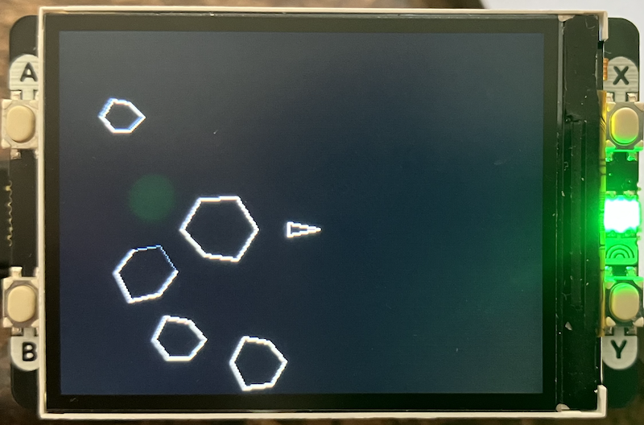

## Vector Space Combat Game: Asteroids Clone

A classic Asteroids-style game implemented for the
Raspberry Pi Pico with Pimoroni Display Pack 2.0.

Asteroids is one of the most iconic arcade games in history.
Created by Lyle Rains and Ed Logg, it was released by Atari
in November 1979. The game was revolutionary for its time,
featuring vector graphics that gave it a distinctive clean,
geometric look on the original arcade cabinets.

In Asteroids, players control a triangular spaceship in an
asteroid field, using thrust and rotation controls to navigate
while shooting asteroids and avoiding collisions.
The game introduced several innovative mechanics:
- *Inertia-based movement*: The ship maintains momentum, requiring careful control
- *Screen wrapping*: Objects leaving one edge reappear on the opposite side
- *Progressive difficulty*: Asteroids break into smaller pieces when shot, increasing the chaos

Asteroids became a cultural phenomenon, earning over $150 million
in its first year and cementing itself as one of the best-selling
arcade games of all time. Its influence can still be seen in games
today, and it remains a favorite project for programmers
learning game development.

### Display Driver Library

A comprehensive hardware abstraction layer for the Pimoroni Display Pack 2.0, providing:

- *Display Control*: Initialisation and management of the ST7789V2 320x240 LCD controller
- *SPI Communication*: Optimised SPI interface with DMA support for fast screen updates
- *Graphics Primitives*: Functions for drawing pixels, rectangles, characters, and strings
- *Button Interface*: Debounced input handling for the four hardware buttons (A, B, X, Y)
- *Hardware Features*:
  - DMA-accelerated transfers for large graphics operations
  - Backlight control
  - RGB565 color format support
  - Comprehensive error handling and bounds checking

Key functions include `display_pack_init()`, `display_fill_rect()`, `display_draw_string()`,
and the button polling system with callbacks.

### Game

The main game logic implementing an Asteroids clone with modern optimisations:

- *Game Engine*:
  - Fixed-point arithmetic (16.16 format) for smooth, deterministic physics
  - Optimised collision detection with bounding rectangles
  - Efficient partial screen clearing to minimize redraw overhead
  - 50 FPS game loop with consistent timing

- *Game Objects*:
  - Player ship with inertia-based physics and thrust mechanics
  - Bullet system with limited lifetime and pooling
  - Procedurally generated asteroids that split when destroyed
  - Screen wrapping for continuous gameplay space

- *Visual Features*:
  - Vector-style line drawing for authentic retro appearance
  - Thrust flame animation
  - Invulnerability flash during respawn
  - Clean UI with score and lives display

- *Controls*:
  - *Button B*: Rotate left
  - *Button Y*: Rotate right
  - *Button A*: Thrust forward
  - *Button X*: Fire weapon / Restart game

- *Additional Features*:
  - RGB LED feedback indicating game state (thrusting, firing, game over)
  - Progressive difficulty with wave spawning
  - Optimised rendering using pre-computed trigonometry tables

*Plenty of room for improvements ..*

### Hardware Requirements

- Raspberry Pi Pico (RP2040)
- Pimoroni Display Pack 2.0 (320x240 LCD with ST7789V2 controller) incl. four hardware buttons (A, B, X, Y)

s
### Gameplay Tips

- Use thrust sparingly - momentum carries you!
- Shoot large asteroids first to prevent them from splitting into multiple threats
- Watch for screen wrapping - asteroids can appear from any edge
- Use rotation to line up shots while drifting
- During respawn invulnerability (flashing), position yourself safely before engaging

