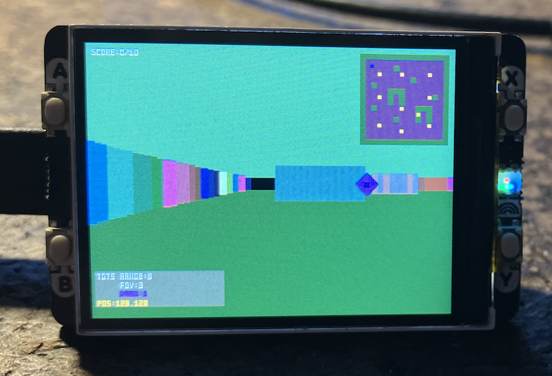

## Maze 2

Inspired by raycasting like [DOOM](https://en.wikipedia.org/wiki/Doom_(1993_video_game)).
Yes, Graham made a [port](https://kilograham.github.io/rp2040-doom/) for the Pico .. but what's the fun in that, when you can make your own .. from perhaps this half finished project.

DOOM can, as you know, be played on a lot of things .. including [toothbrushes](https://www.techradar.com/home/smart-home/doom-can-now-run-on-an-electric-toothbrush-but-should-you-be-worried) ..

