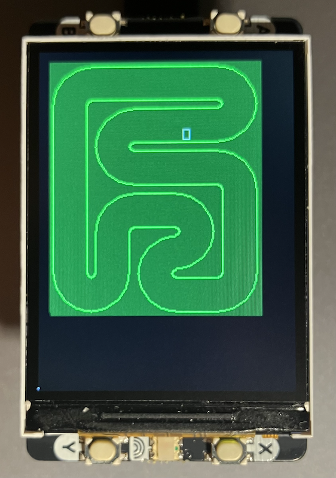

## Racer

Mitxela’s projects are a rich source of inspiration, and I began this code as a faithful port of
his Retro Racer game (see https://mitxela.com/projects/console/retroracer) to run on the Raspberry
Pi Pico 2 with the Pimoroni Display Pack 2, in C. While I retain the spirit and underlying design
of his work, many parts have been adapted, "improved," or replaced to suit the constraints and
possibilities of the Pico environment.

Here are some of the key changes:
- We do not redraw the entire screen every frame, this version tracks "dirty" regions
  (areas that have changed) and only updates those. This reduces wasted drawing overhead
  and frees CPU cycles for logic and animation.
- The code includes DMA support, so that bulk transfers of pixel data (or screen updates)
  can happen with minimal CPU intervention--improving efficiency and responsiveness.
- Other modifications are scattered through the code: optimisations in collision detection,
  altered coordinate scaling, modified asset layouts, and so forth.

More on the development of the "library" used in this code, see [drivers](./../../../drivers/pack20/).

