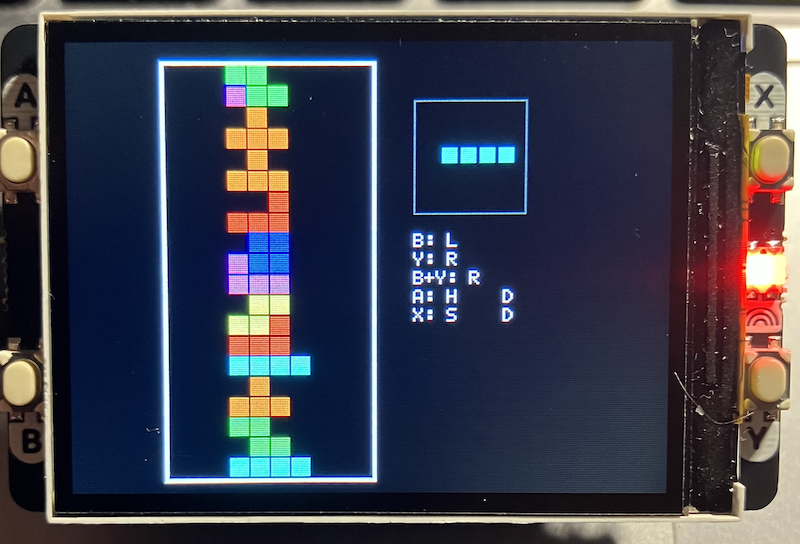
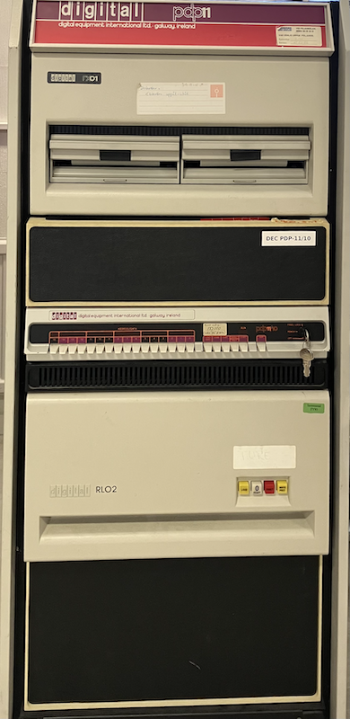

## Tetris

In 1984, a Soviet computer scientist named Alexey Pajitnov created a simple puzzle
game while working at the Dorodnitsyn Computing Centre of the Soviet Academy of
Sciences in Moscow. Using an Electronika 60, a Soviet clone of the PDP-11, Pajitnov
designed a game where geometric shapes made of four squares each--"tetrominoes"--fell
from the top of the screen and had to be arranged into complete lines. He named the
game Tetris, combining the Greek prefix "tetra" (meaning four) with his favourite
sport, tennis.

The game spread quickly among Soviet colleagues, and programmers in Hungary soon
ported it to Western platforms like the IBM PC and Commodore 64. By the mid-1980s,
Western software companies saw its potential and began competing for the rights.
This led to a complex legal dispute, because the Soviet Union, through the state
agency ELORG, held the actual ownership of the game, while multiple firms in the
West--including Andromeda, Mirrorsoft, Spectrum HoloByte, Atari, and later
Nintendo--tried to secure publishing rights.

The decisive moment came in 1989, when Nintendo bundled Tetris with its new handheld
console, the Game Boy. The addictive simplicity of the game, combined with the
portability of the device, turned it into a worldwide phenomenon. While Pajitnov
himself initially received no royalties due to Soviet state control, he later
moved to the United States in the 1990s, co-founded The Tetris Company, and
finally gained recognition and financial benefit from his creation.

Since then, Tetris has become one of the most iconic and widely played games in
history, ported to nearly every platform imaginable and celebrated as both a
cultural and design milestone in video gaming.

