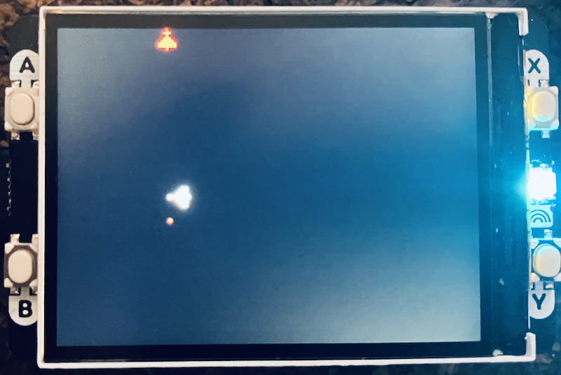
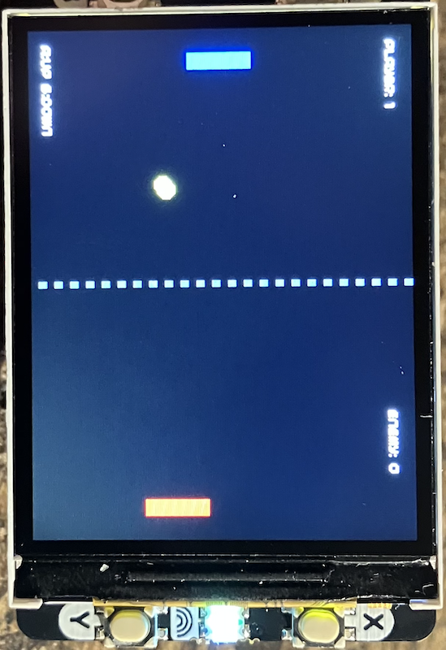
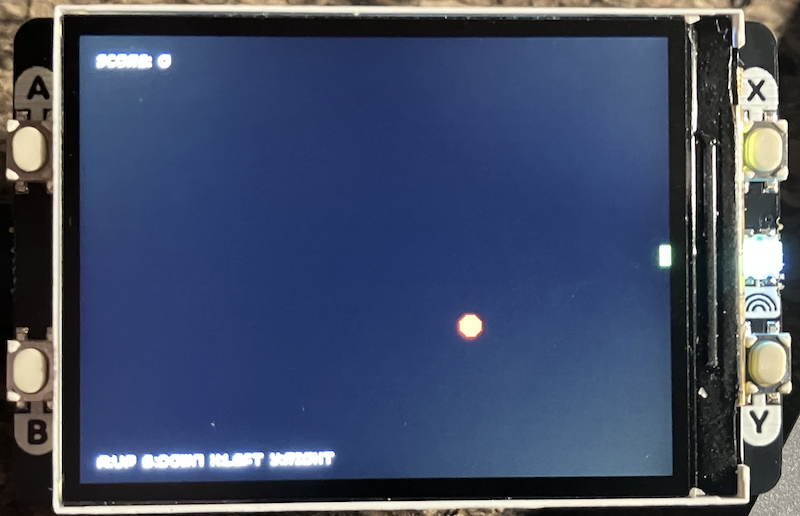
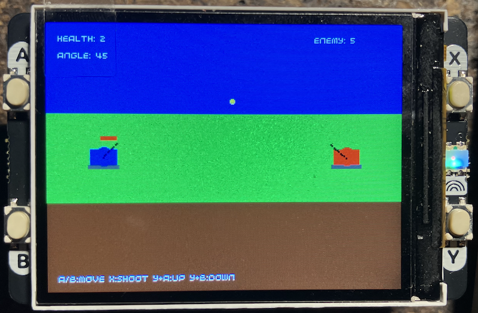

## Simple Games

Games, at their core, are interactive simulations that run in a continuous loop,
responding to player input while updating the state of the world and rendering
visuals to create an engaging experience. Most simple games follow a basic structure:
a main loop that repeatedly checks for input, updates game elements (like positions,
scores, or statuses), handles interactions (such as collisions), and draws everything
on the screen. This loop typically runs at a fixed rate, say 10 to 60 times per
second, to keep things smooth and responsive. By building on this foundation, you
can create everything from classic arcade-style challenges to strategic duels,
starting with just a few key concepts.

To get started building simple games, think of your game as a collection of objects
or "entities" that interact in a virtual space. For example, you might have a
player-controlled character, opponents, obstacles, and items. Each entity has
properties like position (x and y coordinates), size, speed, and state
(alive, moving, etc.). You'll define how these entities behave over time—moving,
shooting, or growing—and how they react to each other or to the player's actions.

Let's break it down step by step, with ideas for how you could implement basic
games inspired by timeless mechanics.


### 1. The Game Loop: The Heartbeat of Your Game

Every game needs a central loop that keeps things running. In pseudocode,
it might look like this:

```
while not game_over:
    handle_input()  # Check buttons or controls
    update_game()   # Move things, check collisions
    render()        # Draw everything
    wait_a_bit()    # Pause for frame rate control
```

This loop ensures constant action. For instance, in a flying duel game,
the loop would move your plane and an opponent's, update any fired shots,
and check if anyone's been hit. You could set a delay of about 0.1 seconds
per loop for a relaxed 10 FPS pace, or faster for more fluid motion.


### 2. Handling Input: Making It Interactive

Input lets the player control the game. Assume you have buttons for actions
like moving left/right, up/down, firing, or resetting. In code, you'd check
these in each loop iteration.

- For a turning-based game like steering a jet: If button A is pressed,
  turn left (change direction by 45 degrees); button B turns right.
  Pressing both could trigger a shot.
- In a paddle game: Button A moves up, B moves down, keeping the paddle
  within screen bounds.
- For aiming in a projectile game: Use one button to adjust angle up or down,
  combined with another to fire.

Keep it simple—debounce inputs by adding short cooldowns to avoid rapid-fire glitches.


### 3. Updating the Game State: Movement and Logic

This is where the fun happens. Update positions and states for all entities each frame.

- *Movement*: Use directions as vectors (like dx for horizontal, dy for vertical speed).
  For a snake-like game, add a new head segment in the current direction and remove the
  tail unless it "grows" after eating.
- *AI Opponents*: For single-player fun, add simple computer-controlled enemies. In a
  chasing game, have the AI calculate the direction to the player and turn toward them
  occasionally, with random wiggles for unpredictability. In a side-view battle, the
  AI could randomly adjust aim and fire at intervals.
- *Projectiles*: When firing, create a new object with initial position and velocity.
  Update it by adding speed each frame, perhaps with gravity for arcing shots in a
  tank duel (dy increases downward over time).
- *Wrapping or Boundaries*: For endless arenas, wrap positions around screen edges
  (e.g., if x > width, set x = 0). Otherwise, bounce or stop at walls.

Add timers for cooldowns, like limiting shots to every 0.5 seconds.


### 4. Collisions and Interactions: Adding Challenge

Games thrive on consequences. Check if entities overlap or touch.

- Use simple rectangle or circle checks: If two objects' bounding boxes intersect,
  trigger an event.
- Examples:
  - In an invasion defense game: If your bullet hits an enemy, remove both and
    increase score. If an enemy reaches the bottom or hits you, end the game.
  - For a ball-and-paddle setup: If the ball hits a paddle, reverse its horisontal
    direction and tweak vertical speed based on where it struck for spin-like effects.
  - In a shooting duel: If a missile lands near a target, reduce health. Add destructible
    barriers that erode on hits for strategy.
- Track scores or health: Increment points for successes, decrement life for failures.
  End when a win condition is met, like reaching 5 points or eliminating all foes.


### 5. Rendering: Drawing the World

Clear the screen each frame, then draw entities using basic shapes like rectangles,
circles, lines, or pixels.

- Colors and Styles: Use pens for colors—white for players, red for enemies, yellow
  for shots. Draw health bars as filled rectangles.
- Entities:
  - Planes or tanks: Combine rectangles for bodies, circles for turrets, lines for barrels.
  - Invaders or snakes: Use pixel arrays to define shapes, scaling them up for visibility.
  - Text: Overlay scores, angles, or "Game Over" messages.
- For polish, add backgrounds like gradients for sky/ground or dotted lines for dividers.


### Building Your First Games: Starting Points

With these basics, you can prototype simple games quickly. Here are ideas to expand from:

- *Aerial Duel*: Control a jet that turns and shoots in 8 directions. Add an AI opponent
  that chases and fires back. Wrap the screen for endless pursuit, track wins on hits.
- *Invasion Defense*: Waves of enemies march down; shoot them before they reach you.
  Add bunkers that crumble under fire for cover.
- *Bounce Challenge*: Move a paddle to hit a ball back at an AI opponent. Score on misses,
  first to 5 wins.
- *Growth Quest*: Steer a growing line (snake) to eat items while avoiding walls and
  self-collisions. Randomize food placement.
- *Artillery Battle*: Position and angle your shooter to lob arcs at an enemy.
  Include gravity, health, and AI that moves unpredictably.

*Start small: Code a single moving object first, then add input, collisions, and opponents.
Test often—tweak speeds, sizes, and rates for balance. As you iterate, you'll see how these
elements combine into addictive play. Experiment with randomness for replayability, like
varying AI behaviors or item spawns. From there, the sky's the limit for adding power-ups,
levels, or multiplayer twists!*

### Samples








