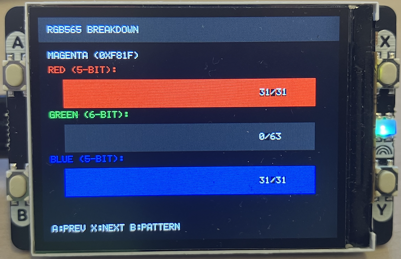

## Display Pack Test Pattern Demo

This project demonstrates the Pimoroni Display Pack 2.0 for Raspberry Pi Pico
with a TV test pattern and interactive color palette explorer.


### Features 

#### Mode 1: Test Pattern
- Displays a classic TV test card with color bars
- Shows white, yellow, cyan, green, magenta, red, blue, and black bars
- Demonstrates RGB565 colour rendering

#### Mode 2: Colour Palette Demo
- Browse through 16 predefined colours
- Shows color name, hex value (RGB565), and bit components
- Large color swatch for visual reference

#### Mode 3: RGB Component Breakdown
- Visual representation of RGB565 encoding
- Shows individual Red (5-bit), Green (6-bit), and Blue (5-bit) components
- Bar graphs showing the intensity of each component


### Button Controls

- *Button A*: Previous colour (in palette modes)
- *Button B*: Cycle through display modes
- *Button X*: Next colour (in palette modes)
- *Button Y*: Jump to RGB breakdown mode


### Hardware Required

- Raspberry Pi Pico or Pico W
- Pimoroni Display Pack 2.0 (320×240 ST7789 LCD with buttons)


### Understanding RGB565

The ST7789 display uses *RGB565 colour format*:

- *5 bits* for Red (0-31)
- *6 bits* for Green (0-63) 
- *5 bits* for Blue (0-31)
- Total: *16 bits* per pixel (65,536 colors)


#### Colour Format
```
Bit:  15 14 13 12 11 | 10 09 08 07 06 05 | 04 03 02 01 00
       R  R  R  R  R |  G  G  G  G  G  G |  B  B  B  B  B
```

#### Why 6 bits for green?
The human eye is most sensitive to green wavelengths, so an extra bit of precision
improves perceived image quality without increasing to 24-bit colour.


### Example Colors in RGB565

| Color   | Hex Value | Binary                | R  | G  | B  |
|---------|-----------|-----------------------|----|----|----| 
| Red     | 0xF800    | 11111 000000 00000    | 31 | 0  | 0  |
| Green   | 0x07E0    | 00000 111111 00000    | 0  | 63 | 0  |
| Blue    | 0x001F    | 00000 000000 11111    | 0  | 0  | 31 |
| White   | 0xFFFF    | 11111 111111 11111    | 31 | 63 | 31 |
| Yellow  | 0xFFE0    | 11111 111111 00000    | 31 | 63 | 0  |
| Cyan    | 0x07FF    | 00000 111111 11111    | 0  | 63 | 31 |
| Magenta | 0xF81F    | 11111 000000 11111    | 31 | 0  | 31 |


### Building

#### Prerequisites

1. Install the Raspberry Pi Pico SDK
2. Set the `PICO_SDK_PATH` environment variable:
   ```bash
   export PICO_SDK_PATH=/path/to/pico-sdk
   ```

#### Build Steps

```bash
mkdir build
cd build
cmake ..
make
```

This will generate `display_test_pattern.uf2` in the build directory.

#### Flashing to Pico

1. Hold the BOOTSEL button on your Pico
2. Connect it to your computer via USB
3. Release BOOTSEL (Pico appears as a USB drive)
4. Copy `display_test_pattern.uf2` to the Pico drive
5. The Pico will automatically reboot and run the program


### Troubleshooting

#### Display shows nothing
- Check wiring connections
- Verify PICO_SDK_PATH is set correctly
- Ensure Display Pack is properly seated on Pico

#### Colors look wrong
- This is normal for RGB565--it has limited colour depth
- Gradients may show "banding" due to fewer bits per channel

#### Buttons not responding
- Buttons have 50ms debounce delay
- Make sure Display Pack is firmly connected



