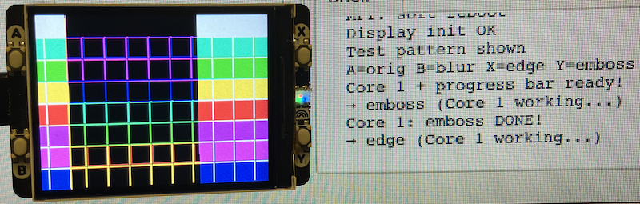

## Convolutional Image Processing

*Convolution* is a mathematical operation that combines two functions to produce a third.  
In *image processing*, it’s used to *apply filters* (like blur, sharpen, edge detection) to an image.

Think of it like *sliding a small window (kernel)* over every pixel in the image.
(Also compare with CNN in neural netowrking!)


#### The Kernel (Filter Matrix)

A *kernel* is a small grid of numbers (e.g., 3×3 or 5×5) that defines the *effect* of the filter.

| 1 | 4 | 6 | 4 | 1 |
|---|---|---|---|---|
| 4 | 16 | 24 | 16 | 4 |
| 6 | 24 | 36 | 24 | 6 |
| 4 | 16 | 24 | 16 | 4 |
| 1 | 4 | 6 | 4 | 1 |

This is a *Gaussian blur* kernel (5×5). The center pixel gets the most weight (36), edges less.

1. *Place the kernel* over a pixel and its neighbors.
2. *Multiply* each pixel value by the corresponding kernel value.
3. *Sum* all results -> new pixel value.
4. *Repeat* for every pixel.

```text
Input Pixel Grid:        Kernel:         Output:
[10 20 30]               [0  1  0]       [20]
[40 50 60]    ×          [1 -4  1]   →   [ -160 ]
[70 80 90]               [0  1  0]
```
This is a *Laplacian edge detector*--highlights changes.


#### Common Filters

| Filter | Effect | Kernel Example |
|--------|--------|----------------|
| *Blur* | Soften image | Gaussian weights |
| *Sharpen* | Enhance edges | Center high, edges negative |
| *Edge Detection* | Find boundaries | High center, negative surround |
| *Emboss* | 3D raised effect | Diagonal gradients |


### Normalisation

Most kernels have a *sum* (e.g., Gaussian = 256).  
Divide output by this sum to keep brightness:

```python
output = (sum of products) // 256
```

Or use `>> 8` for fast division by 256.


### Edge Handling

Near image borders, the kernel *overhangs*.
Solutions:
- *Pad* with zeros or repeat edge pixels
- *Clamp* coordinates: `px = max(0, min(x, width-1))`


### Performance

The Raspberry Pi Pico is not a fast computer!
Convolution is *computation-heavy*:
- 3×3 kernel -> 9 operations per pixel
- 5×5 kernel -> 25 operations per pixel
- For 240×360 image -> *2.16 million operations* (5×5)

This *Pico 2W program* (too little memory on the original)
implements *real-time convolution* using:

- *Dual-core processing* (`_thread`) -- Core 1 does filtering
- *Live progress bar* -- Core 0 updates UI
- *Dynamic kernel size* -- 3×3 (edge, emboss) or 5×5 (blur)
- *Row caching* -- reduces redundant pixel reads
- *RGB565 -> RGB888 -> filter -> RGB565* -- full color processing

```text
Button A -> Original
Button B -> Gaussian Blur (5×5)
Button X -> Edge Detection (3×3)
Button Y -> Emboss (3×3)
```

The program is not crash free with the restrictions of the Pico, so
one task is to make it better, more robust!

### Next
Try adding:
- *Sobel edge detection*
- *Custom kernels via serial input*
- *Animated filters*


