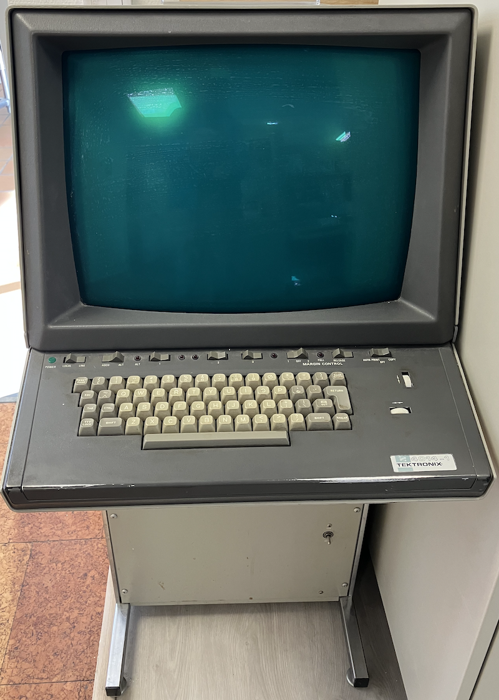

## Vector Graphics

Looking back, it is interesting how my own fascination was tied to the aesthetics of vector graphics, while the
designers of the time were often motivated by very different concerns. Raster displays were expensive, memory was
limited, and processors could not always handle the overhead of moving and refreshing a full bitmap. Vector displays,
by contrast, required much less memory: the system only needed to store coordinates and instructions for drawing
lines or shapes. The screen then traced those vectors directly with the electron beam. What I admired as elegant
precision was, in fact, a clever optimisation born of necessity.

Of course, those same limitations shaped the unique look and feel of the technology. The crisp, glowing lines,
the smooth scaling, and the sense of immediacy in how objects appeared on screen were not simply engineering
compromises--they became an artistic medium in their own right. Games like *Asteroids* and *Battlezone* created
experiences that would have been impossible, or at least very different, on contemporary raster hardware.

Today, with nearly unlimited pixel resolution and powerful GPUs, it is easy to forget how distinctive those earlier
approaches were. But I think there is still something deeply appealing about vector displays: the way geometry is
represented directly, the simplicity of line art, and the connection between mathematics and imagery. In a sense,
they embody a kind of "purity" of graphics--one that still inspires me, even if the original motivation was
*cost efficiency* rather than visual clarity.

In fact, what fascinates me is how these ideas have never really gone away, even though raster graphics eventually
won out in mainstream displays. The concept of representing images as lines, curves, and shapes rather than as
fixed grids of pixels still thrives in many areas.

Think of SVG (Scalable Vector Graphics) on the web: a modern descendant of those same principles, where graphics
are described mathematically and can be scaled to any resolution without losing clarity. Or consider CAD systems,
which rely heavily on vector representations to describe technical drawings and 3D models with exact precision.
Even in hardware, oscilloscopes and laser projectors still use vector-style drawing, steering beams directly
to positions rather than painting an entire raster image.

There is also a kind of "maker culture" revival around these ideas. Plotters, CNC machines, and laser cutters
all work fundamentally with vector instructions, moving along paths instead of filling in pixels. What I once
admired in a cinema lobby arcade machine now reappears in tools for design, fabrication, and creative coding.

So although vector displays may have started as a cost-saving compromise, their legacy is richer than that.
They remind us that technical constraints can lead not only to clever solutions but also to new aesthetics and
new ways of thinking about imagery--lessons that still echo in today’s graphics, design, and digital fabrication.


### A Short History

- *1950s–1960s:* Early computer displays such as the *SAGE* system and *DEC PDP-1* used
  *vector monitors*, where the electron beam directly drew lines between coordinates.  
- *1970s:* Vector plotters became standard in engineering and design, physically drawing lines with pens on paper.  
- *1980s:* The introduction of *PostScript* by Adobe (1982) brought device-independent vector graphics
  into printing and desktop publishing.  
- *1990s:* Vector-based drawing applications such as CorelDRAW and Adobe Illustrator popularised digital vector artwork.  
- *2000s:* The *SVG (Scalable Vector Graphics)* standard, developed by the W3C, made vector graphics native to the web.  
- *Today:* Vector representations are ubiquitous--from fonts (TrueType, OpenType) to modern GPU pipelines
  that rely on vector data before rasterisation.


### What Are Vector Graphics?

Vector graphics represent images as *mathematical descriptions of shapes*--such as lines, curves,
and polygons--rather than as a fixed grid of coloured pixels. Each element (for example, a circle
or a path) is defined by coordinates, control points, and style attributes such as stroke colour
or fill pattern.

Unlike bitmap (raster) graphics, which describe images as a matrix of pixels, vector graphics can
be *scaled* (infinitely) without any loss of quality. This makes them ideal for diagrams, fonts,
technical drawings, and logos--anywhere crisp edges and scalability matter.


### Why Vector Graphics?

The motivation for vector graphics comes from several practical needs:
- *Resolution independence*: Vector images stay sharp at any zoom level or output resolution.  
- *Compact representation*: Mathematical descriptions are often much smaller than equivalent raster images.  
- *Editability*: Individual shapes can be moved, recoloured, or reshaped easily.  
- *Device independence*: A vector description can be rendered on screens, printers, or plotters with consistent results.

These advantages made vector formats crucial in CAD (Computer-Aided Design), typography, and scalable web graphics.


### How Do Vector Graphics Work?

At their core, vector graphics are *lists of drawing instructions* interpreted by a rendering system.
A vector image might contain commands like:

```
MoveTo(10, 10)
LineTo(100, 10)
LineTo(100, 50)
ClosePath()
Fill(#0000FF)
```

These are not pixels, but geometric definitions. When displayed, a *rasteriser* (software or hardware)
converts these shapes into pixels appropriate for the target device in a process called *scan conversion*.

#### Core Concepts

- *Primitives:* Lines, curves (Bézier), polygons, circles, text glyphs.  
- *Paths:* Continuous sequences of drawing commands forming outlines.  
- *Transforms:* Scaling, rotation, and translation applied via matrices.  
- *Fills and Strokes:* Define interior colour and outline style.  
- *Compositing:* Layering of multiple shapes with transparency or blending.  

The mathematics behind curves (notably *quadratic* and *cubic Bézier curves*) allows smooth and precise
shapes using only a few control points. Modern rendering engines (e.g., in browsers, PDF viewers, or GPUs)
efficiently evaluate these curves and fill or stroke them as needed.


### Vector vs. Raster at a Glance

| Feature           | Vector Graphics               | Raster Graphics                    |
|-------------------|-------------------------------|------------------------------------|
| Representation    | Mathematical shapes           | Pixel grid                         |
| Scaling           | Infinite, lossless            | Pixelated when enlarged            |
| File size         | Small for simple scenes       | Grows with resolution              |
| Editing           | Shape-based and precise       | Pixel-based, destructive           |
| Typical formats   | SVG, EPS, PDF, AI             | PNG, JPEG, BMP, GIF                |
| Best suited for   | Logos, diagrams, type, CAD    | Photos, textures, complex images   |


### From Vectors to Pixels: The Rasterisation Process

Although vector graphics describe shapes mathematically, every screen is ultimately a
rectangular grid of pixels. The process of converting vector data into pixels is
called *rasterisation*.


#### Scan Conversion

The most common method is *scanline rasterisation*, where the renderer sweeps horizontally
across each pixel row (scanline) and determines which pixels lie inside the shape. This
involves computing intersections between the scanline and the vector paths and filling
between them according to even–odd or non-zero winding rules.

For strokes, the rasteriser expands the line’s mathematical centre into a *polygonal outline*
based on stroke width, joins, and caps, then fills that shape.


#### Anti-aliasing

Because vector edges rarely align perfectly with the pixel grid, rasterisation can produce
jagged edges (“aliasing”). To counter this, renderers use *anti-aliasing*, which computes
partial pixel coverage, effectively blending the edge colour proportionally to how much of
each pixel is covered by the shape. Techniques such as *supersampling*, *area sampling*,
or *analytic coverage* (as in modern GPU pipelines) improve smoothness.


#### GPU and Hardware Acceleration

Contemporary graphics hardware performs rasterisation in parallel:
1. Vertex coordinates are transformed by the GPU’s vector pipeline (matrix transformations, clipping, projection).
2. The resulting primitives (triangles or curves) are sent to the *rasteriser*, which determines pixel coverage.
3. A *fragment shader* computes the final colour of each pixel, combining fills, strokes, textures, and transparency.


#### Vector Rasterisation in Modern Systems

- *Web browsers* rasterise SVG paths using GPU-assisted pipelines (Skia, Direct2D, Metal, or Core Graphics).
- *PDF viewers* use similar algorithms for print-level precision.
- *Font rendering* applies specialised curve rasterisers for Bézier outlines, often with hinting
  to align glyph edges cleanly to the pixel grid.

In short, rasterisation bridges the abstract geometry of vector graphics with the discrete world of displays
and image buffers. Every Bézier curve, line segment, or filled polygon must ultimately pass through this
stage to become visible on a screen.


### Summary

Vector graphics thus encode images as *structured geometry* rather than raw pixel data. This approach,
first used in oscilloscopes and plotters, remains essential for modern display and printing technologies.
Every scalable logo, font, and SVG image today relies on these same principles: *mathematical precision,
transformable geometry, and device-independent rendering*.



