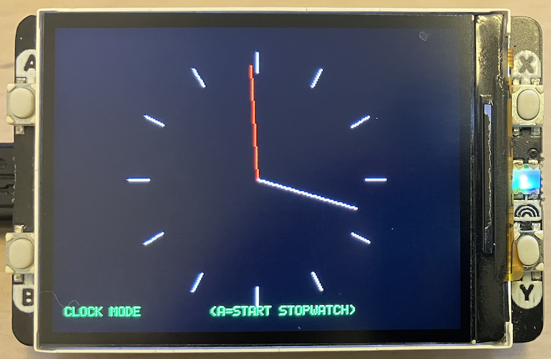

## Vector Graphics in a Clock

How It Works Conceptually:

1. *Primitive generation:* The program defines lines, polygons, or curves in abstract coordinate space.
2. *Transformation:* These coordinates are converted to screen space, potentially applying scaling or translation.
3. *Rasterisation:* The vector instructions are translated into pixel data written to a frame buffer or display memory.
4. *Display update:* The buffer is sent to the output device, producing the final image.

Even though implemented in plain C, this process mirrors the same principles used in SVG, PDF, or
modern GPU pipelines--geometry first, pixels second.

### Projects

The current implementation provides an excellent base for exploring deeper
aspects of vector rendering and display control. Here are some projects
and extensions you might think of as worth pursuing:

#### 1. Software Rasteriser with Bézier Support
Implement quadratic and cubic Bézier curves (using De Casteljau’s algorithm) and
extend your line rasteriser to handle curved paths with fill and stroke operations.  
You can test this by rendering simple fonts or parametric shapes.

### 2. Transformation Stack
Add a small transformation API (translation, rotation, scale) using 2D matrices.
Allow shapes to be drawn in local coordinates and transformed dynamically before
rendering--mirroring how PostScript and OpenGL pipelines work.

### 3. Anti-Aliased Rendering
Implement pixel coverage estimation or supersampling to smooth line edges. Even a
simple 2x2 sample grid can significantly improve visual quality and deepen your
understanding of scan conversion.

### 4. Display Driver Abstraction
Separate the geometry and rasterisation layers from the hardware-dependent drawing code.
By isolating the frame buffer operations, you can port your vector engine to different
devices or output formats.

### 5. Vector Scene Descriptions
Define a simple textual or binary format (like a minimal SVG subset) that your C
program can parse and render. This will turn your renderer into a reusable,
device-independent vector viewer.

### 6. Profiling and Optimisation
Measure the performance of your drawing routines--for example, line throughput, fill rate,
and buffer update time--and experiment with integer vs. fixed-point arithmetic for speed
on embedded targets.

These projects move the system from basic procedural drawing toward a genuine
*vector graphics engine*, capable of handling transformations, compositing, and
device abstraction--still in C, and still entirely under your control.
You might ven go further to a graphics game engine ..

