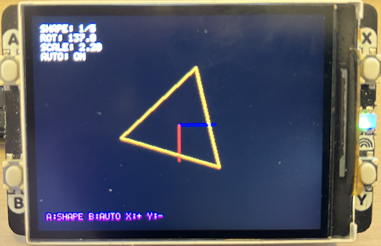

## Vector Graphics Transformation Demo

An interactive 2D vector graphics demonstration for the Raspberry Pi Pico
with Pimoroni Display Pack 2.0, showcasing real-time geometric transformations
using homogeneous coordinates and matrix mathematics.

This demo provides a hands-on exploration of fundamental computer graphics
concepts through an interactive interface. Users can manipulate various
geometric shapes using rotation, scaling, and translation operations,
all rendered in real-time using classic line-drawing algorithms.

The demo implements *2D homogeneous coordinates* using 3x3 transformation matrices,
a technique fundamental to computer graphics:

- *Translation Matrix*: Moves shapes in 2D space
- *Rotation Matrix*: Rotates shapes around the origin using trigonometric functions
- *Scaling Matrix*: Enlarges or shrinks shapes uniformly or non-uniformly
- *Matrix Composition*: Combines multiple transformations through matrix multiplication

All transformations are composable, meaning complex movements can be built from
simple operations. The *order of matrix multiplication* matters:
this demo applies transformations in the order Scale -> Rotate -> Translate,
producing intuitive results where shapes rotate around their center before
being positioned on screen.

### Interactive Controls
- *Button A*: Cycle through geometric shapes (Triangle, Square, Pentagon, Hexagon, Star)
- *Button B*: Toggle automatic rotation on/off
- *Button X*: Increase scale (zoom in)
- *Button Y*: Decrease scale (zoom out)

### Visual Elements
- *Geometric Shapes*: Five pre-defined shapes with distinct colors
- *Coordinate Axes*: Red (X-axis) and green (Y-axis) lines showing the local coordinate system
- *Real-time Display*: Shows current shape, rotation angle, scale factor, and auto-rotation status
- *Smooth Animation*: 60 FPS rendering with automatic rotation when enabled

### Shapes Included
1. *Triangle* (Cyan) - 3 vertices
2. *Square* (Yellow) - 4 vertices  
3. *Pentagon* (Magenta) - 5 vertices
4. *Hexagon* (Green) - 6 vertices
5. *Star* (Red) - 10 vertices

### Display: Hardware Abstraction Layer

Provides a reasonable complete driver interface for the Pimoroni Display Pack 2.0:

- *Display Management*:
  - ST7789V2 LCD controller initialization (320x240 RGB565)
  - SPI communication with DMA acceleration
  - Hardware reset and backlight control
  - Efficient block transfers for full-screen updates

- *Graphics Functions*:
  - `display_pack_init()`: Initialize the display hardware
  - `display_blit_full()`: Transfer entire framebuffer to screen via DMA
  - `display_fill_rect()`: Fast rectangle filling with DMA optimization
  - `display_draw_char()` / `display_draw_string()`: Text rendering with 5x8 bitmap font
  - `display_get_font_char()`: Access individual character glyphs

- *Button System*:
  - Hardware-debounced button polling (50ms debounce interval)
  - Callback-based event system for clean input handling
  - Support for all four buttons (A, B, X, Y)

- *Performance Features*:
  - DMA-accelerated transfers for large data blocks (>64 bytes)
  - Interrupt-driven DMA completion
  - SPI FIFO synchronization to prevent data corruption
  - Proper timing guards and timeout handling

*Key Technical Details*:
- Uses SPI0 at 31.25 MHz for display communication
- RGB565 color format (16-bit per pixel)
- DMA channel management with error recovery
- Comprehensive error handling with descriptive error codes

### Graphics Engine & Application Logic

Implements a complete 2D vector graphics system with interactive transformation controls:

- *Framebuffer Architecture*:
  - Software framebuffer (320×240×16-bit = 153,600 bytes)
  - Double-buffering concept: render to memory, then blit to display
  - Cleared each frame for clean rendering

- *Vector Math System*:
  - 2D vector representation (`vec2` structure)
  - 3×3 transformation matrices (`mat3` structure) 
  - Homogeneous coordinate transformations
  - Matrix multiplication for transformation composition
  - Point transformation function

- *Shape Representation*:
  - Vertex-based shape definition
  - Closed polygons (last vertex connects to first)
  - Per-shape color assignment
  - Flexible vertex count (3-10 vertices in demo)

- *Rendering Pipeline*:
  1. Clear framebuffer
  2. Update rotation if auto-rotation enabled
  3. Compute transformation matrix (Scale × Rotate × Translate)
  4. Transform and draw current shape
  5. Draw coordinate axes
  6. Render UI overlay
  7. Blit framebuffer to display

- *Line Drawing*:
  - Bresenham's line algorithm implementation
  - Efficient integer-only arithmetic
  - Clipping to screen boundaries

- *UI System*:
  - Real-time parameter display
  - Button mapping reference
  - Text rendering using bitmap font from display driver

### Transformation Order
The demo uses the transformation sequence: *T(translate) × R(rotate) × S(scale)*

This means:
1. Shape is scaled first (in its local space)
2. Then rotated around the origin
3. Finally translated to screen position

This order ensures the shape rotates around its own center rather than orbiting around a distant point.

### Coordinate Systems
- *Local Space*: Where the shape vertices are defined (centered at origin)
- *World Space*: After transformations are applied (screen coordinates)
- *Screen Space*: Final pixel positions (0,0 at top-left)

### Bresenham's Algorithm
The line drawing uses Bresenham's algorithm, a classic computer graphics technique that:
- Draws pixel-perfect lines using only integer arithmetic
- Avoids expensive floating-point calculations
- Minimizes CPU usage for smooth rendering

### Hardware Requirements

- *Raspberry Pi Pico* (RP2040 microcontroller)
- *Pimoroni Display Pack 2.0* (320×240 LCD with ST7789V2)
- *Buttons*: Four hardware buttons (A, B, X, Y) - included on Display Pack
- *USB Connection*: For power and optional serial output

### Extending the Demo

Ideas for modifications:
- Add more complex shapes (stars with different points, letters, curves)
- Implement non-uniform scaling (different X and Y scale factors)
- Add translation controls to move the shape around the screen
- Draw multiple shapes simultaneously
- Implement shape morphing (interpolating between vertex positions)
- Add perspective transformation for 3D-like effects
- Create animation sequences with keyframes

