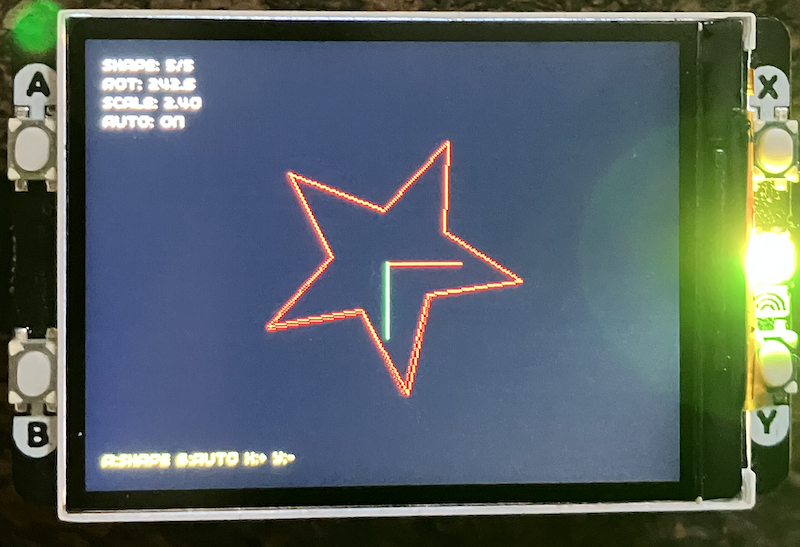

## Vector Graphics Demo

An interactive 2D transformation demo for Raspberry Pi Pico with Pimoroni Display Pack 2.0,
written in MicroPython. This tool demonstrates fundamental computer graphics concepts through
real-time geometric transformations.

This implementation of the vector graphics transformation demo, providing the same educational
value as the C version but with the accessibility and simplicity of Python.


### Advantages of MicroPython in this case
- *Rapid Development*: Write and test code in minutes, not hours
- *Interactive REPL*: Debug and experiment in real-time
- *Simpler Syntax*: Focus on algorithms, not memory management
- *Built-in Libraries*: Pimoroni's `picographics` handles the display driver
- *Easy Deployment*: Copy a single `.py` file to the Pico

### Trade-offs
- *Performance*: ~60 FPS vs C's potential 60+ FPS (still smooth for this demo)
- *Memory*: MicroPython uses more RAM (~100KB overhead)
- *Direct Control*: Less direct hardware access compared to C

### Interactive Controls
- *Button A*: Cycle through 5 geometric shapes
- *Button B*: Toggle automatic rotation on/off
- *Button X*: Increase scale (zoom in by 0.2)
- *Button Y*: Decrease scale (zoom out by 0.2)

### Visual Elements
- *Five Geometric Shapes*: Triangle, Square, Pentagon, Hexagon, and Star
- *Coordinate Axes*: Red X-axis and Green Y-axis showing local space
- *Live Statistics*: Real-time display of shape number, rotation angle, and scale
- *Smooth Animation*: Approximately 60 FPS rendering

### Educational Value
The code explicitly demonstrates:
- *Matrix composition order* with clear comments
- *Homogeneous coordinates* using 3×3 matrices
- *Object-oriented design* with `Vec2`, `Matrix3`, and `Shape` classes
- *Bresenham's line algorithm* for efficient line drawing
- *Transformation pipeline* from local to world space

#### 1. *Hardware Initialisation*
```python
display = PicoGraphics(display=DISPLAY_PICO_DISPLAY_2)
button_a = Button(12)  # Four buttons on pins 12-15
```

#### 2. *Vector Math System*
- *`Vec2` Class*: Represents 2D points with x, y coordinates
- *`Matrix3` Class*: Implements 3×3 transformation matrices
  - `identity()`: Creates identity matrix
  - `translate(x, y)`: Creates translation matrix
  - `rotate(angle)`: Creates rotation matrix (angle in radians)
  - `scale(sx, sy)`: Creates scaling matrix
  - `multiply(other)`: Matrix multiplication for composition
  - `transform_point(point)`: Applies transformation to a point

#### 3. *Shape Representation*
- *`Shape` Class*: Encapsulates geometry and rendering
  - Stores vertices as `Vec2` objects
  - Stores color for rendering
  - `draw(transform)`: Transforms and renders the shape

#### 4. *Rendering Functions*
- *`draw_line(x0, y0, x1, y1)`*: Bresenham's line algorithm implementation
  - Integer-only arithmetic for efficiency
  - Clipping to screen boundaries

#### 5. *UI System*
- *`draw_ui()`*: Renders on-screen information
  - Shape selection indicator
  - Current rotation in degrees
  - Current scale factor
  - Auto-rotation status
  - Button control reference

#### 6. *Main Loop*
- Button state handling with edge detection
- Transformation matrix composition
- Frame rendering pipeline
- Display update and timing


### Transformation Order
The demo uses the critical transformation sequence:
```python
# We want: Scale → Rotate → Translate
# Matrix math: T × R × S (right-to-left application)
m_scale = Matrix3.scale(scale, scale)
m_rotate = Matrix3.rotate(rotation)
m_translate = Matrix3.translate(translation.x, translation.y)

temp = m_rotate.multiply(m_scale)      # R × S
transform = m_translate.multiply(temp)  # T × (R × S)
```

*Why this order?*
1. *Scale first*: Size the shape in its local coordinate system
2. *Rotate second*: Spin around the shape's own center (origin)
3. *Translate last*: Move to final screen position

If we reversed translate and rotate, the shape would *orbit*
around a distant point instead of rotating in place!

### Homogeneous Coordinates
Using 3×3 matrices for 2D graphics allows:
- Uniform representation of all transformations
- Easy composition through matrix multiplication
- Translation as a matrix operation (not just addition)
- Future extension to perspective transforms

### Bresenham's Algorithm
The line drawing implementation uses this classic algorithm because:
- *Integer-only*: No floating-point calculations needed
- *Accurate*: Produces pixel-perfect lines
- *Fast*: Minimal CPU cycles per pixel
- *Memory-efficient*: No lookup tables required


### Getting Started

#### Requirements
- *Hardware*:
  - Raspberry Pi Pico or Pico W
  - Pimoroni Display Pack 2.0 (320×240 LCD)
  
- *Software*:
  - Pimoroni MicroPython firmware (includes `picographics` library)
  - Thonny IDE or any MicroPython file transfer tool

#### Installation

1. *Flash Pimoroni MicroPython firmware* to your Pico:
   - Download from: https://github.com/pimoroni/pimoroni-pico/releases
   - Choose: `pimoroni-pico-v*.*.*-micropython.uf2`
   - Hold BOOTSEL, connect Pico, drag-and-drop firmware

2. *Upload the demo*:
   - Open `demo.py` in Thonny
   - Save to Pico as `main.py` (runs on boot) or `demo.py` (run manually)

3. *Run*:
   - If saved as `main.py`: Disconnect and reconnect Pico
   - If saved as `demo.py`: Click "Run" in Thonny
   - Or use `ampy` from command line:
     ```bash
     ampy --port /dev/ttyACM0 put demo.py
     ampy --port /dev/ttyACM0 run demo.py
     ```

#### First Run

Upon starting, you'll see:
- A cyan triangle centered on screen
- Red X-axis and green Y-axis
- UI showing current parameters
- The shape rotating automatically

Press buttons to interact:
- *A*: Switch shapes
- *B*: Stop/start rotation
- *X/Y*: Adjust size


### Code Walkthrough

#### Understanding Matrix Multiplication Order

This is the *most important concept* in the demo. The code includes explicit comments:

```python
# CRITICAL: Matrix multiplication order matters!
# To transform: Scale -> Rotate -> Translate
# Result = Translate * Rotate * Scale
```

Why is the multiplication order reversed? Because transformations are applied *right-to-left*:

1. Point starts in local space
2. Point × Scale = scaled point
3. Scaled point × Rotate = rotated, scaled point  
4. Rotated point × Translate = final screen position

When composing matrices: `T × R × S` means "first S, then R, then T"

#### Shape Definition

Shapes are defined with vertices centered at origin (0, 0):

```python
# Triangle vertices
Shape([(0, -30), (26, 15), (-26, 15)], CYAN)
```

This allows transformations to naturally work around the shape's center.

#### The Rendering Pipeline

Each frame:
1. *Clear* framebuffer (set all pixels to black)
2. *Update* rotation if auto-rotation enabled
3. *Compose* transformation matrices
4. *Transform* shape vertices
5. *Draw* shape edges using transformed vertices
6. *Render* coordinate axes and UI
7. *Update* display hardware


### Extending the Demo

#### Easy Modifications

*Add a new shape:*
```python
# Add to shapes list
Shape([(x1, y1), (x2, y2), ...], COLOR)
```

*Change rotation speed:*
```python
rotation += 0.05  # Faster (was 0.02)
```

*Adjust scale limits:*
```python
if scale > 5.0:  # Allow bigger (was 3.0)
    scale = 5.0
```

#### Advanced Ideas

1. *Non-uniform Scaling*: Different X and Y scale factors
   ```python
   m_scale = Matrix3.scale(scale_x, scale_y)
   ```

2. *Multiple Shapes*: Draw all shapes simultaneously with different transforms

3. *Shape Morphing*: Interpolate between different vertex sets

4. *User-Controlled Translation*: Add buttons to move shape around screen

5. *Shear Transformations*: Add skewing effects
   ```python
   @staticmethod
   def shear(sx, sy):
       m = Matrix3()
       m.m[0][1] = sx
       m.m[1][0] = sy
       return m
   ```

6. *Trail Effects*: Don't clear the screen every frame

7. *3D Projection*: Add Z-coordinate and perspective division


### Performance Notes

- *Frame Rate*: ~60 FPS with single shape
- *Memory*: ~150KB free after demo loads
- *CPU Usage*: ~40-50% at 133MHz (default Pico clock)

The demo is deliberately simple to maintain smooth performance. For more complex scenes:
- Reduce vertex count per shape
- Use simpler shapes
- Decrease screen resolution (use a clipping window)
- Optimize matrix multiplication (cache repeated calculations)


### Educational Use

This demo is suitable for teaching:

__Mathematics__
- Linear algebra and matrix operations
- Homogeneous coordinates
- Trigonometric functions in graphics
- Composition of transformations

__Computer Science__
- Object-oriented programming
- Algorithms (Bresenham's line drawing)
- Event-driven programming (button callbacks)
- Real-time systems and frame timing

__Graphics Programming__
- Transformation pipelines
- Coordinate spaces (local vs. world vs. screen)
- Vertex transformation
- Rasterization basics


### Troubleshooting

*Shape not appearing?*
- Check scale isn't too small (`scale >= 0.2`)
- Verify vertices are defined around origin
- Ensure color pen is created before use

*Slow frame rate?*
- Reduce shape complexity (fewer vertices)
- Disable debug output (`print()` statements slow things down)
- Check for other programs running on Pico

*Buttons not responding?*
- Ensure Display Pack is properly seated
- Check button pins (12-15) aren't used by other code
- Add debouncing delay if needed

*Import errors?*
- Verify Pimoroni MicroPython firmware is installed
- Check `picographics` and `Button` libraries are available
- Re-flash firmware if needed


### Comparison Table: C vs MicroPython

| Feature | C Version | MicroPython Version |
|---------|-----------|---------------------|
| *Setup Time* | Hours | Minutes |
| *Lines of Code* | ~800 | ~250 |
| *Frame Rate* | 60+ FPS | ~60 FPS |
| *Memory Usage* | ~160KB | ~250KB |
| *Learning Curve* | Steep | Gentle |
| *Hardware Control* | Complete | Abstracted |
| *Debug Speed* | Slow (compile/flash) | Fast (REPL) |
| *Best For* | Production, Performance | Learning, Prototyping |



