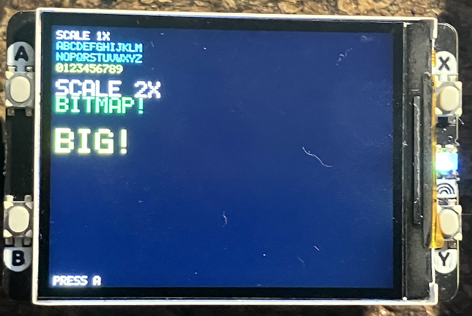

## Pixel/Bitmap Fonts

*Bitmap fonts* (also called *pixel fonts* or *raster fonts*) represent characters as
fixed grids of pixels. Unlike vector fonts that use mathematical curves, bitmap fonts
literally store which pixels should be "on" or "off" for each character.

Think of it like a tiny image for each letter, you're storing the actual pixel pattern,
not instructions on how to draw it.


### Storage Format

The most efficient way to store bitmap fonts is using *bit patterns*. 
Each character is represented as a series of bytes where:

1. *Each byte represents a column (or row)* of pixels in the character
2. *Each bit in that byte represents one pixel* (1 = on, 0 = off)
3. A 5x7 character needs only 5 bytes of storage

*Example: The letter 'A' in a 5x7 grid*
```
  X X X X X    <- Top (bit 0)
  X       X
  X       X
  X X X X X    <- Middle crossbar
  X       X
  X       X
  X       X    <- Bottom (bit 6)
```

Stored as: `[0x7E, 0x11, 0x11, 0x11, 0x7E]`
- `0x7E` = binary `01111110` = column with 6 pixels (vertical stroke)
- `0x11` = binary `00010001` = column with 2 pixels (crossbar edges)


### Advantages of Bitmap Fonts

1. *Extremely fast rendering* - No calculations needed, just copy pixels
2. *Predictable appearance* - Looks exactly the same every time
3. *Very small memory footprint* - 5 bytes per character for 5x7 font
4. *Perfect for low-resolution displays* - Can be designed pixel-by-pixel for clarity
5. *No anti-aliasing needed* - Already optimized for the pixel grid
6. *Consistent spacing* - Each character occupies fixed width/height


### Disadvantages of Bitmap Fonts

1. *Fixed size* - A 5x7 font can't smoothly scale to 10x14
2. *Scaling looks blocky* - Doubling size means 2x2 pixel blocks (pixelated look)
3. *Multiple sizes need multiple fonts* - Want 8pt, 10pt, 12pt? Store three complete font sets
4. *Not resolution-independent* - Designed for specific pixel density
5. *Limited transformations* - Rotation at arbitrary angles looks terrible


### Common Bitmap Font Sizes

- *3x5*: Tiny, barely readable, for space-constrained displays
- *5x7*: Standard, good readability, compact
- *6x8*: More readable, common in terminals
- *8x8*: Square characters, common in old computers
- *8x16*: Taller, better readability, classic PC BIOS font


### How Rendering Works

```python
# For each character:
for col in range(char_width):
    column_data = font[char][col]  # Get one byte
    for row in range(char_height):
        if (column_data >> row) & 1:  # Check if bit is set
            draw_pixel(x + col, y + row)  # Draw the pixel
```

The process is straightforward:
1. Get the byte for current column
2. Check each bit (shift right and mask with 1)
3. If bit is 1, draw a pixel at that position
4. Move to next column


### Scaling Bitmap Fonts

To make bitmap fonts larger, you draw *blocks* instead of single pixels:

*Scale 2x*: Each original pixel becomes a 2x2 block
```
Original:     Scaled 2x:
X .           X X . .
. X           X X . .
              . . X X
              . . X X
```

This creates the characteristic "blocky" retro look. It's fast and simple,
but not smooth like vector scaling.


### Character Encoding

Most bitmap fonts store ASCII characters (32-127):
- Space through `~` (tilde)
- 95 printable characters
- At 5 bytes each = 475 bytes total

Extended fonts might include:
- Accented characters (à, é, ñ)
- Box-drawing characters (│, ─, ┌)
- Symbols (©, ®, ™)
- Custom game/UI icons


### Historical Context

Bitmap fonts dominated early computing:

- *1970s-1980s*: All computer displays used bitmap fonts
- *Apple II, Commodore 64*: Character generators were bitmap fonts in ROM
- *Early Windows/Mac*: System fonts were bitmaps at multiple sizes
- *Arcade games*: All text was bitmap fonts (with the exception for e.g. Asteriods and Battlezone)
- *LCD calculators/watches*: Still use bitmap fonts today


### Modern Use Cases

Despite being "old technology," bitmap fonts are still used:

1. *Embedded systems* - Microcontrollers with limited memory/CPU
2. *Retro gaming* - Authentic 8-bit/16-bit aesthetic
3. *Low-resolution displays* - E-ink, LED matrices, small OLED screens
4. *Debug consoles* - Fast, no dependencies, always works
5. *Pixel art games* - Intentional retro style
6. *Status displays* - Thermostats, appliances, industrial equipment


### Optimisation Techniques

*Run-Length Encoding (RLE)*: If many columns are identical or blank, store once
```python
# Instead of: [0x00, 0x00, 0x00, 0x00]  (4 blank columns)
# Store: (0x00, count=4)
```

*Proportional Spacing*: Store width per character, not fixed width
```python
'I': width=3  # Narrow
'W': width=7  # Wide
```

*Sparse Storage*: Only store non-zero bytes, with position markers


### Comparison: Bitmap vs Vector

| Feature | Bitmap Font | Vector Font |
|---------|-------------|-------------|
| Storage | Pixel data | Mathematical curves |
| Scaling | Blocky/pixelated | Smooth at any size |
| Speed | Very fast | Requires calculation |
| Memory | Fixed per size | Single definition |
| Use case | Small screens, retro | Modern displays, documents |


### Best Practices

1. *Design at target size* - Don't scale bitmap fonts if possible
2. *Test on actual hardware* - Fonts look different on real displays
3. *Consider readability* - Bigger isn't always better; 5x7 is often ideal
4. *Add spacing* - 1-2 pixel gaps between characters improve readability
5. *Use appropriate style* - Serif fonts don't work well at small sizes


### The Future of Bitmap Fonts

While vector fonts dominate high-resolution displays, bitmap fonts remain essential for:
- *IoT devices* - Millions of small displays
- *Retro computing* - Growing hobbyist community
- *Artistic choice* - Intentional aesthetic in games and design
- *Performance-critical applications* - When every millisecond counts

The simplicity and efficiency of bitmap fonts ensure they'll continue to be relevant,
especially in embedded systems where resources are limited and reliability is crucial.



