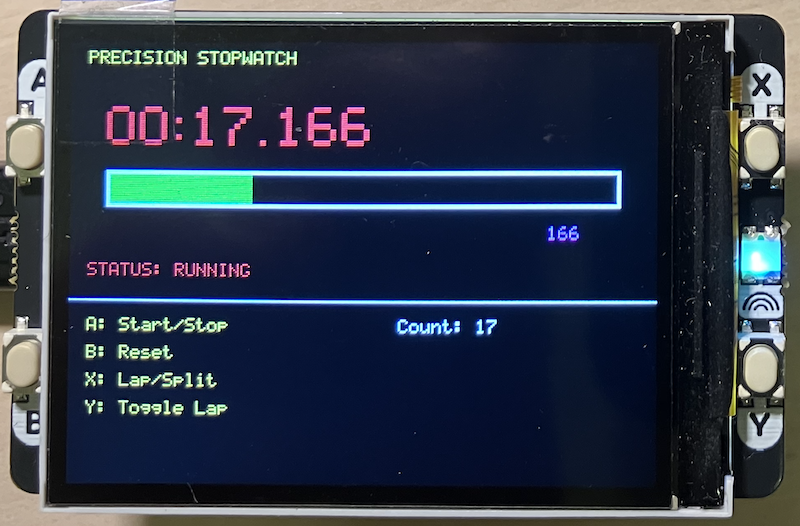

## Precision Stopwatch

A high-precision stopwatch application for the Raspberry Pi Pico/Pico 2
with the Pimoroni Display Pack 2.0, featuring millisecond accuracy,
lap timing, and a smooth framebuffer-based UI.

- *Millisecond Precision*: Accurate timing down to 1ms resolution
- *Large Digital Display*: Easy-to-read 3x scaled digits
- *Visual Progress Bar*: Shows progress through each 60-second interval
- *Lap/Split Timing*: Capture and display lap times
- *Smooth Updates*: Framebuffer rendering eliminates flicker
- *Hardware-Accelerated*: DMA-powered SPI transfers for maximum performance


### Controls

| Button | Function                 |
|--------|--------------------------|
| *A*    | Start/Stop the timer     |
| *B*    | Reset timer to 00:00.000 |
| *X*    | Record lap/split time    |
| *Y*    | Toggle lap time display  |


### Display Driver Features

The `display.c` driver provides a comprehensive API for the ST7789 LCD:

__Direct Drawing__
- `disp_clear()` - Clear entire screen
- `disp_fill_rect()` - Draw filled rectangles
- `disp_draw_pixel()` - Set individual pixels
- `disp_draw_text()` - Render text with 5x8 font
- `disp_blit()` - Bulk pixel transfer

__Framebuffer Mode__
For smooth, flicker-free rendering:
- `disp_framebuffer_alloc()` - Allocate double buffer
- `disp_framebuffer_clear()` - Clear framebuffer
- `disp_framebuffer_fill_rect()` - Draw rectangles to buffer
- `disp_framebuffer_draw_text()` - Draw text to buffer
- `disp_framebuffer_flush()` - Transfer buffer to display

__Button Support__
- Debounced input (50ms)
- Edge detection (press/release)
- Callback system
- Active-low with internal pull-ups


#### More features

- *DMA Transfers*: Automatic DMA for large transfers (>64 bytes)
- *High SPI Speed*: 62.5 MHz SPI clock
- *Optimized Fills*: Chunked DMA transfers for solid fills
- *Hardware Acceleration*: Utilizes Pico's DMA controller

The driver provides RGB565 color constants:

```c
COLOR_BLACK   0x0000    COLOR_WHITE   0xFFFF
COLOR_RED     0xF800    COLOR_GREEN   0x07E0
COLOR_BLUE    0x001F    COLOR_YELLOW  0xFFE0
COLOR_CYAN    0x07FF    COLOR_MAGENTA 0xF81F
```

- *Framebuffer*: 153,600 bytes (320x240x2)
- *Total RAM*: ~155 KB
- *Recommended*: Pico 2/2W (264 KB SRAM) for comfortable headroom

The Pico 1 (264 KB SRAM) can run this but has less memory for additional features.


### Error Handling

All display functions return `disp_error_t` codes. Check for errors:

```c
disp_error_t err = disp_init(&config);
if (err != DISP_OK) {
    printf("Error: %s\n", disp_error_string(err));
}
```

### Customisation

__Adjust Update Rate__
In `main.c`, modify the update interval:
```c
uint32_t update_interval = state.running ? 33 : 100;  // 33ms = ~30 FPS
```

__Change Colors__
Update color constants in the draw functions:
```c
draw_large_time(20, 35, display_ms, COLOR_GREEN);  // Change to COLOR_CYAN, etc.
```

__Disable DMA__
If experiencing issues, disable DMA in config:
```c
disp_config_t config = disp_get_default_config();
config.use_dma = false;
```

### Troubleshooting

*Display shows nothing:*
- Check SPI connections
- Verify backlight is enabled
- Try lowering SPI baudrate to 10 MHz

*Flickering display:*
- Ensure framebuffer is allocated successfully
- Check DMA initialization

*Buttons not responding:*
- Verify pull-ups are enabled
- Check GPIO pin numbers match your hardware
- Call `buttons_update()` regularly in main loop

*Memory allocation failure:*
- Use Pico 2/2W for guaranteed framebuffer space
- Reduce framebuffer size if necessary

### Debug Output

The driver includes printf debug statements. Connect via USB serial (115200 baud) to see:
- Initialization progress
- DMA channel allocation
- Button press events
- Error messages


### Extend

Feel free to enhance this project with:
- Additional timing modes (countdown, interval timer)
- Sound effects via PWM
- Data logging to flash
- Multiple lap storage
- Improved UI animations


