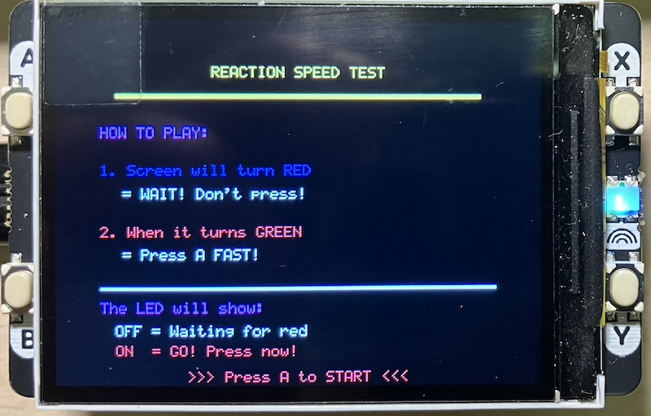

## Reaction Timer

A fast-paced reaction speed testing game for the Raspberry Pi Pico/Pico 2 with Pimoroni Display Pack 2.0.

Test your reflexes with this engaging reaction timer! The game presents a visual "red light, green light"
challenge where you must press a button as quickly as possible when the screen turns green.

- *Visual countdown* with giant numbers (3-2-1)
- *Red/Green light system* - wait for green!
- *LED feedback* - backlight indicates when to press
- *5-round test* with statistics tracking
- *Performance ratings* - from "AMAZING!" to "SLOW"
- *False start detection* - penalizes early presses


- *Raspberry Pi Pico* or *Pico 2* (recommended for framebuffer)
- *Pimoroni Display Pack 2.0* (320×240 ST7789 LCD with 4 buttons)
  - Display: 320×240 pixels, RGB565 color
  - Buttons: A, B, X, Y
  - Backlight LED


### Display Driver (`display.h` / `display.c`)

A full-featured ST7789 display driver with:

- *Hardware acceleration*: DMA support for fast transfers
- *Framebuffer mode*: Double-buffered rendering for flicker-free graphics
- *Drawing primitives*: Pixels, rectangles, text rendering
- *Button handling*: Debounced input with callbacks
- *5×8 ASCII font*: Full printable character set (ASCII 32-127)
- *Error handling*: Comprehensive error reporting system

### Game Features

1. *Instructions Screen*: Clear gameplay instructions
2. *Countdown*: Giant 3-2-1 countdown with visual effects
3. *Waiting Phase*: Red screen - tests your patience!
4. *GO Signal*: Green screen with LED indicator
5. *Results*: 
   - Your reaction time in milliseconds
   - Performance rating based on speed
   - Best time tracking
   - Average time calculation
   - Progress dots showing round count
6. *Statistics*: Tracks best, worst, and average times over 5 rounds

### Performance Ratings (change as needed)

| Time (ms) | Rating           |
|-----------|------------------|
| < 200     | AMAZING!         |
| 200-250   | EXCELLENT!       |
| 250-300   | GREAT!           |
| 300-400   | GOOD             |
| > 400     | SLOW - TRY AGAIN |


### How to Play

1. *Start*: Press Button A on the instructions screen
2. *Get Ready*: Watch the countdown (3-2-1)
3. *Wait*: Screen turns RED - DON'T PRESS YET! (LED turns OFF)
4. *React*: Screen turns GREEN - PRESS A NOW! (LED turns ON)
5. *Results*: See your time and rating
6. *Continue*: Press A for next round (up to 5 rounds)
7. *Restart*: Press B anytime to restart the game

### Controls

- *Button A*: Start game / Press on GREEN / Next round
- *Button B*: Restart game (return to instructions)
- *LED Indicator*: 
  - OFF = Waiting (red light)
  - ON = Press now (green light)


### Configuration

The display driver supports various configurations in `display.c`:

```c
disp_config_t config = {
    .spi_baudrate = 62500000,  // 62.5 MHz for fast updates
    .use_dma = true,           // Enable DMA acceleration
    .dma_timeout_ms = 1000,    // DMA timeout
    .enable_backlight = true   // Auto-enable backlight
};
```

### Memory Requirements

- *Framebuffer*: 320 × 240 × 2 bytes = 150 KB
- *Code + Stack*: ~50 KB
- *Total*: ~200 KB (fits comfortably in Pico 2's 520 KB SRAM)

*Note*: Original Pico (264 KB SRAM) should work but may be tight.
Pico 2 is highly recommended.


### Display doesn't init
- Check SPI connections (CLK, MOSI, CS, DC, RST)
- Verify pin definitions match your hardware
- Check serial output for debug messages

### Buttons not responding
- Ensure button pins are correctly defined
- Check button_update() is called regularly
- Verify pull-up resistors are enabled

### Slow/flickering display
- Enable DMA in configuration
- Use framebuffer mode for complex graphics
- Reduce SPI baudrate if experiencing corruption

### Build errors
- Ensure `PICO_SDK_PATH` is set correctly
- Check SDK version (1.5.0+ recommended)
- Verify all source files are present


### Extend

Ideas for modifications:

- *Difficulty levels*: Adjust wait time randomization
- *Sound effects*: Add buzzer/speaker support
- *Multiplayer*: Two-player split-screen races
- *High score table*: Store best times in flash
- *More rounds*: Configurable test length
- *Practice mode*: Unlimited attempts without scoring


