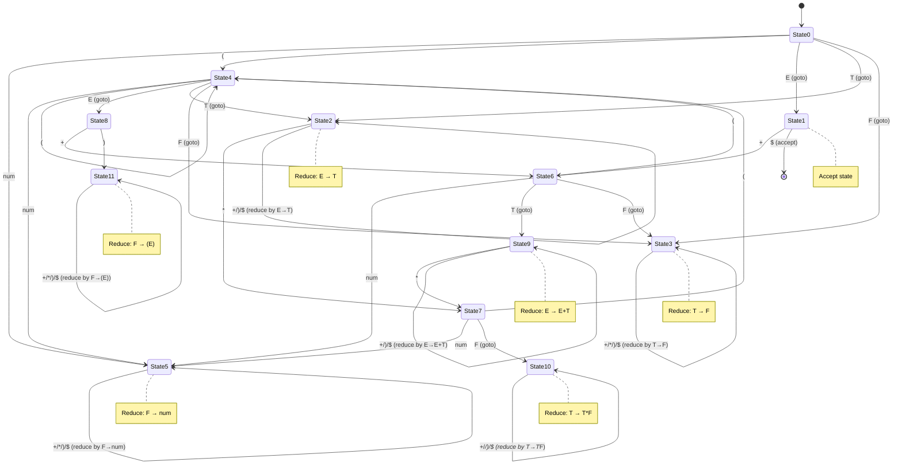

## SLR(1)

*SLR(1)* stands for *Simple LR(1) parser*.
It is a type of bottom-up parser used in compiler design.
It's one of the simplest and most efficient methods for parsing context-free grammars.

Key characteristics:
- *LR* = Left-to-right scan, Rightmost derivation in reverse
- *(1)* = Uses 1 lookahead token to make parsing decisions
- *Simple* = Uses a simplified method for constructing the
  parsing table compared to more complex LR parsers

SLR(1) parsers use two main components:
1. *Action table*: Determines whether to shift (read next token) or reduce (apply a grammar rule)
2. *Goto table*: Determines the next state after a reduction

This program implements an SLR(1) parser for a simple arithmetic expression grammar:

```
E -> E + T | T       (addition)
T -> T * F | F       (multiplication)
F -> ( E ) | num     (parentheses and numbers)
```

*The program:*
1. *Tokenises* an input expression (e.g., `"3 + 4 * (2 + 5)"`) into tokens: `num`, `+`, `*`, `(`, `)`, `$`
2. *Parses* using a state machine with 12 states (0-11)
3. *Uses shift-reduce actions*:
   - *Shift*: Push the current token and move to a new state
   - *Reduce*: Apply a grammar production rule and backtrack states
   - *Accept*: Successfully parsed the input
4. *Respects operator precedence*: `*` binds tighter than `+` (multiplication before addition)
5. *Handles parentheses* for grouping expressions

The parser validates that the expression follows the grammar rules
and reports success or raises a syntax error if the input is malformed.

The diagram below shows:
- Shift transitions (solid arrows with terminal symbols like num, +, *, (, ))
- Goto transitions (labeled with non-terminals like E, T, F)
- Reduce actions (noted with self-loops or notes showing which production is reduced)
- Accept action (transition to final state with $)




